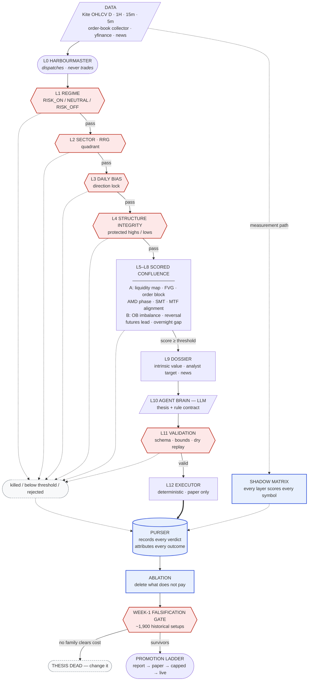
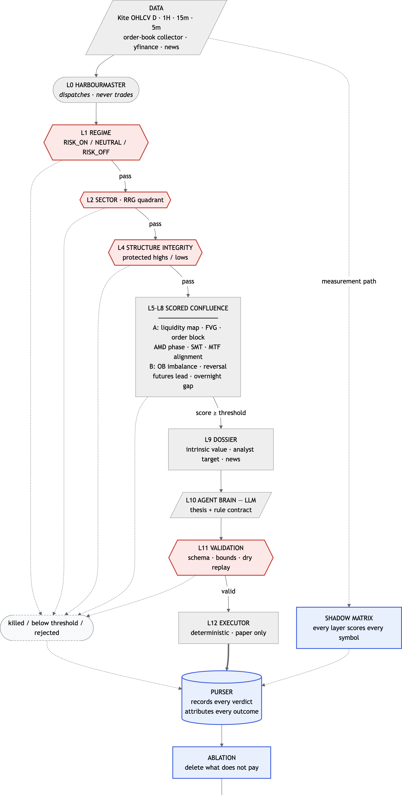

# TradePilot Agentic Waterfall — Design

::: {.report-meta}

| | |
|:--|:--|
| **Project** | TradePilot |
| **Version** | `v0.1.0` |
| **Status** | Draft — for review |
| **Created** | 2026-08-09 |
| **Updated** | 2026-08-09 |

:::

::: {.doc-author}

| | |
|:--|:--|
| **Author** | Soumya Swain |
| **Email** | soumya@suryaai.co.in |

:::

## 1. Thesis

The purpose of this system is profit. Nothing else in this document outranks that.

The **workflow shape** is borrowed from Jayesh Betala's "Agentic Waters" demo at the
Agentic Summit Bengaluru (22 July 2026) — a harbourmaster that stays on shore, a fleet
of named ships each with a role and a cadence, and an approval gate capping every
ship's autonomy. We take the shape and none of the thesis. Our gates exist for one
reason: an unproven agent loses money, so it stays capped until it has earned its way
up.

### 1.1 The problem this must solve

Measured 2026-08-05 through 2026-08-07 on live paper trades:

| Finding | Measurement |
|:--|:--|
| Entry timing loses to random | Random entry in the same stock, same day, same stop beat our timed entry by **0.18%/trade**, 5/5 seeds, t 2.76–4.24 |
| Every feature is backward-looking | All six scoring inputs describe what already happened. Leading weight: **0.0%** |
| The edge is real but sub-toll | **+0.069%/trade** gross against **0.120%** cost. The toll is 1.75× the edge |
| Holding longer does not rescue it | Market-adjusted multi-day return: **zero to four decimal places** |

The bottleneck is **information, not architecture**. Fifty agents over the same six
backward-looking features produce fifty times the decisions at the same negative edge.
This design is therefore pointed at new information — market structure, correlated-asset
divergence, and valuation context — with the agent framework as the harness that lets us
test many hypotheses in parallel without risking capital.

### 1.2 Success criteria

1. A ship's setups clear the 0.120% round-trip cost on out-of-sample paper trades,
   with t > 2 over ≥ 60 trades.
2. The funnel reports, for every session, exactly why each candidate died.
3. Every structural predicate has an independently measured contribution to edge.
   Predicates that do not carry edge are deleted, not carried.
4. No ship reaches live capital without passing the full promotion ladder.

## 2. Terminology — two different "fair values"

These collide in ordinary speech and must never collide in code.

| Term | Code name | Meaning |
|:--|:--|:--|
| Fair Value Gap | `fvg` | ICT three-candle price imbalance. Intraday structure, computed from bars. |
| Fair value / intrinsic | `intrinsic_value` | Valuation: PE, price-to-book, analyst consensus target. Nightly, fundamental. |

Linting rule: `fvg` may never appear in the dossier module, and `intrinsic_value` may
never appear in the structure module.

### 2.1 Fleet vocabulary

| Agentic Waters | TradePilot |
|:--|:--|
| Harbourmaster | Orchestrator. Dispatches, collects, gates. **Never places a trade.** |
| Ship | One stock-agent, owning exactly one symbol |
| Route | Shared dependency — sector, regime, data source |
| Voyage | One session's run for one ship |
| Incident | A failure, or a thesis invalidated |
| Lighthouse | Fixed reference: the gate taxonomy and evidence store |
| **Purser** | The recording agent. Owns no stock. Records every layer verdict, every signal, every outcome, and why. See §7.4. |

## 3. Architecture

### 3.1 The two paths

Every layer runs in one of two modes, and this separation is the core of the design.

**Action path — a strict sequential funnel.** A candidate that fails a hard veto stops
immediately and is not evaluated further. Cheap, and it produces a clean per-stage
drop-off ledger.

**Measurement path — full evaluation.** Every layer computes its verdict for *every*
symbol regardless of where that symbol died in the funnel. Logged, never acted on.

Without the measurement path the funnel counts are self-confirming: a stock killed at
the regime layer is never seen by the bias layer, so the bias layer looks harmless
because it never faced the hard cases. Ablation on funnel counts alone would be
circular — the same class of error that invalidated four findings the week of
2026-08-03.

### 3.2 The waterfall

```
L0   HARBOURMASTER wakes (pre-open)                     dispatch or stand down
─────────────────── market-wide, once per session ───────────────────
L1   REGIME          RISK_ON / NEUTRAL / RISK_OFF       HARD VETO — whole fleet
L2   SECTOR / ROUTE  RRG quadrant per sector            HARD VETO — ship group
─────────────────── per ship, nightly ───────────────────
L3   (deleted 2026-08-10 — measured, did not clear cost; see §4)
L4   STRUCTURE       protected highs/lows intact        HARD VETO — integrity
L5   LIQUIDITY MAP   pools, equal highs/lows, PDH/PDL,  levels + confluence
                     order blocks, FVGs
L6   AMD PHASE       accumulation/manipulation/         confluence
                     distribution
L7   SMT DIVERGENCE  stock vs sector index vs NIFTY     confluence
L8   MTF ALIGNMENT   D → 1H → 15m → 5m                  confluence
L9   DOSSIER         intrinsic value, analyst target,   context for the thesis
                     news
─────────────────── decision ───────────────────
L10  AGENT BRAIN     LLM: written thesis + rule set     one call per ship per night
L11  RULE VALIDATION schema, bounds, dry replay         reject malformed
L12  EXECUTOR        deterministic, intraday, paper     no LLM in the fast path
L13  JOURNAL         thesis, rules, fills, outcome
L14  PROMOTION       move the ship's gate on evidence
```

L1–L2 run once per session. L3–L10 run nightly per ship. L12 is pure code. L13 (journal) and L14 (promotion) are specified in §7 and §6
respectively rather than in §4, because they are cross-cutting rather than per-session
stages.

### 3.3 Runtime model

| Stage | When | Cost |
|:--|:--|:--|
| L1–L9 | Nightly, after close | Deterministic compute, no LLM |
| L10 | Nightly, one LLM call per surviving ship | ≤ 50 calls/night |
| L12 | Intraday, tick loop | Pure code, no network, no LLM |

An LLM never sits in the intraday path. That keeps execution deterministic,
replayable against history, and free of latency and per-decision cost.

## 4. Layer specifications

### L1 — Regime (hard veto, fleet-wide)

Consumes existing modules: `regime_detector`, `market_breadth`, `cross_asset`,
`premarket_intel`, `fii_feed`.

Output: `{"verdict": "RISK_ON|NEUTRAL|RISK_OFF", "reasons": [...]}`.
`RISK_OFF` stands the whole fleet down. `NEUTRAL` permits long and short.

### L2 — Sector / route (hard veto, group)

Consumes `rrg_regime`. A sector in the Lagging quadrant vetoes long setups for its
ships; Improving/Leading vetoes shorts.

### L3 — Daily bias — **DELETED 2026-08-10**

The pre-registered gate was: *if inverted-bias does not beat random entry at t > 2
over >= 300 setups after costs, mean reversion is dead and L3 is deleted rather than
inverted.* It was run on 6,600 setups across 201 symbols and **failed**:

| Variant | n | net after cost | t |
|:--|--:|--:|--:|
| with daily bias | 6,600 | -0.0964% | -11.66 |
| **against daily bias** | 6,600 | **-0.0277%** | **-3.22** |
| fade >= 2% 5-day move | 3,861 | +0.0153% | 1.32 |
| fade >= 6% 5-day move | 905 | +0.0088% | 0.36 |
| RISK_OFF only | 2,649 | -0.0170% | -1.19 |

Nothing clears the toll. **There is no daily-bias layer in this design.**

What is true and worth keeping: fading the bias consistently beats following it
(+0.0510% vs -0.0177% gross, beating random by +0.0701% at size). The market does
mean-revert intraday. The reversion is simply smaller than the fee — the fourth
independent family to land in that same place, after the v5 technical scorer, SMC/ICT
and the evidenced baseline.

One caution recorded for whoever reads this next: a 30-symbol smoke run showed net
edge RISING monotonically with fade depth (+0.0119% -> +0.0510% -> +0.0783%) and it
looked like the first real find in months. At full sample the curve is flat and
insignificant. The gradient was noise off samples as small as 116. Do not act on a
smoke run.

Evidence: `1cr-roadmap/research/mean-reversion-result.json`,
`scripts/test-mean-reversion.py`.

### L4 — Structure integrity (hard veto)

A **protected high** is the swing high that produced the most recent bullish break of
structure; a **protected low** the converse. If the protected level in the bias
direction has been closed through, the structure is broken and the ship stands down.

### L5 — Liquidity map (levels + confluence)

Computed per timeframe from OHLCV:

| Object | Definition |
|:--|:--|
| `fvg` | Three-candle imbalance: candle 1 high < candle 3 low (bullish), or inverse. Zone = the gap. Tracked as mitigated or unmitigated. |
| `order_block` | Last opposing candle before a displacement leg that broke structure. Zone = that candle's open–close range. |
| `equal_highs` / `equal_lows` | ≥ 2 swing points within 0.10% of each other — a resting liquidity pool |
| `PDH` / `PDL` | Prior day high / low |
| `PWH` / `PWL` | Prior week high / low |

Output is a set of **numeric levels**, not a score. These become the entry and exit
references in the rule contract.

### L6 — AMD phase (confluence)

Measurable definitions, so the phase is falsifiable:

| Phase | Test |
|:--|:--|
| Accumulation | Range compression: current-session range < 0.6 × ATR(14), price inside prior day range |
| Manipulation | A liquidity level (PDH/PDL/equal highs/lows) is swept, then price closes back inside within 3 bars on the entry timeframe |
| Distribution | Displacement away from the swept level: a candle body > 1.5 × ATR(14) in the bias direction |

Highest confluence weight when the phase reads *manipulation complete* — swept and
reclaimed — because that is the point at which the level's liquidity has been taken.

### L7 — SMT divergence (confluence)

Compare the ship's symbol against its sector index and NIFTY over a **20-bar lookback
on the 15m timeframe**. Divergence is present when the symbol makes a higher low while
the reference makes a lower low (bullish), or the inverse. Swing points are the same
fractal definition used in L4, so SMT and structure cannot disagree about what a swing
is.

This is the only layer whose information comes from **outside the symbol's own price
history**, which is what makes it worth testing independently of the rest.

### L8 — MTF alignment (confluence)

Timeframes: **D → 1H → 15m → 5m**. Daily sets bias, 1H the intermediate leg, 15m
locates the order block or FVG, 5m triggers. Score = count of timeframes whose
structural direction agrees with the daily bias, 0–4.

### L9 — Dossier (context)

Nightly per ship, from yfinance (verified 2026-08-09, 5/5 coverage on NSE names for
PE, forward PE, price-to-book, book value, EPS, growth, analyst target and analyst
count):

```
intrinsic_value: { trailing_pe, forward_pe, price_to_book, book_value,
                   trailing_eps, forward_eps, revenue_growth, earnings_growth,
                   target_mean_price, num_analysts, sector, market_cap }
news:            headlines since last session, with timestamps
depth:           order-book statistics from the existing collector, when available
```

`target_mean_price` is the single genuinely forward-looking field available today and
is therefore recorded from day one regardless of whether the first version uses it.

### L10 — Agent brain

One LLM call per ship per night. Input: the outputs of L1–L9 for that symbol plus the
ship's own last 20 journal entries. Output: the rule contract in §5.

The agent's job is to read structure and choose **which setup is on tonight, at what
exact levels, and what kills it**. It does not get to invent predicates; it selects
from the grammar.

### L11 — Rule validation

Rejects a contract that fails any of: schema validity, predicate names in the grammar,
levels within ±20% of last close, stop and target on the correct sides of entry, time
window inside 09:15–15:30, `valid_until` not beyond the session. A rejected contract is
an **incident** and the ship does not sail that day.

### L12 — Executor

Deterministic. Loads validated contracts, evaluates triggers against live bars, places
paper orders, enforces stops, targets, time stops and invalidations. No network calls
to an LLM, no discretion.

## 5. The rule contract

The load-bearing interface. ICT setups are natively *level + trigger + invalidation*,
which is exactly this shape.

```json
{ "symbol":"RELIANCE", "session":"2026-08-10", "gate":"paper_only",
  "daily_bias":"long",
  "thesis":"Swept Friday's low into a 15m bullish order block at 1412 that is
            unmitigated. SMT: NIFTY made a lower low, RELIANCE did not. AMD reads
            manipulation-complete. Trades 12% under analyst consensus.",
  "setup":"sweep_reclaim_into_ob",
  "entry": {"trigger":"sweep_then_reclaim","level":"PDL",
            "confirm":"tap_order_block","ob_tf":"15m","ob_zone":[1408,1416],
            "window":["09:30","12:00"]},
  "exit":  {"target":"liquidity_pool_above","ref":"PDH",
            "stop":"below_protected_low","level":1401,"time_stop":"14:45"},
  "invalidate":["close_below_protected_low","bias_flips","smt_flips","regime_risk_off"],
  "confluence": {"fvg":1,"order_block":1,"liquidity_sweep":1,"amd":1,"smt":1,"mtf":3},
  "confidence":0.62 }
```

### 5.1 Grammar

Fixed vocabulary. The LLM selects; it never authors free code.

| Slot | Permitted values |
|:--|:--|
| `entry.trigger` | `sweep_then_reclaim`, `tap_fvg`, `mitigate_order_block`, `break_of_structure`, `change_of_character`, `retest_breakout` |
| `level` refs | `PDH`, `PDL`, `PWH`, `PWL`, `protected_high`, `protected_low`, `equal_highs`, `equal_lows`, `vwap`, `orh`, `orl`, or a numeric pair |
| `exit.target` | `liquidity_pool_above`, `liquidity_pool_below`, `opposing_order_block`, `fixed_pct`, `rr_multiple` |
| `exit.stop` | `below_protected_low`, `above_protected_high`, `fixed_pct`, `structure_invalidation` |
| `invalidate` | `close_below_protected_low`, `close_above_protected_high`, `bias_flips`, `smt_flips`, `regime_risk_off`, `news_negative`, `time_expiry` |

### 5.2 Why a bounded contract rather than a live agent call

Three properties fall out at once: the intraday path stays deterministic and fast;
every decision replays against history, so the promotion ladder can be evidence-based;
and an LLM cannot emit unsafe or arbitrary logic. Agent freedom is spent on reading
structure, not on being trusted with a live trigger.

## 6. Falsification first, then the promotion ladder

### 6.1 The week-1 kill gate

A week of forward paper trading cannot validate anything. 50 stocks x 5 sessions =
250 stock-days; at a 10-20% setup rate that is 25-50 trades. Detecting a net edge of
0.15% against a per-trade spread of ~1.3% at t=2 needs roughly (2*1.3/0.15)^2 ~ 300
trades. Forward-testing for a week is 6-12x short of the power required, which is
exactly how the previous two months produced no conclusion.

The structure layers L3-L8 are computable from bars closing before each decision, so
they backtest without lookahead. **12 months x 50 stocks ~ 12,500 stock-days ~ 1,900
setups** — enough power, available in hours.

**The asymmetry that makes this valid:** a backtest can kill a thesis definitively but
can never confirm one. No edge in-sample guarantees no edge out-of-sample; edge
in-sample may be overfitting. Week 1 is therefore a **falsification gate**, not a
validation gate.

| Week-1 outcome | Decision |
|:--|:--|
| No predicate family clears 0.120% cost at t>2 over ~1,900 historical setups | **Thesis dead.** Stop. Change the thesis. |
| Some predicates clear it | Keep only those. Proceed to forward paper with the survivors. |
| Everything clears it easily | Suspect overfitting. Re-run on a held-out year before believing it. |

The deadline is one week from build start. If the gate is not run by then, that is
itself a failure and the fleet does not sail.

### 6.2 Two predicate families, one gate

Do not bet the thesis on one school. Both families run through the identical
falsification gate and are measured on identical terms.

| Family A — SMC / ICT | Family B — evidenced baseline |
|:--|:--|
| MTF alignment | Order-book imbalance (already collecting) |
| Liquidity sweep + reclaim | Short-term reversal (5-day loser bounce) |
| Fair Value Gap | Index-futures lead to constituent |
| SMT divergence | Overnight gap follow-through |
| Order block | Opening-range behaviour |
| AMD phase | |

Family B costs almost nothing because the data already exists, and it guards against
the failure mode where the whole thesis rests on one unvalidated school. Whatever pays
stays; whatever does not is deleted.

Standing of the Family A predicates, stated honestly up front so the backtest is not
grading its own homework: MTF alignment is momentum under another name (strong
evidence); liquidity sweep, FVG and SMT are re-descriptions of stop-run reversion, gap
fill and lead-lag respectively (moderate evidence); **order block and AMD phase are
subjective, hardest to define without hindsight, and carry the weakest support**. If
the backtest favours those two above all others, treat it as a red flag for hindsight
fitting rather than a discovery.

### 6.3 The promotion ladder

Only reached by predicates that survive 6.1. Every ship starts at `report_only`; any
incident demotes one level immediately.

| Gate | The ship may | Promotion requires |
|:--|:--|:--|
| `report_only` | Emit a thesis only | 5 sessions, zero schema failures |
| `paper_only` | Place paper trades | Survived the week-1 gate, plus 3 weeks forward paper with edge consistent with backtest |
| `human_approves_entry` | Ask before each entry | 30 approved entries, >=80% human agreement, edge holds |
| `live_capped` | Trade real money, capped | 4 weeks sustained, no incidents |
| `live` | Trade to full size | — |

Costs are charged at **0.120% round trip** at every gate, matching the measured live
rate. No gate uses gross P&L.

Forward paper is deliberately *confirmation that live behaviour matches the backtest* —
fills, slippage, data gaps — not rediscovery of the edge. That is why 3 weeks suffices
here where 3 months did not before: the statistical work was already done historically.

## 7. Measurement

### 7.1 Funnel ledger

Written every session:

```
L1 regime      200 in →  200 out    0 killed   (RISK_ON)
L2 sector      200 in →  148 out   52 killed   (3 sectors lagging)
L3 (deleted)   —
L4 structure   148 in →  112 out   36 killed
L5+ confluence 112 in →   14 out   98 below threshold
```

"No trades today" must always resolve to a specific layer and a specific count.

### 7.2 Shadow matrix

Every layer's verdict for every symbol, whether or not the funnel reached it. This is
what makes per-layer statistics honest.

### 7.3 Ablation

Monthly: replay the period with layer K disabled and compare per-trade edge and trade
count. A layer that does not improve net-of-cost edge is deleted. This is the
mechanism that answers "does this help or harm" with a number.

Each confluence factor carries its own weight and its own measured contribution, so
factors can be dropped individually rather than as a block.

### 7.4 The Purser — the recording agent

One agent owns no stock and never trades. It records what happened and why, and it is
the only component permitted to write to the evidence store.

**Runs:** after every session close, and after every backtest run.

**Records, per symbol per session:**

```
symbol, session, funnel_stage_reached, killed_by_layer, kill_reason,
all_layer_verdicts        (from the measurement path, including layers the
                           funnel never reached),
confluence_scores         (each factor separately, not just the total),
contract_issued           (the full rule contract, or null),
contract_rejected_reason  (if L11 refused it),
fired                     (did the entry trigger actually fire),
outcome, pnl_gross, pnl_net, exit_reason
```

**Outcome attribution.** Every closed trade is classified causally, not just by sign:

| Class | Meaning | What it teaches |
|:--|:--|:--|
| `WIN_THESIS` | Target hit and the thesis was the reason | The predicate carried it |
| `WIN_DRIFT` | Target hit but the thesis never played out | Lucky. Does not count as evidence for the predicate |
| `LOSS_STOP` | Stop hit with thesis still valid | The setup was wrong |
| `LOSS_LATE_INVALIDATION` | Thesis invalidated *before* the stop, but the exit fired at the stop | **The invalidation logic is too slow — a fixable bug, not a bad setup** |
| `TIMEOUT` | Time stop; thesis neither confirmed nor invalidated | The trigger fires too early or the window is too long |
| `VOID` | Data gap, rejected contract, or halted symbol | Excluded from edge statistics, counted as an incident |

The `WIN_DRIFT` / `LOSS_LATE_INVALIDATION` split is the point of the whole agent.
Scoring on P&L alone rewards being lucky and cannot distinguish a bad setup from a
correct setup exited badly — which is precisely the distinction needed to improve a
predicate rather than just delete it.

**Outputs:** the funnel ledger (§7.1), the shadow matrix (§7.2), and a per-predicate
scorecard that feeds ablation (§7.3). The Purser is the only reason the promotion
ladder can be evidence-based rather than opinion-based.

## 8. System map

Action path solid, measurement path dotted. The Purser observes every layer.





**Reading the map:** the four diamonds down the left spine are the sequential funnel —
each can kill a candidate outright, and each reports its kill to the Purser. The
confluence block scores rather than vetoes. Nothing reaches the executor without a
validated contract. Every path, including every kill, terminates at the Purser, which
is what makes ablation and promotion evidence-based. The week-1 gate sits at the bottom
with the authority to declare the whole thesis dead.


## 9. Anti-lookahead discipline

Non-negotiable, because four findings collapsed the week of 2026-08-03 from exactly
this class of error.

1. **Structure layers (L3–L8) are safe to backtest.** Every predicate is computed only
   from bars that closed before the decision timestamp. This is enforced in code by
   passing an explicit `as_of` timestamp and slicing bars to `< as_of`.
2. **Fundamentals are not.** yfinance returns *today's* PE and analyst target with no
   history. Using them against a past date is lookahead. Therefore the dossier is
   **snapshotted nightly to disk from day one** and backtests may read only snapshots
   dated before the session under test. Until snapshots accumulate, L9 is recorded but
   excluded from any historical claim.
3. **No `verdict_as_of` may consume its own output.** Validation layers read raw bars,
   never a derived artifact from the same session.

## 10. Deliverable 1 — the week-1 falsification backtest

Built and run **before** any agent, any LLM call, or any live paper trade. It answers
one question: do any of these predicates carry edge over history?

**Scope.** NIFTY-200, 12 months of Kite bars at D / 1H / 15m / 5m. For every
stock-day, compute all eleven predicates from Family A and Family B using only bars
closing before the decision timestamp. Simulate a fixed, dumb exit (1.2% target /
0.6% stop / 14:45 time stop) so the test measures **predicate quality, not exit
tuning** — one variable at a time, exactly as `test-timeframe.py` held entries
constant to isolate holding period.

**Reports, per predicate and per combination:**

| Metric | Purpose |
|:--|:--|
| n setups | Is there enough to conclude anything |
| gross edge %/trade | Before cost |
| net edge %/trade | After 0.120% round trip |
| t-statistic | Is it distinguishable from noise |
| vs random-entry baseline | The control that killed the current engine |
| by regime / by sector | Does it only work in one condition |

**The random-entry control is mandatory.** Every predicate is compared against a
random entry on the same stock, same day, same exit rules, 5 seeds. A predicate that
cannot beat random is not a signal, whatever its win rate looks like. This is the exact
test that exposed the current engine.

**Kill criteria** are in §6.1. If nothing survives, the thesis is dead and we change it
rather than spending another two months confirming a negative.

## 11. Deliverable 2 — the walking skeleton

One ship, `RELIANCE`, end to end: harbourmaster → L1 → L2 → L3 → L4 → L5 → L9 →
L10 → L11 → L12 → L13, paper only, funnel ledger written.

Deferred until the skeleton runs unattended for five sessions: L6 AMD, L7 SMT, L8 MTF,
the promotion ladder, the ablation harness, and ships 2–50.

Rationale: it proves every seam while there is one of everything to debug. Widening to
50 multiplies both the value and the cost of any design error.

### 11.1 Definition of done

- Five consecutive sessions with no manual intervention
- A funnel ledger for each, accounting for every candidate
- Every paper fill traceable to a written thesis and a validated contract
- Rule validation rejects a deliberately malformed contract (negative control)

## 12. Risks

| Risk | Mitigation |
|:--|:--|
| SMC concepts have a large following and thin published evidence | Each predicate is implemented as a falsifiable test and measured independently before it may size anything. Ablation deletes what does not pay. |
| Seven layers AND-ed produce no trades | Only four are hard vetoes; the rest are scored. The funnel ledger makes a silent zero impossible to miss. |
| yfinance is unofficial and may break | Dossier failure degrades L9 to absent, it does not stop the ship. Fundamentals are cached nightly. |
| LLM emits plausible but wrong levels | L11 bounds every level to ±20% of last close and dry-replays the contract before acceptance. |
| 50 nightly LLM calls drift in cost | One call per ship per night, capped. No LLM intraday. |
| The whole premise fails — no edge in structure either | The ladder keeps everything at paper. The cost of being wrong is compute, not capital. |

## 13. Out of scope

Live capital of any kind in the first deliverable. Options. Overnight positions.
Replacing the existing 34 engines — they continue as the out-of-sample control while
this is built alongside.
