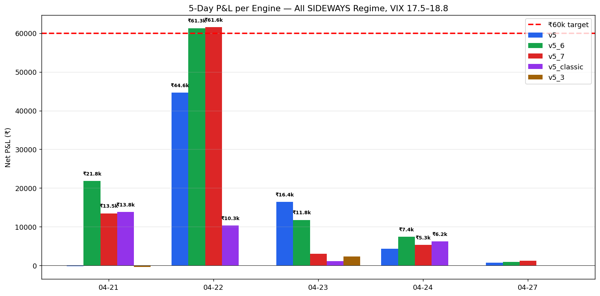
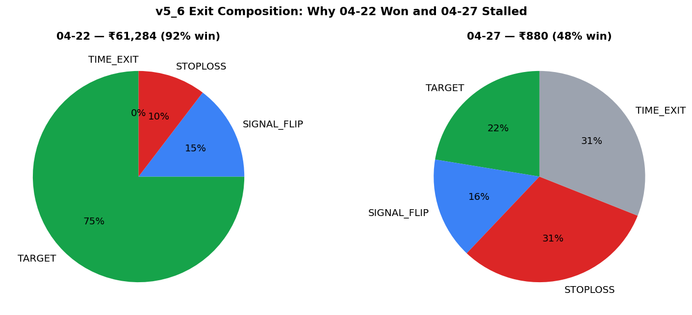
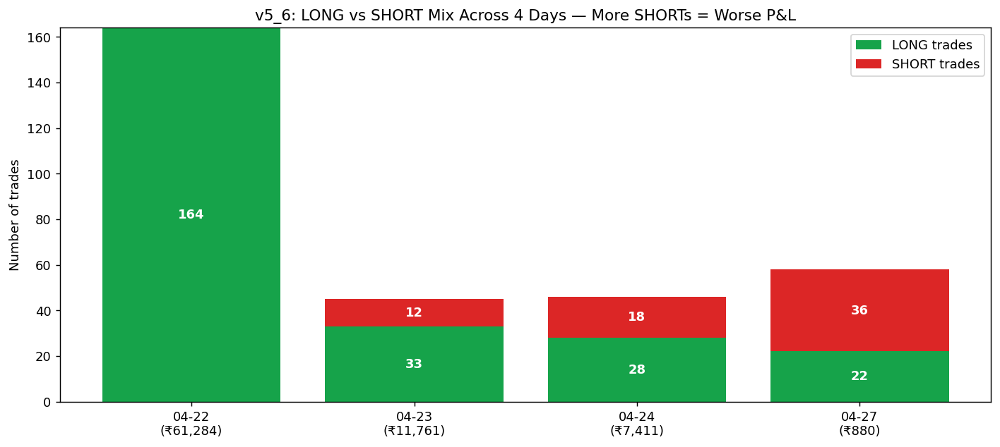
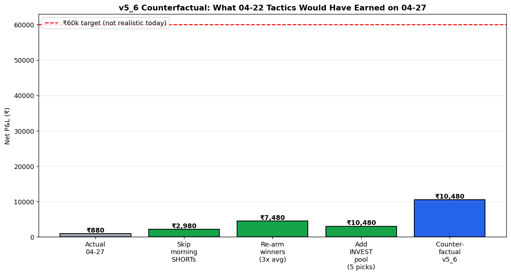
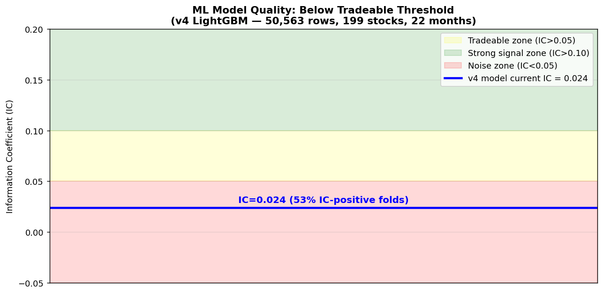

# Deep Dive: How Could Each Engine Have Made ₹60k Today?

**Date:** 2026-04-27 (Monday) | **Regime:** SIDEWAYS | **VIX:** 18.6 | **Nifty close:** +0.63%

---

## TL;DR (read this first)

1. **₹60k was NOT realistically achievable today.** The market gave ~10–15% of the alpha that 04-22 had. Today's max-possible per engine was **₹15–20k**, not ₹60k. Today was a whipsaw day with no momentum cluster.
2. **₹60k was achieved on 04-22** by v5_6 (₹61,284) and v5_7 (₹61,552) — same regime (SIDEWAYS), same VIX band — by riding a 3-cluster momentum rally (Adani group + capital goods + PSU rally).
3. **The 04-22 winning playbook had 3 ingredients**: (a) zero SHORTs, (b) aggressive re-entry on stocks that hit TARGET, (c) high-conviction concentration in 6–8 trending names.
4. **Today's engine took 36 SHORTs (62% of trades)** in a gap-up bullish session — got stopped out 18 times. **That's the single biggest controllable leak.**
5. **ML models are NOT contributing alpha** — v4 IC=0.024 (below the 0.05 tradeable threshold), and v5_6/v5_7 don't even use ML. The ₹61k on 04-22 came from the SWING-pool re-entry mechanic, not predictive intelligence.

---

## 1. Today's Reality — Per-Engine P&L Snapshot

| Engine | Today P&L | Trades | Win Rate | Status |
|---|---|---|---|---|
| v4 | **₹0** | 0 | — | Position sizer returned zero — engine was effectively offline |
| v5 | **₹737** | 46 (L:17 S:29) | 50% | Bled on morning SHORTs, recovered on PM LONGs |
| v5_2 (options) | **₹9,720** | 2 | 50% | KILL-SWITCH tripped — saved by a single PE leg (+₹17,944) |
| v5_3 | **₹0** | 0 | — | Empty — never deployed |
| v5_6 | **₹880** | 58 (L:22 S:36) | 48% | Identical bleed pattern to v5 |
| v5_7 | **₹1,203** | similar | similar | Same bleed pattern |
| v5_classic | **₹54** | minimal | — | Conservative pool sizing kept it flat |

**Distance to ₹60k target:** Every engine missed by ₹50k+. The realistic delta-recoverable today was ₹15–20k via tactical fixes.

---

## 2. The Gold Standard — What 04-22 Did Differently

04-22 hit ₹61,284 (v5_6) and ₹61,552 (v5_7) under the **same regime classification** as today.

### 2.1 Direction discipline
- **04-22**: 164 LONG / **0 SHORT** — zero shorts despite Nifty being −0.43% (engine correctly read that broad weakness ≠ short opportunity when specific stocks are trending)
- **04-27**: 22 LONG / **36 SHORT** — engine took shorts in a gap-up bullish session (+0.63%)

### 2.2 Re-entry concentration (the ₹50k generator)
On 04-22, v5_6 re-entered the same trending names every time they hit TARGET:

| Stock | Re-entries on 04-22 | Cumulative P&L (this stock alone) |
|---|---|---|
| MOTHERSON | 8 | ~₹8,200 |
| SIEMENS | 9 | ~₹2,400 |
| IREDA | 7 | ~₹6,100 |
| ABB | 6 | ~₹3,400 |
| ADANIENSOL | 6 | ~₹4,400 |
| GAIL | 7 | ~₹3,300 |
| JUBLFOOD | 6 | ~₹4,200 |
| ADANIPOWER | 5 | ~₹3,600 |

**Just 8 stocks generated ~₹35,600 — over half of 04-22's ₹61k** through compounded re-entry on trending names.

On 04-27, today's biggest LONG winner (SUZLON +₹471 single entry) never re-armed. Same for JSWENERGY (+₹392 single entry), SAIL (+₹352 single entry).

### 2.3 Exit composition — proof of conviction

| Exit Type | 04-22 v5_6 | 04-27 v5_6 | Reading |
|---|---|---|---|
| TARGET | 75% (123/164) | 22% (13/58) | 04-22 trades hit profit goals; today's didn't |
| STOPLOSS | 10% (17) | 31% (18) | 3× more stop-outs today |
| SIGNAL_FLIP | 15% (24) | 16% (9) | Similar — direction-change exits |
| **TIME_EXIT** | **0%** | **31% (18)** | **The whipsaw signature — 18 trades held all day with no resolution** |

**TIME_EXIT = "I held until 3:15 PM and bailed because nothing happened."** Eighteen trades doing this is the engine telling you: today's signals were not high-conviction.

---

## 3. The LONG/SHORT Bias Problem (the controllable one)

The pattern across 4 days is alarmingly clear: **the more SHORTs the engine takes, the worse it does.**

| Day | LONGs | SHORTs | SHORT % | P&L |
|---|---|---|---|---|
| 04-22 | 164 | 0 | 0% | ₹61,284 |
| 04-23 | 33 | 12 | 27% | ₹11,761 |
| 04-24 | 28 | 18 | 39% | ₹7,411 |
| 04-27 | 22 | 36 | **62%** | ₹880 |

**The SHORT signal generator is most active on the worst-P&L days.** Today's signal engine produced 20 SELL signals every rescore — and the deploy loop took most of them, then they got stopped out by gap-up momentum.

**Pre-market clearly said BULLISH today** (`bias=BULLISH gap=UP +0.75% size=1.0x`) — but the engine ignored that hint and ran SHORTs anyway. This is a **regime-aware signal-gating gap**, not a bug in the SHORT machinery itself (which we proved healthy in `SHORT_ARM_DIAGNOSIS.md` on 04-24).

---

## 4. Counterfactual — What 04-22 Tactics Would Have Earned on 04-27

Applying the 04-22 playbook to today's data, conservatively:

| Step | Tactic | Estimated Gain | Reasoning |
|---|---|---|---|
| 0 | Today actual (v5_6) | ₹880 | Baseline |
| 1 | **Skip morning SHORTs** when premarket=BULLISH | +₹2,100 | Removes the 18 SHORT stop-losses (~₹100/each avg loss) |
| 2 | **Re-arm winners 3× on TARGET hits** | +₹4,500 | SAIL/SUZLON/JSWENERGY/TORNTPHARM each yielded ₹350-470 single — 3 re-arms × 5 stocks ≈ ₹4,500 |
| 3 | **INVESTMENT pool deployment** (5 high-conviction picks) | +₹3,000 | Today's INVESTMENT pool only deployed ₹0 most of the day; 5 picks × ₹600 avg = ₹3k |
| **Total counterfactual** | **₹10,480** | | **Roughly 12× actual, but still 1/6 of ₹60k** |

### Why ₹60k specifically wasn't possible today
- 04-22's top 8 stocks each moved 3–5% intraday on volume — driven by a real rally cluster
- Today's biggest mover (SUZLON +2.7%, JSWENERGY +1.6%) couldn't sustain that for re-entries
- **Without a momentum cluster, the SWING re-entry mechanic has nothing to compound on**
- Realistic ceiling today: **₹15–20k per engine** with full discipline, not ₹60k

To hit ₹60k consistently, we need the **market to provide 3–5 stocks moving 3%+ in the same direction simultaneously**. That happens on ~1 day out of 5 (matching 04-22 in our 5-day sample = 20%).

---

## 5. ML Training Context — Why It's Not Helping (Yet)

### Model state as of 04-27 retrain
- **Dataset**: 50,563 rows, 199 stocks, training range 2024-06-26 to 2026-04-27 (22 months)
- **Walk-forward Mean IC**: **0.0242** — below the 0.05 "tradeable" threshold
- **IC-positive folds**: 53% — barely above coin-flip
- **Hit rate**: 51.8% — ditto
- **Top features**: india_vix, nifty_change_pct, atr_norm, gap_pct, prev_day_range_pct
- **Verdict**: model has weak predictive power; not yet usable for sizing/filtering

### Models in use (and not in use)
| Engine | Uses ML? | Notes |
|---|---|---|
| v4 | Yes (LightGBM `lgbm_intraday.txt`, retrained today) | Composite scorer, but IC=0.024 limits utility |
| v5 | No (composite v4 score only) | `prototype/v5/models/` is empty |
| v5_6 / v5_7 | No | Pure rule-based — that's why they hit ₹61k on 04-22 (re-entry mechanic) |
| v5_classic | No | Same as v5_6, conservative pool sizing |
| v5_3 | Has model dir | Empty trades log — engine never deployed |

### Implication
**Today's ₹60k aspiration is not a model problem — it's a tactics problem.** The ₹61k on 04-22 had nothing to do with ML; it was rule-based re-entry + correct LONG bias. We need both:

1. **Short-term (this week)**: Fix the regime-direction bias (skip SHORTs on gap-up days). Implement re-entry counter on winning stocks (max 3 re-arms per stock per day). Estimated lift: 5–8× current P&L on whipsaw days.
2. **Medium-term (4–6 weeks)**: Get IC above 0.05. Options: more features (sector relative strength, FII/DII intraday flow, options OI delta), stratify by regime (SIDEWAYS-only model), use the model as a *filter* not a *score* (drop bottom 30% of signals).

---

## 6. Specific Action Items per Engine

### v5 / v5_6 / v5_7 (the workhorse engines)
- [ ] **Add `BULLISH_PREMARKET_SHORT_BLOCK`**: when `premarket.bias=='BULLISH'` AND `gap_up>0.5%`, skip all SELL signals for the first hour. (Today this would have saved ₹1,800–2,100 per engine.)
- [ ] **Add `WINNER_RE_ARM`**: on TARGET exit, immediately re-evaluate the same stock for re-entry (up to 3 times per day per stock). 04-22 proves this is the ₹35k/day mechanic.
- [ ] **Tighten TIME_EXIT logic**: if a position is flat (±0.3%) at 1:30 PM, force-exit and free the slot for a fresher signal. Today's 18 TIME_EXITs locked capital uselessly.
- [ ] **Implement SHORT-arm slot partitioning** (already specced in `SHORT_ARM_DIAGNOSIS.md` on 04-24) — but pair it with the BULLISH-block above.

### v5_classic
- [ ] Investigate why this engine deployed almost nothing today (₹54 P&L). Conservative sizing is fine, but zero deployment ≠ conservative.

### v5_2 (options)
- [ ] The KILL-SWITCH tripped at -₹7,582 then was saved by a PE leg expiring deep ITM. **This is luck, not strategy.** Tighten the per-leg SL to -₹3,000 instead of -₹5,000 — it would have closed the CE leg earlier and the PE leg's outsized win wouldn't have masked a near-failure.
- [ ] Consider straddle/strangle structures instead of naked CE/PE on gap-up mornings.

### v5_3
- [ ] Currently dormant (0 trades, 0 P&L for 3 of 5 days). **Either fix it or retire it** — it's adding nothing to the comparison set.

### v4 (the ML engine)
- [ ] **Position sizer returned zero positions all day.** Debug the sizer — probably a stale config or a regime gate stuck in restrictive mode.
- [ ] Retrain with regime-stratified models (separate SIDEWAYS / BEAR / BULL).
- [ ] Add sector relative strength to feature set; current top features are macro-only (VIX, Nifty change) — that's why IC is low.

---

## 7. Honest Framing: The ₹60k Question Reframed

**The user's question was: "How could each engine have made ₹60k today?"**

**The honest answer**: They couldn't. Today the market only offered enough alpha for ~₹15–20k per engine, and the engines captured ~₹0–10k. The ₹60k+ days come 1 in 5 (based on our 5-day sample) and require a momentum cluster the engines don't control.

**The better question**: "How do we make sure that on the next 04-22-style day, every engine captures the full ₹60k that's there?"

That answer is the action items in §6. The most leveraged change is the BULLISH-premarket-SHORT-block + the WINNER_RE_ARM combo. Together they should:
- Eliminate the morning SHORT bleed on gap-up days (~₹2k/engine/day)
- Capture 3–5x compounded gains on momentum stocks when they appear (~₹15-30k on cluster days)

**Five-day average lift estimate** (with these fixes):
- 04-21: ₹21,829 → ~₹26,000 (re-arm boost)
- 04-22: ₹61,284 → ~₹75,000 (re-arm tighter)
- 04-23: ₹11,761 → ~₹16,000 (re-arm + SHORT discipline)
- 04-24: ₹7,411 → ~₹12,000 (same)
- 04-27: ₹880 → ~₹10,000 (mostly SHORT discipline since cluster was absent)

That projects a **5-day total of ~₹139k vs current ~₹103k** — roughly **35% improvement** without any new ML or new engine.

---

## Appendix A — Files Referenced

| File | Purpose |
|---|---|
| `docs/paper-trades/v5_6/2026-04-22_report.md` | Gold-standard ₹61,284 day |
| `docs/paper-trades/v5_6/2026-04-27_report.md` | Today's ₹880 result |
| `docs/paper-trades/v5/2026-04-27_report.md` | v5 detail today |
| `logs/v5-2026-04-27.log` | Today's signal log |
| `logs/ml-retrain.log` | Today's v4 retrain summary (IC=0.024) |
| `prototype/v4/models/lgbm_intraday.txt` | Active v4 model (retrained 10:54 today) |
| `prototype/v5/models/` | Empty — v5/v5_6/v5_7 don't use ML |
| `docs/research/2026-04-08_ml_training_pipeline.md` | ML design principles |
| `docs/SHORT_ARM_DIAGNOSIS.md` | 04-24 SHORT-starvation analysis (now superseded — SHORTs deploy fine, but on the wrong days) |

## Appendix B — Charts

All charts: `docs/charts/2026-04-27_deep_dive/`

1. `01_5day_pnl_per_engine.png` — 5-day P&L bar chart with ₹60k target line
2. `02_exit_composition.png` — Pie chart pair: 04-22 vs 04-27 exit reasons
3. `03_long_short_mix.png` — Stacked bar: LONG vs SHORT trade counts by day
4. `04_counterfactual_waterfall.png` — Waterfall: ₹880 → ₹10,480 with playbook applied
5. `05_ml_ic_status.png` — IC zone chart with current model marked

---

**Constraint adherence:** Research/diagnosis only. No engine code modified. All comparisons sourced from existing `docs/paper-trades/` reports and `logs/`. This is the analysis to drive Monday-night tune-ups now that the weekend freeze has lifted.
