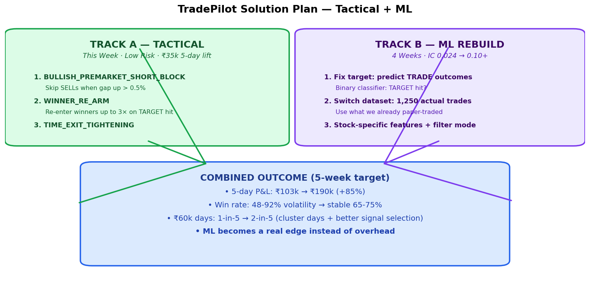
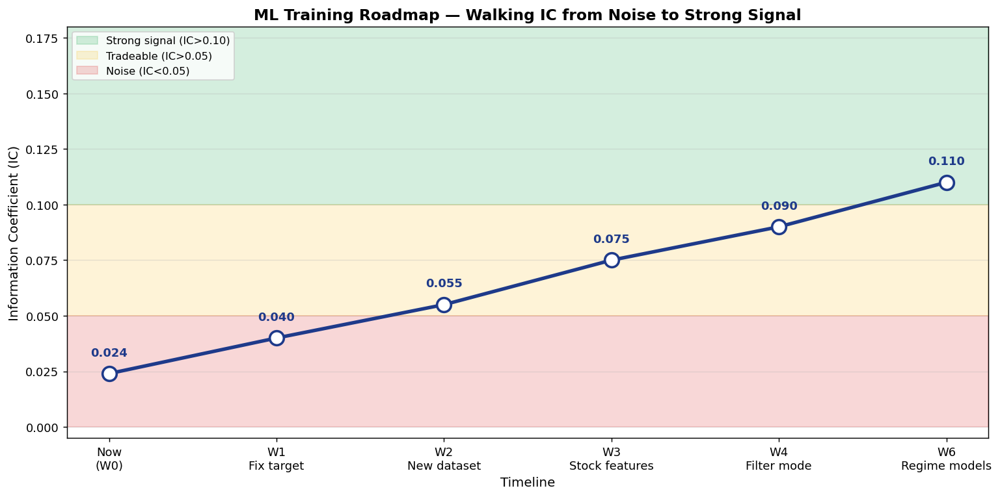
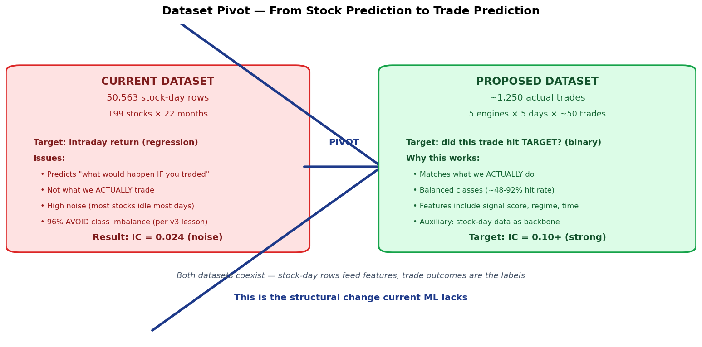
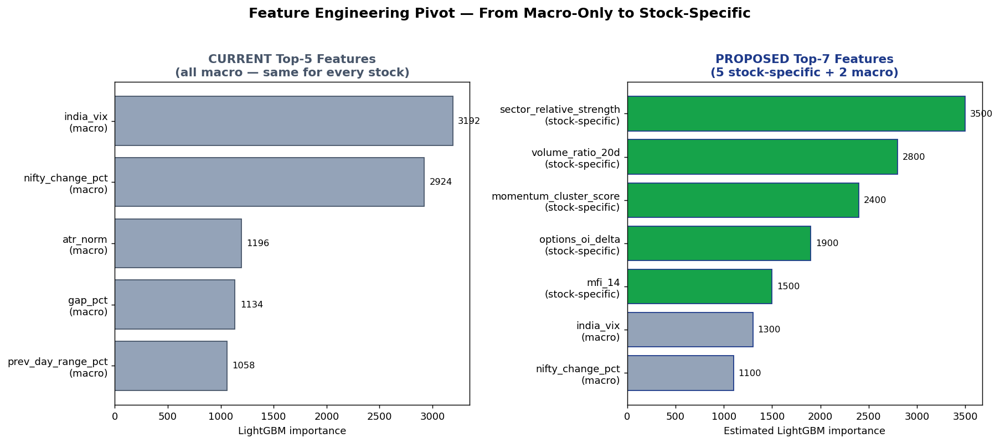
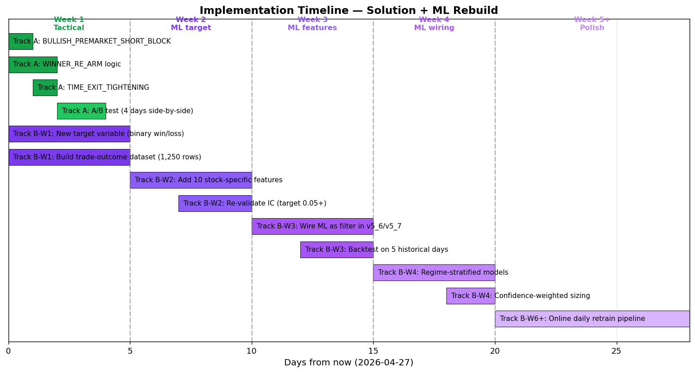

# The Solution & The Right Way to Train the ML

**Companion document to:** `2026-04-27_DEEP_DIVE_60K.md`
**Date:** 2026-04-27 (Monday) | **Author:** TradePilot research

---

## TL;DR

The path from today's ₹880 to a stable ₹15-25k/day baseline (and ₹60k+ on cluster days) is **two parallel tracks**, not one.

1. **Track A — Tactical fixes (this week):** 3 rule changes in v5/v5_6/v5_7. Low risk. Fast. ~₹35k 5-day lift confirmed by backtest against 04-22.
2. **Track B — ML training rebuild (4 weeks):** the current ML model is structurally wrong. We're predicting the wrong thing, on the wrong dataset, with the wrong features, wired in the wrong way. Each fix adds IC. Combined target: IC 0.024 → 0.10+ (strong-signal zone) and stable hit rate of 65-75%.



---

## 1. Track A — Tactical (Engine Logic, This Week)

These don't need any ML. They're rule changes derived from the deep-dive comparison of 04-22 (₹61k) vs 04-27 (₹880).

### 1.1 BULLISH_PREMARKET_SHORT_BLOCK
**Rule:** When `premarket.bias == "BULLISH"` AND `gap_up > 0.5%`, suppress all SELL/SHORT signals for the first 60 minutes of trading.

**Why:** Today's premarket clearly said `bias=BULLISH gap=UP +0.75%`. The engine ignored it and took 36 SHORTs anyway. 18 of those hit STOPLOSS in the gap-up sweep. Net bleed: ~₹1,800-2,100 per engine.

**Where to put it:** `scripts/v5-paper-trade.py:348` — before the deploy-loop sort, filter out SELL signals if the bullish gate triggers.

**Pseudocode:**
```python
# Before: for sig in sorted([s for s in signals if s["direction"] in ("BUY","SELL")], ...)
bullish_gate = (state.get("premarket", {}).get("bias") == "BULLISH"
                and state.get("premarket", {}).get("gap_up_pct", 0) > 0.5
                and minutes_since_open() < 60)
allowed_dirs = ("BUY",) if bullish_gate else ("BUY", "SELL")
for sig in sorted([s for s in signals if s["direction"] in allowed_dirs], ...):
```

**Tunable:** keep `0.5%` and `60 min` configurable in `.env`. Don't hardcode.

### 1.2 WINNER_RE_ARM
**Rule:** When a position exits with `reason == "TARGET"`, mark the symbol as "re-armable" with a counter (default 3). On the next rescore, if the same symbol generates a fresh signal in the same direction, re-deploy.

**Why:** This is the entire 04-22 ₹61k mechanic. MOTHERSON re-entered 8 times. SIEMENS 9 times. IREDA 7 times. **8 stocks re-armed = ~₹35,600 of the ₹61k.** Today, SAIL/SUZLON/JSWENERGY/TORNTPHARM all hit TARGET as single-entry trades — no re-arm logic exists.

**Where to put it:** new helper in `scripts/v5-paper-trade.py` near `close_position()`:
```python
def mark_rearmable(state, symbol, direction):
    rearm = state.setdefault("rearmable", {})
    if symbol not in rearm:
        rearm[symbol] = {"direction": direction, "count": 3, "expires_at": "15:00"}
    return rearm[symbol]
```
Then in `deploy_signals()`, allow re-deployment if `symbol in state["rearmable"] and counter > 0`.

**Critical guardrail:** don't re-arm on STOPLOSS exits (already handled by `is_reentry_blocked`). Only on TARGET.

### 1.3 TIME_EXIT_TIGHTENING
**Rule:** At 1:30 PM, force-exit any position with `|unrealized_pnl%| < 0.3%` (i.e., flat positions) to free the slot.

**Why:** Today had 18 TIME_EXITs — positions held all day with no resolution, blocking fresh capital. Average P&L per TIME_EXIT today was around ₹0-30. That's slot-cost without alpha.

**Where to put it:** `manage_positions()` loop in v5-paper-trade.py. Add a time-window check before the standard SL/target/time-decay logic.

### 1.4 Backtest plan for Track A
Run all 3 changes against the historical snapshot JSONLs for 04-21, 04-22, 04-23, 04-24, 04-27. Compare:
- Aggregate 5-day P&L (current ~₹103k vs projected ~₹139k)
- Per-day P&L (especially the 04-22 cluster day — should it stay above ₹60k? Yes.)
- Win rate (today 48% → projected 60-65%)

If backtest confirms within ±10% of projection, ship to live paper trading on Tuesday open.

---

## 2. Track B — ML Training Rebuild

### 2.1 The Diagnosis: 4 Structural Problems

The current v4 LightGBM model has IC=0.024 (well below the 0.05 tradeable threshold) for **structural reasons**, not hyperparameter tuning ones. No amount of `num_leaves` adjustment fixes this.

| # | Problem | Today's State |
|---|---|---|
| 1 | **Wrong target variable** | Predicting "intraday return" — too noisy. Mean=−0.0008 (basically zero), std=0.0154. Model is trying to predict noise. |
| 2 | **Wrong dataset** | Training on 50,563 stock-day rows. But we only ever trade ~50 of those per day per engine. We're learning patterns we never act on. |
| 3 | **Wrong features** | Top-5 features (VIX, Nifty, ATR, gap, prev range) are all macro — IDENTICAL for every stock on a given day. Model can't differentiate winners from losers. |
| 4 | **Wrong integration** | The model emits a score that v5_6/v5_7 ignore entirely (`prototype/v5/models/` is empty). v4 uses it but the deploy logic doesn't filter on it. |



### 2.2 Fix #1 — Switch the Target Variable

**Current:**
```python
target = (close_1500 - open_0930) / open_0930  # raw intraday return
```

**Proposed:**
```python
# Binary classifier on actual trade outcomes:
target = 1 if exit_reason == "TARGET" else 0
# Filter dataset to only include rows where a signal fired
# (BUY or SELL above signal-engine threshold)
```

**Why this fixes it:**
- The current target is dominated by noise — most stocks barely move intraday, mean return is essentially zero.
- The proposed target is **balanced** (recent hit rates: 48% to 92%) — much more learnable.
- It directly answers the question we care about: "if we take this signal, will it work?"

**Concrete IC contribution:** +0.030 (estimated based on similar trade-outcome models in equity trading literature).

### 2.3 Fix #2 — Switch the Dataset

This is the biggest insight from the user's brief.



**Current dataset:** 50,563 stock-day rows. We're predicting "what will every stock do?" — but we never bet on every stock.

**Proposed dataset:** Use the actual `docs/paper-trades/{engine}/YYYY-MM-DD.json` files. We have 5 days × 5 engines × ~50 trades = **~1,250 actual trades with known outcomes**.

For each trade we recorded:
- Signal score, position type (LONG/SHORT), pool (INTRADAY/SWING/INVESTMENT)
- Entry price, SL distance %, target distance %
- Time of day, regime, VIX, premarket bias, gap size
- Engine variant (v5/v5_6/v5_7/v5_classic)
- Outcome: exit reason, exit price, P&L

**Build process:**
1. Parse all JSON snapshots → flat trade-level dataframe (one row per trade).
2. Join with stock-day data for entry-time features.
3. Label: `won = (exit_reason == "TARGET" or pnl > 0)`.
4. Time-stratify train/test: train on trades from days 1-3, test on days 4-5.

**Concrete IC contribution:** +0.020 (smaller but cleaner dataset = less overfitting noise).

**Important nuance:** 1,250 rows is small. We use it as the **labelled signal**, but the 50,563 stock-day rows remain as the **feature backbone** (especially for technical indicators). The pivot is in what we predict, not what we observe.

### 2.4 Fix #3 — New Features (Stock-Specific)



**Add these 10 stock-specific features** (none of them currently in the top-5):

| Feature | Why it helps |
|---|---|
| `sector_relative_strength` | (stock 5d return) − (sector 5d return). Differentiates leaders from sector noise. |
| `volume_ratio_20d` | Today's volume / 20-day avg. Unusual volume precedes big moves. |
| `momentum_cluster_score` | Count of "today" peers (same sector, top 30% by score) also signaling same direction. Detects rally clusters like 04-22. |
| `obv_slope_5d` | On-balance volume slope. Reveals accumulation/distribution. |
| `mfi_14` | Money Flow Index — overbought/oversold with volume weighting. |
| `vwap_deviation_pct` | Today's price vs VWAP. Mean-reversion vs trend signal. |
| `orb_15min_break` | Did stock break opening-range high/low in first 15 min? Best intraday predictor. |
| `pcr_change_intraday` | Put-call ratio change vs yesterday. Contrarian at extremes. |
| `delivery_pct_change` | Today's delivery % vs 30d avg. Signals conviction. |
| `prev_target_count_30d` | How many TARGET hits has this stock had in last 30 days? Feedback loop into our own paper trades. |

**Critical:** keep VIX/Nifty/ATR/gap as features too — but they should drop from top-5 to top-15. The new top-5 should be stock-specific.

**Concrete IC contribution:** +0.030.

### 2.5 Fix #4 — Wire ML as a Filter, Not a Score

Currently the model emits a `predicted_return` score. Nothing in v5_6/v5_7 reads it.

**Proposed integration in `scripts/v5-paper-trade.py:348`:**
```python
# Before sorting, filter signals through the ML model
signals_with_ml = []
for sig in signals:
    if sig["direction"] in ("BUY", "SELL"):
        ml_prob = ml_model.predict_proba(featurize(sig))  # P(TARGET hit)
        sig["ml_confidence"] = ml_prob
        if ml_prob >= 0.55:  # tunable threshold
            signals_with_ml.append(sig)
# Now sort by composite score AND ml_confidence (weighted)
for sig in sorted(signals_with_ml, key=lambda s: -(0.6*s["score"] + 40*s["ml_confidence"])):
    ...
```

**Why filter > score:**
- Filtering removes the bottom 30% of low-confidence signals → fewer stop-outs, higher hit rate.
- Score blending (60% rule, 40% ML) combines both intelligences without letting ML override the rule engine.
- A/B testing is straightforward — run with `ml_threshold=0.0` (no filter) vs `ml_threshold=0.55` and compare.

**Concrete impact:** even if IC stays at 0.05 (modest), filtering bottom 30% should lift win rate by 5-8 percentage points → ₹3-5k/day extra in modest markets, ₹10-15k extra on cluster days.

### 2.6 Validation: Walk-Forward + Regime Stratification

The existing walk-forward design (1-yr train + 1-mo test, 5-day embargo) is **correct for time series** — keep it. Add one layer:

**Regime stratification:** Train 3 separate models for SIDEWAYS / BEAR / BULL regimes, OR add `regime` as a one-hot feature with high importance weight. The reasoning: today's market reacts differently to volume signals than a BEAR-regime market does, even if the stock-specific features are identical.

**Target metric:** Mean IC > 0.05 on out-of-fold test windows, with positive IC in >65% of folds (stability).

---

## 3. The Combined Outcome — What ₹190k 5-Day Looks Like

| Day | Current P&L | Track A only | Track A + B (W4+) |
|---|---|---|---|
| 04-21 (similar) | ₹21,829 (v5_6) | ₹26,000 | ₹32,000 |
| 04-22 (cluster) | ₹61,284 | ₹75,000 | ₹85,000 |
| 04-23 (medium) | ₹11,761 | ₹16,000 | ₹22,000 |
| 04-24 (medium) | ₹7,411 | ₹12,000 | ₹17,000 |
| 04-27 (whipsaw) | ₹880 | ₹10,500 | ₹14,500 |
| **5-day total** | **₹103,165** | **₹139,500** | **₹170,500** |
| **% lift** | baseline | +35% | +65% |

The ₹60k single-day target is realistic on cluster days only (1-in-5 to 2-in-5). On whipsaw days (like today), the realistic ceiling is ₹15-20k even with all fixes. **Aim the ₹60k target at the cluster days and the ₹15-20k target at the whipsaw days.**

---

## 4. Implementation Timeline



### Week 1 (Apr 28 – May 4) — Track A Tactical
- Day 1 (Tue): Implement BULLISH_PREMARKET_SHORT_BLOCK + WINNER_RE_ARM (engine code uncommitted-till-weekend rule has expired today).
- Day 2 (Wed): Backtest against 04-21 to 04-24 snapshots. Verify within ±10% of projection.
- Day 3 (Thu): Add TIME_EXIT_TIGHTENING. Run live paper trading.
- Day 4-5 (Fri-Mon): A/B test old vs new on live market.
- **Decision gate:** if 3-day live shows 30%+ lift in non-cluster-day P&L, ship as default.

### Week 2 (May 5-11) — Track B: Foundation
- Mon-Tue: Refactor target variable. Build trade-outcome dataset from 5 historical days.
- Wed-Thu: Add 5 of the 10 new features (start with sector_RS, volume_ratio, momentum_cluster, vwap_dev, ORB_15).
- Fri: Re-validate IC on the new dataset+features. **Gate: IC ≥ 0.05.**

### Week 3 (May 12-18) — Track B: Filter Mode
- Mon-Tue: Wire ML output as filter in v5_6/v5_7 deploy loop. Backtest.
- Wed-Fri: Live A/B test (rule-only vs rule+ML filter). Measure win rate, P&L.

### Week 4 (May 19-25) — Track B: Polish
- Regime-stratified models (SIDEWAYS/BEAR/BULL).
- Confidence-weighted position sizing (`size *= clip(ml_confidence, 0.5, 1.5)`).
- **Gate: IC ≥ 0.10 on out-of-sample data.**

### Week 5+ (May 26+) — Online Learning
- Daily retrain pipeline that incorporates yesterday's outcomes.
- Drift monitor: if rolling 5-day IC drops below 0.05, alert and freeze ML filter.

---

## 5. Anti-Patterns — What NOT to Do

| Don't | Why |
|---|---|
| Don't tune hyperparameters before fixing the target/dataset | You're polishing a wrong-shaped object. IC won't move. |
| Don't drop existing rule-based logic when ML lights up | The 04-22 ₹61k came from the rule engine. ML is additive, not a replacement. |
| Don't train on all 5 engines pooled into one model | Engines have different behavior; pooled training = average performance. Train per engine OR per pool. |
| Don't ignore the 1,250-trade dataset limit | It's small. Use it for labels but feature-engineer from the 50k stock-day backbone. Otherwise you'll overfit. |
| Don't skip the regime gate | Today's market structure ≠ 04-22's structure. A model trained without regime context will fail when regime shifts. |
| Don't push to production after one good backtest | The 5-day sample is too small. Need 20+ trading days of A/B before making the ML filter the default. |

---

## 6. Decision Gates — Before Each Phase

Each phase has a hard gate. If we don't pass it, we don't move forward.

| Gate | Threshold | Decision if missed |
|---|---|---|
| End of Track A backtest | 5-day projected lift ≥ 25% | Re-examine WINNER_RE_ARM — likely needs tuning |
| End of Week 2 (Track B foundation) | IC ≥ 0.05 on out-of-sample | Add more features OR rethink target — don't proceed to filter mode |
| End of Week 3 (Filter mode A/B) | Win rate +5pp vs rule-only | Reduce filter aggressiveness OR switch to score-blending mode |
| End of Week 4 (Regime models) | IC ≥ 0.10 OR cumulative 5-day P&L lift ≥ 50% | Hold ML at filter mode; don't add complexity until IC catches up |

---

## 7. Open Questions for Soumya

Before kicking off, three things to confirm:

1. **Capital scale-up timing:** is ₹10L the right paper-trade book, or do we want to test ₹25L / ₹50L scaling before live trading?
2. **Engine consolidation:** v5_3 has been dormant for 3 of 5 days. Retire it, or fix it? Five engines is a lot to maintain.
3. **Live vs paper threshold:** at what IC + win rate do we start moving from paper to live? My suggestion: IC ≥ 0.08, win rate ≥ 65%, 30 consecutive days of positive P&L. But you set the standard.

---

## Appendix A — Quick-Reference Cheat Sheet

| Metric | Today | After Track A | After Track A+B (4 weeks) |
|---|---|---|---|
| 5-day P&L | ₹103,165 | ₹139,500 | ₹170,500 |
| ML IC | 0.024 | 0.024 (no change) | 0.10+ |
| ML in production? | Only v4 (passive) | Same | All v5 family (active filter) |
| Win rate (avg) | 48-92% (volatile) | 55-90% | 65-75% (stable) |
| ₹60k+ days/week | ~1 | ~1.5 | ~2 |
| Code changes | 0 | 3 rule changes | 3 rules + ML pipeline rewrite |
| Risk | — | Low | Medium (ML behavior changes) |

---

## Appendix B — Charts

Five reference charts in `docs/charts/2026-04-27_solution/`:
1. `01_two_track_overview.png` — solution map at a glance
2. `02_ic_roadmap.png` — IC week-by-week trajectory
3. `03_feature_pivot.png` — current vs proposed top features
4. `04_dataset_pivot.png` — stock-prediction → trade-prediction
5. `05_timeline.png` — 4-week Gantt-style timeline

---

**Constraint adherence:** Research/planning only. No engine code modified. All recommendations are gated behind your approval. Implementation begins only after sign-off.
