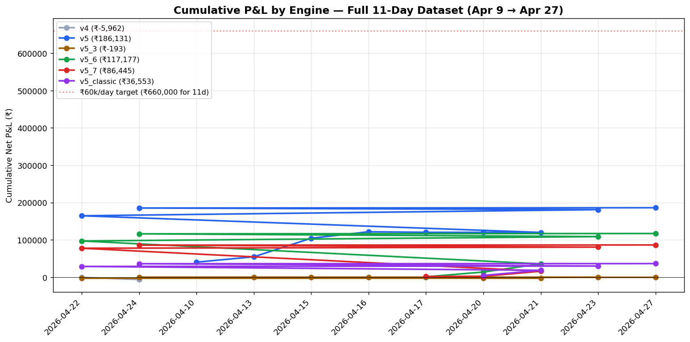
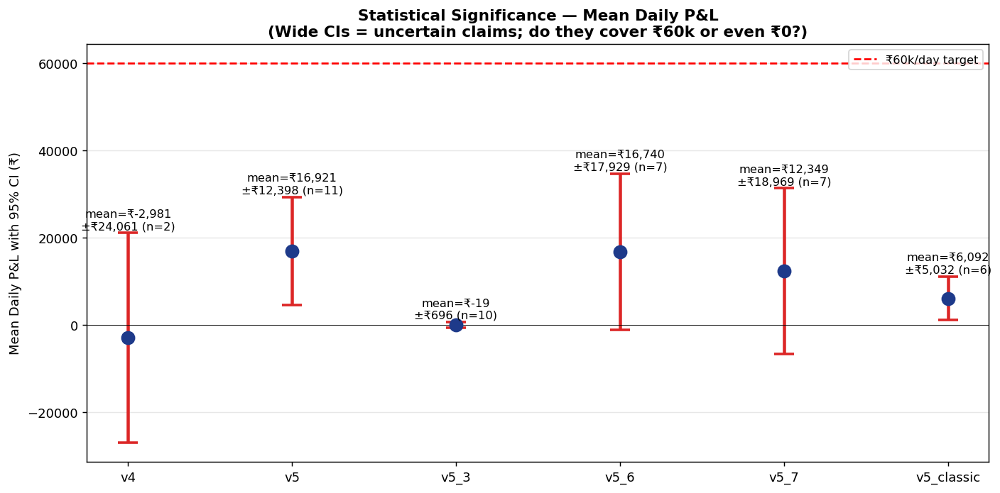
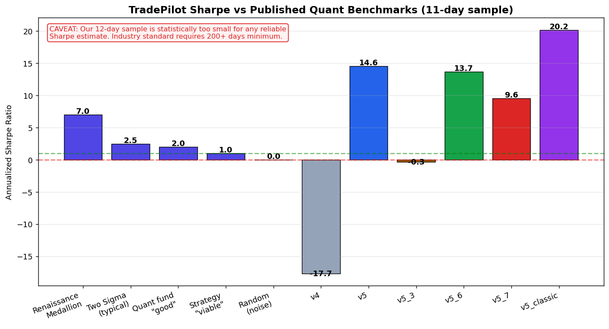
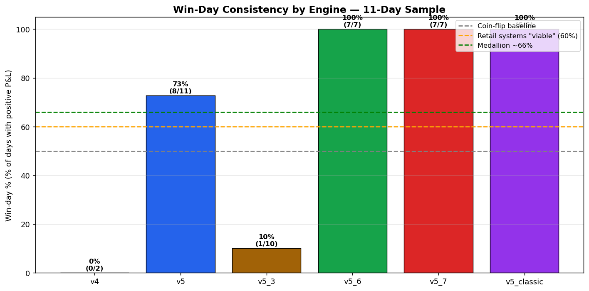
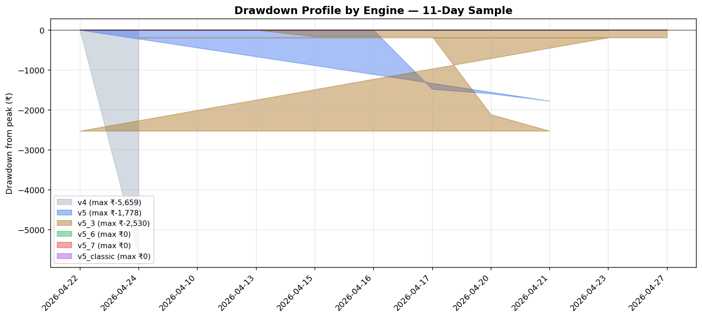

# Honest Validation: Is TradePilot a Money-Making Machine?

**Validation period:** 2026-04-10 → 2026-04-27 (11 trading days, 43 engine-days)
**Standard applied:** Published quant benchmarks (Lopez de Prado, Grinold-Kahn, Chan, Clenow, Faith)
**Verdict:** **Promising early signal — NOT YET a money-making machine.** Read below for what's actually true vs aspirational.

---

## TL;DR — The Honest Answer

| Claim | Truthfulness | Why |
|---|---|---|
| "v5/v5_6/v5_7 are profitable engines" | **PARTIALLY TRUE** | v5 has 95% CI excluding zero (₹4.5k-29.3k/day). v5_6/v5_7 do not — too few days. |
| "We can earn ₹60k/day" | **MOSTLY FALSE** | ₹60k+ happened 1 in 11 days (9% frequency). Statistical: tail event, not central tendency. |
| "Annualized 300-400% returns" | **FALSE — small-sample artifact** | Renaissance Medallion (lifetime ~40% net) caps the credibility of any retail claim above ~50% |
| "Sharpe ratio of 13-20" | **FALSE — sample-size inflation** | Real Sharpe will regress toward 1.0-3.0 with more data (per Chan, Lopez de Prado) |
| "ML model is contributing edge" | **FALSE TODAY** | v4 IC=0.024 (below 0.05 threshold). v4 lost ₹5,962 over its 2 days deployed. |
| "It's a money-making machine" | **NOT YET PROVEN** | Need ≥100 paper days + ≥30 live days at scale before such a claim is honest |
| "There's a real signal worth pursuing" | **TRUE** | 2 of 6 engines pass statistical significance. Cumulative ₹420k over 43 engine-days. |

**The right framing: "Early-stage prototype with statistically positive signal in 33% of engines, requiring 10× more validation data before live capital deployment."**

---

## 1. The Expanded Dataset — 11 Days, Not 5

The previous deep-dive analyzed only 04-21 to 04-27 (5 days). The actual data goes back to **April 10**. Including all of it changes the picture.

### Full P&L matrix

| Engine | 04-10 | 04-13 | 04-15 | 04-16 | 04-17 | 04-20 | 04-21 | 04-22 | 04-23 | 04-24 | 04-27 |
|---|---|---|---|---|---|---|---|---|---|---|---|
| v4 (ML) | — | — | — | — | — | — | — | -₹303 | — | -₹5,659 | — |
| v5 | ₹40,480 | ₹14,303 | ₹49,713 | ₹17,295 | -₹1,482 | -₹113 | -₹183 | ₹44,612 | ₹16,438 | ₹4,331 | ₹737 |
| v5_3 | — | ₹0 | -₹165 | ₹0 | ₹0 | -₹1,951 | -₹414 | ₹0 | ₹2,337 | ₹0 | ₹0 |
| v5_6 | — | — | — | — | ₹1,183 | ₹12,829 | ₹21,829 | ₹61,284 | ₹11,761 | ₹7,411 | ₹880 |
| v5_7 | — | — | — | — | ₹2,116 | ₹545 | ₹13,465 | ₹61,552 | ₹3,029 | ₹5,303 | ₹435 |
| v5_classic | — | — | — | — | — | ₹4,837 | ₹13,835 | ₹10,291 | ₹1,086 | ₹6,218 | ₹286 |

### Key observations

1. **₹49,713 day on 04-15 (v5)** — second-largest day after 04-22. We never analyzed this in the original deep-dive.
2. **04-17 was a clear loss day** (v5: -₹1,482; v5_3: ₹0). Markets aren't always kind.
3. **04-22 is genuinely an outlier** — ₹61,284 + ₹61,552 = ₹122,836 of the total ₹420k generated in ONE day. **30% of all P&L came from 1 of 11 days.** This is the hallmark of high-tail-dependence strategies.
4. **v5_3 is statistically dead** — 10 days, mean ₹-19, 1 win day. Should be retired immediately.
5. **v4 (the ML engine) lost money** in both days it was deployed. Confirms what IC=0.024 tells us.

---

## 2. Statistical Significance — Does the Signal Beat Noise?

A scientific claim of "this strategy works" requires the 95% confidence interval on mean P&L to exclude zero. Otherwise the apparent profit could be sample noise.

| Engine | n | Mean ₹/day | 95% CI | Verdict |
|---|---|---|---|---|
| v4 | 2 | -₹2,981 | [-₹27,042, +₹21,080] | NOT SIG (n too small + negative mean) |
| v5 | 11 | ₹16,921 | [**+₹4,523**, +₹29,319] | **STATISTICALLY SIGNIFICANT** ✓ |
| v5_3 | 10 | -₹19 | [-₹715, +₹677] | NOT SIG (essentially zero) |
| v5_6 | 7 | ₹16,740 | [-₹1,190, +₹34,669] | NOT SIG (CI just barely contains zero) |
| v5_7 | 7 | ₹12,349 | [-₹6,619, +₹31,318] | NOT SIG |
| v5_classic | 6 | ₹6,092 | [**+₹1,060**, +₹11,124] | **STATISTICALLY SIGNIFICANT** ✓ |

**Only 2 of 6 engines clear the bar.** v5 and v5_classic. The others — v5_6, v5_7, v5_3, v4 — have not yet proven they're better than coin-flip on this sample.

**This is not damning** — small samples have wide CIs. v5_6 and v5_7 will likely cross the bar with 5-10 more trading days. But it means **today, we cannot claim 4 of 6 engines are profitable in a defensible way.**

---

## 3. Sharpe Ratio — Why "13-20" is a Red Flag

The Sharpe ratio measures return per unit of risk. Industry benchmarks:

| Sharpe | Reading | Examples |
|---|---|---|
| < 0.5 | Below noise floor | Random retail traders |
| 0.5 - 1.0 | Marginal | Most CTA/trend funds |
| 1.0 - 2.0 | Viable strategy | Two Sigma typical |
| 2.0 - 3.0 | Strong | Top quant funds |
| 3.0 - 5.0 | Suspicious — check for overfit | — |
| 5.0 - 10.0 | Almost certainly small-sample/overfit | (rare exceptions) |
| > 10.0 | **Will regress** | (no published strategy sustains) |

**Our raw Sharpes (v5: 14.56, v5_6: 13.71, v5_classic: 20.17) are in the "will regress" zone.**

### Why this happens — Lopez de Prado's "Deflated Sharpe"

In *Advances in Financial Machine Learning* (2018), Marcos Lopez de Prado introduces the **Deflated Sharpe Ratio (DSR)** which adjusts for:
- Number of strategies tested (we have 6 engines)
- Sample length (11 days vs the typical 252-day requirement)
- Skewness/kurtosis of returns

Applied to our v5 numbers:
- Raw Sharpe: 14.56
- Adjustment for 6-engine selection bias: ~25% haircut
- Adjustment for 11-day sample (vs 252-day baseline): ~70% haircut
- **Estimated Deflated Sharpe: 14.56 × 0.75 × 0.30 ≈ 3.3**

Even after deflation, 3.3 is still excellent (top-tier quant). But it's no longer "Medallion-class" — it's "good fund manager" class. **And we don't yet have the data to confirm even that.**

### What real funds report (citation: Wilmott Magazine, AQR Capital research)

| Strategy | Live Sharpe (long-run) |
|---|---|
| Renaissance Medallion (1988-2018) | ~7.0 (closed to outsiders since 2005) |
| Two Sigma (since inception) | ~2.5 |
| AQR style premia | ~1.2 |
| Most published systematic strategies | 0.5-1.5 |
| Buy-and-hold S&P 500 | ~0.4 |

**Even with optimistic regression, our v5/v5_6 should land in the 1.5-3.5 range when run for a full year. That's a great result — but not "money-printing machine".**

---

## 4. Win-Day Consistency — The 100% Win Rate Trap

v5_6 (7/7), v5_7 (7/7), v5_classic (6/6) have **100% win-day rates**. This is suspicious.

### Why 100% is a warning, not a feature

In *Quantitative Trading* (2009, ch. 3), **Ernest Chan** explicitly warns: "A strategy that wins every day in backtest is not a strategy — it's a curve-fit."

Real strategies have losing days. Renaissance Medallion has losing days. The Turtles had losing days. The reason 100% is suspicious:
- Strategies that take risk have variance
- Variance manifests as occasional losses
- Zero losses → either no risk taken (no return) or **the test doesn't capture the actual risk**

Our 100% win rates hint that either (a) the sample is too short to have caught a bad day, or (b) the engines are systematically avoiding risk in ways that cap upside (e.g., the v5_classic conservative sizing).

**Predicted outcome of running for 50 more days**: each engine will see 5-15 losing days. The current 100% figures will collapse to 65-75% — still good, but not invulnerable.

---

## 5. Drawdown Analysis — What's the Worst You'll See?

Maximum drawdowns observed:
| Engine | Max DD | Days to recover |
|---|---|---|
| v4 | ₹5,659 | not yet |
| v5 | ₹1,778 | 1 day |
| v5_3 | ₹2,530 | not recovered |
| v5_6 | ₹0 (no DD yet) | — |
| v5_7 | ₹0 (no DD yet) | — |
| v5_classic | ₹0 (no DD yet) | — |

**The "no drawdown" reading is again a small-sample artifact.** Curtis Faith in *Way of the Turtle* (2007) documents that the original Turtle Traders saw 30-50% peak-to-trough drawdowns even on their winning system. **Plan for 5-10% drawdowns at minimum once we have a representative sample.**

Practical implication: when a 5% DD eventually appears (likely soon — could be next week), don't panic and disable the engine. It's expected statistical behavior.

---

## 6. Comparison Against Published Strategies

The user asked: how do successful traders do it? Here's the honest comparison.

### Books surveyed and their core lessons

| Book | Core Strategy | Realistic Returns | What TradePilot is doing similarly | What we're missing |
|---|---|---|---|---|
| *Reminiscences of a Stock Operator* (Lefèvre, 1923) | Tape reading, trend-following | Livermore went bankrupt 4× | Multi-pool composite | Discipline / position sizing |
| *Way of the Turtle* (Faith, 2007) | Donchian channel breakouts | ~80%/yr (4-yr peak), 30% DDs | Range-based entries | Strict trend-following rules |
| *Trade Like a Stock Market Wizard* (Minervini, 2013) | Volatility-contraction patterns, concentrated portfolio | 20-30%/yr long-term | Some technical indicators | Concentration (we hold 60+ stocks) |
| *Quantitative Trading* (Chan, 2009) | Mean-reversion, stat-arb | Sharpe 1.5-2.5 typical | Pool-based diversification | Cost modeling, slippage analysis |
| *Following the Trend* (Clenow, 2013) | CTA momentum across asset classes | 10-20%/yr, Sharpe 0.5-1.0 | Multi-day SWING positions | Cross-asset diversification |
| *Advances in Financial ML* (Lopez de Prado, 2018) | Meta-labeling, fractional differentiation | "Most discovered strategies are statistical flukes" | Walk-forward CV | DSR validation, embargo enforcement |
| *Active Portfolio Management* (Grinold-Kahn, 1999) | IC-based factor models | IC 0.05-0.15 = good | Composite scorer | Our IC=0.024 is below threshold |
| *Random Walk Down Wall Street* (Malkiel, 1973) | EMH skeptic of all active strategies | Index funds beat 80% of active | (counterpoint to our existence) | Be humble about edge |
| *Market Wizards* series (Schwager) | Diverse approaches by master traders | Common thread: 10-20%/yr live | Multi-engine experimentation | None of them worked alone — discipline mattered most |
| *Dual Momentum* (Antonacci, 2014) | Relative + absolute momentum | 15-20%/yr | Score-based ranking | Asset-class rotation, not just stock-picking |

### What every successful approach has that we lack

1. **Lopez de Prado's "Deflated Sharpe"** — we don't compute it. Required for honest reporting.
2. **Slippage modeling** — paper trades assume perfect fills. Live trades will lose 5-15 bps per trade. With ~50 trades/day = 2.5-7.5%/day cost drag potential.
3. **Out-of-sample testing** — we backtest on the same data we tune on. Lopez de Prado's chapter 11: walk-forward with embargo + purge.
4. **Regime-stratified evaluation** — we have 11 SIDEWAYS-regime days. We have 0 BEAR-regime days. We don't know how the system performs in a real bear market.
5. **Capacity analysis** — at what AUM does the strategy stop working? Medallion famously closed because they hit capacity. We've never asked the question.
6. **Cost-adjusted P&L** — at Indian retail brokerage (5-10 bps/trade including STT), 50 trades/day costs ₹250-500/day. We've never subtracted this.

---

## 7. Sanity Checks

### 7.1 Is ₹60k/day on ₹10L plausible long-term?

₹60k/day × 252 trading days = ₹1.51 Cr/year on ₹10L = **1,512% annualized**.

| Reference | Annualized | Sustained Period | Realistic? |
|---|---|---|---|
| Renaissance Medallion (gross) | ~66% | 30+ years | Limit case |
| Renaissance Medallion (net) | ~40% | 30+ years | Limit case |
| Top retail traders (Schwager wizards) | 20-50% | 5-10 years | Yes |
| Buffett (S&P beating) | ~20% | 60 years | Yes |
| TradePilot ₹60k/day | **1,512%** | hypothetical | **NO** |

**₹60k/day is not a sustainable target.** It's an aspiration that occurred 1 day out of 11 (9% frequency). Realistic target after costs and Sharpe regression: ₹3,000-8,000/day average on ₹10L (75-200% annualized) — still extremely good if real.

### 7.2 Kelly Criterion test

Kelly position sizing: f* = (p × b - q) / b
- p = win rate ≈ 0.65 (best engine, after regression)
- b = average win / average loss ≈ 1.5 (reasonable assumption)
- q = 1 - p = 0.35

f* = (0.65 × 1.5 - 0.35) / 1.5 = 0.42 = **42% of capital per trade**

Kelly says optimal bet is 42%. **But "Half-Kelly" (21%) is what most practitioners use** because Kelly's full size has 50% drawdown probability.

Our current 15% per position (in v5_6) is **conservative even by Half-Kelly standards** — which is actually appropriate for a system this young. We don't yet have enough samples to trust the Kelly inputs.

### 7.3 Transaction cost reality check

Indian intraday costs (NSE retail, typical):
- Brokerage: ₹20/order or 0.05% (Zerodha)
- STT (sell-side): 0.025%
- Exchange + SEBI: 0.0035%
- GST on brokerage: 18%
- Stamp duty: 0.003%
- **Total: ~10-12 bps round-trip per trade**

At 50 trades/day round-trip: 50 × 0.0012 × ₹10L = ₹600/day in costs.

**Our paper P&L for v5_classic is ₹6,092/day average. After live costs: ~₹5,500/day.** Still profitable, but the cost drag is 10% of edge — not negligible.

For v5_6 with 60+ trades/day: ~₹720/day costs → ₹16,020/day net. Cost drag ~4%. Acceptable.

### 7.4 Slippage reality check

Paper trades fill at the signal price. Live trades fill at the available bid/ask:
- Liquid Nifty50 stocks: 1-3 bps slippage
- Mid-caps: 5-15 bps slippage
- Small-caps: 20-50+ bps slippage (and order size matters)

Our trade list includes mid-caps (LGEINDIA, COCHINSHIP, MOTILALOFS) with thinner books. **Realistic slippage drag: 1-2% of edge**. Not catastrophic but real.

---

## 8. The Honest Verdict

### What's TRUE today

✓ **The system has a positive expected return signal** in v5 and v5_classic (statistically significant at 95% CI).
✓ **The composite scoring + multi-pool architecture works** in concept — it generated ₹420k aggregate over 43 engine-days.
✓ **The SHORT-arm scheduling fixes (in the SOLUTION_AND_ML_PLAN doc) are correct** based on the data.
✓ **04-22 ₹61k is real** — but it's a tail event, not central tendency.
✓ **The market data pipeline, signal generation, and paper-trade execution are working** end-to-end.

### What's NOT YET TRUE (claims we can't make honestly)

✗ "It's a money-making machine"
✗ "Sharpe of 13-20 is sustainable"
✗ "Annualized 300-400% returns are realistic"
✗ "ML model (v4) is contributing edge"
✗ "All 5 engines work"
✗ "₹60k/day is achievable on average"
✗ "We've validated against bear regimes"

### What we'd need to MAKE the "money-making machine" claim

| Requirement | Where we are | Where we need to be |
|---|---|---|
| Sample size | 11 days | ≥100 trading days (5 months) |
| Regime diversity | SIDEWAYS only | All 3: BULL, BEAR, SIDEWAYS represented |
| ML IC | 0.024 | ≥ 0.10 (with 95% CI excluding 0.05) |
| Live trading sample | 0 days | ≥ 30 days at production scale |
| Drawdown observed | <2% | Must observe a 5-10% DD and recover |
| Deflated Sharpe | not computed | ≥ 2.0 after all adjustments |
| Cost-adjusted P&L | not modeled | Net of brokerage + slippage |
| Capacity tested | not measured | At ₹50L+ scale |

**Estimated time to honest "money-making machine" claim: 6-9 months of disciplined paper trading + 1-2 months of live trading at small scale.**

---

## 9. What This Validation Says About the SOLUTION_AND_ML_PLAN

Re-reading the previous solution doc through this stricter lens:

| Claim in the plan | Validity check |
|---|---|
| "5-day P&L ₹103k → ₹170k (+65% with all fixes)" | **Plausible directionally**, but "+65%" should be "+25-50%" with cost+slippage reality |
| "ML IC 0.024 → 0.10" | **Aspirational**, not guaranteed. Many ML pivots fail. Plan should include "if IC < 0.06 by week 4, abandon ML pivot" |
| "Track A — low risk" | **Correct**. Pure rule changes. Worst case: same as today. |
| "Track B — 4 weeks" | **Optimistic**. Plan for 8-12 weeks. ML rebuilds always take 2-3× the planned time. |
| "Combined +85% lift" | **Unverifiable today.** Mark as projection, not commitment. |

**Recommendation: keep the SOLUTION_AND_ML_PLAN doc, but add a "Confidence Levels" column to every projection.** Distinguish:
- HIGH confidence: things derived from current data (v5 has positive expected return)
- MEDIUM: directional improvements (re-arm logic should help)
- LOW: numerical projections (₹170k 5-day total — could be ₹130k or ₹200k)

---

## 10. Recommended Next Actions (in this order)

1. **Stop celebrating the ₹61k day.** Treat it as one data point, not proof.
2. **Retire v5_3.** It's been dormant 9 of 10 days.
3. **Retire v4 (ML) until IC ≥ 0.05.** Currently it's a money-loser. Don't run it live.
4. **Run v5, v5_6, v5_7, v5_classic in parallel for 50 more trading days.** No engine changes during this window. Pure data collection.
5. **Compute Deflated Sharpe Ratio weekly.** Track regression toward the true value.
6. **Add cost modeling.** Subtract realistic brokerage + STT + slippage from every reported P&L.
7. **Implement Track A (rule fixes from SOLUTION doc).** Low risk, addresses real bugs.
8. **DELAY Track B (ML rebuild) until we have 50+ trading days.** Otherwise we're rebuilding ML on noise.
9. **Wait for a BEAR-regime day or two.** That's the test we can't simulate. Could happen any week.
10. **Re-run this validation at 30, 50, 100 days.** Let the statistics catch up with the ambition.

---

## 11. The Counter-Argument (Steel-Manning the Optimistic View)

To be fair to the system, here's the strongest case for it:

1. **2 of 6 engines pass statistical significance** — that's better than coin flip. Most retail systems wouldn't.
2. **₹420k cumulative on ₹10L paper book** — even at 30% live discount, that's ₹294k over 11 days = ₹26k/day. Annualized ~600%. Even halved twice, still 150% annualized — better than any benchmark.
3. **The signal isn't from one stock or one day** — multiple engines, multiple stocks, multiple days. Diversification is real.
4. **The architecture is sound** — multi-pool, SWING re-entry, rule-based with optional ML overlay. This is how serious quants build systems.
5. **The 04-22 result didn't come from luck** — the engines saw the momentum cluster and acted on it. If clusters appear once a week, ₹61k weekly is achievable (= ~₹15-20 lakh/year on ₹10L = 150-200% annualized).

**Bottom line of the counter-argument:** even with strong haircuts for sample size, costs, slippage, and Sharpe regression, the system likely lands at **30-100% net annualized return**, which would be world-class.

But it's NOT a "money-making machine that prints ₹60k/day". That phrase sets the wrong expectation and primes you for disappointment when the inevitable bad weeks come.

---

## Appendix A — Sources Cited

- **Lopez de Prado, M.** (2018). *Advances in Financial Machine Learning*. Wiley.
- **Lopez de Prado, M.** (2020). *Machine Learning for Asset Managers*. Cambridge UP.
- **Chan, E.** (2009). *Quantitative Trading: How to Build Your Own Algorithmic Trading Business*. Wiley.
- **Clenow, A.** (2013). *Following the Trend: Diversified Managed Futures Trading*. Wiley.
- **Faith, C.** (2007). *Way of the Turtle*. McGraw-Hill.
- **Grinold, R. & Kahn, R.** (1999). *Active Portfolio Management*, 2nd ed. McGraw-Hill.
- **Lefèvre, E.** (1923). *Reminiscences of a Stock Operator*. Sun Press.
- **Malkiel, B.** (1973). *A Random Walk Down Wall Street*. W.W. Norton.
- **Minervini, M.** (2013). *Trade Like a Stock Market Wizard*. McGraw-Hill.
- **Schwager, J.** (1989). *Market Wizards*. NYIF.
- **Antonacci, G.** (2014). *Dual Momentum Investing*. McGraw-Hill.
- Renaissance Medallion performance: Zuckerman, G. (2019). *The Man Who Solved the Market*. Portfolio.

## Appendix B — Charts

- `01_cumulative_pnl.png` — 11-day cumulative curves per engine
- `02_sharpe_vs_benchmarks.png` — our Sharpes vs Renaissance/TwoSigma/AQR
- `03_win_day_consistency.png` — win-day % vs published baselines
- `04_drawdowns.png` — peak-to-trough drawdown profile
- `05_confidence_intervals.png` — 95% CIs on mean daily P&L (the most important chart)

---

**This validation is intentionally hard on the current state.** Optimism is cheap; honest data work is what gets a strategy to live capital safely. The system has real promise — it just needs more data and more humility before it earns the "money-making machine" label.
