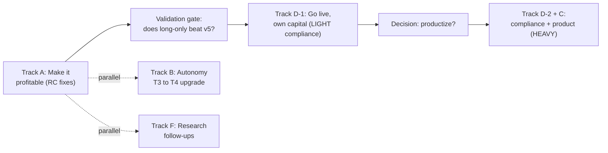

# TradePilot — Master Roadmap

*Everything we now know we need to do — performance, autonomy, moat, compliance, validation, research*

::: {.report-meta}

| | |
|:--|:--|
| **Project** | TradePilot (autonomous agentic trading) |
| **Document** | Master roadmap (consolidates root-cause + competitive + compliance research) |
| **Version** | `v1.0.0` |
| **Status** | Active |
| **Created** | 2026-06-28 |
| **Sources** | Root-cause investigation (11 agents) · competitive deep-research (105 agents) · SEBI + Tier-2 + Tier-4 research (3 agents) |

:::

::: {.doc-author}

| | |
|:--|:--|
| **Author** | Soumya Swain |
| **Email** | soumya@sidewall.in |

:::

---

## 0. The one-paragraph state of play

TradePilot is a **T3 (Conditional Autonomy)** agentic trading system — the same autonomy level credible institutional operators actually run at, and ahead of the unverified "fully autonomous" marketing of pre-launch startups. It has **no direct competitor in India** (every Indian platform is a rule-based strategy builder, not agentic) and the research literature **validates its core design choice** (execution discipline over LLM-alpha, which is largely lookahead-bias illusion). The gaps are the same ones almost every peer shares: **live capital, an audited track record, and scale.** Nothing it does today is non-compliant — paper trading is outside SEBI's framework entirely. The roadmap below sequences the work so we **prove profitability first, go live cheaply second, and only take on heavy compliance if we productize.**

## 1. Sequencing — do these in order

**The rule:** don't spend a rupee or a day on heavy (product) compliance until the agent is *proven profitable* and *you've decided to sell it*. Paper-perfect first.

## 2. Track A — Make it profitable (from root-cause work)

::: {.task-table-3}

| ID | Action | Status |
|:--|:--|:--|
| RC-1 | Long-only shadow (`v5_long`, NIFTY-200) racing live v5 | Live Mon 06-29 |
| RC-2 | If long-only wins ~2 wks → gate shorts in live v5 | Pending RC-1 result |
| RC-3 | Fix entry timing (collapse SHORT_BLOCK lag, 2nd deploy pass) | Queued |
| RC-4 | Concentrate capital (cut cap 20→5-8; deploy more of ₹10L) | Queued |
| — | Data-stall fix (yfinance per-process cache) | Done |
| — | Engine roster trimmed 6→4 (lean stack) | Done |

:::

**Gate:** RC-1's two-week verdict (auto-Telegram'd daily at 15:40) decides whether the whole "short book is the bleed" thesis holds. Everything downstream waits on it.

## 3. Track B — Autonomy upgrade (T3 → T4)

We sit at T3: AI runs the full intraday loop autonomously, humans approve strategy changes. The peers ahead of us (Self-Driving Portfolio's meta-agent) reach higher by **self-modifying strategy parameters**.

::: {.task-table-3}

| ID | Action | Priority |
|:--|:--|:--|
| AU-1 | Let the learnings-store *propose* strategy-param changes (regime weights, signal set, risk limits) as PRs for human approval | Medium |
| AU-2 | Multi-agent debate layer (bull/bear, à la TradingAgents) before signal commit | Low / optional |
| AU-3 | Eventually: auto-apply low-risk param changes without sign-off → T4 | Future (only after live track record) |

:::

**Note:** T4 (self-modifying without approval) is *not* a near-term goal — it's only sensible once the system has a proven live track record. T3 is the right level for now and matches what real funds run.

## 4. Track C — Competitive moat / product

::: {.gap-table}

| Area | Our position | Action |
|:--|:--|:--|
| Autonomy | Uncontested in India (category gap) | Lead with it — "agent that decides what to trade," not another strategy builder |
| Live execution | Incumbents far ahead (Tradetron 1.5M trades/mo, 60+ brokers) | Build a real execution layer (Kite order API) — the biggest product gap |
| Users / distribution | None vs Sensibull 1M+, AlgoTest ~25k | Defer until agent is proven; distribution is a post-PMF problem |
| Positioning | Different *category*, not a better builder | Target the user who doesn't know *what* to trade, not the one who needs execution infra |

:::

## 5. Track D — Compliance (the SEBI answer)

**Paper trading = zero obligations.** SEBI's framework (Feb 2025 circular, fully in force **April 1, 2026**) regulates *orders on exchanges via broker APIs*. We place none. Nothing to fix today.

::: {.gap-table}

| Phase | Trigger | Obligations | Burden |
|:--|:--|:--|:--|
| D-0 (now) | Paper only | None. (Document the no-order-routing architecture for the record.) | Zero |
| D-1 | Go live, own capital via Kite | Static IP + Zerodha whitelist · software kill-switch · 5-yr order audit log · confirm Kite algo TOS · OPS profiling (we run ~0.0024 OPS avg, peak <1 — far under the 10-OPS registration line) · family-account carve-out only | **Light** — a checklist, not a minefield |
| D-2 | Offer to others (product) | SEBI Research Analyst license (we're black-box) · NSE/BSE empanelment · broker partnership · ISO 27001:2022 · biannual CERT-In VAPT · per-strategy algo registration · grievance redressal | **Heavy** — 6–12 months + real spend |

:::

**Comply-before-live checklist (Phase D-1):** static IP → Zerodha whitelist → kill-switch in code → order audit log (5-yr) → Kite Connect algo-TOS review → OPS peak instrumentation → written algo design doc. None are blockers; all are a weekend of work plus broker setup.

**Hard line:** running the algo for anyone outside your family (self/spouse/dependent parents/children) makes you an "algo provider" → instantly triggers the heavy D-2 tier. Keep it personal until you deliberately productize.

## 6. Track E — Validation & risk

::: {.task-table-3}

| ID | Action | Why |
|:--|:--|:--|
| V-1 | Keep alpha in execution, not LLM signals | Literature: LLM alpha is largely lookahead-bias; collapses out-of-sample |
| V-2 | Define the paper→live trust gate (e.g. N profitable weeks, max-drawdown bound) | Don't risk real capital until earned |
| V-3 | Build toward an audited track record | The universal gap vs all peers; the thing that makes claims credible |
| V-4 | Stress-test robustness (perturbation) | TradeTrap: agentic systems are fragile; ours must not be |

:::

## 7. Track F — Research follow-ups

::: {.task-table-3}

| ID | Question | Priority |
|:--|:--|:--|
| R-1 | Numerai deep dive — closest verified AI-native fund (JPMorgan committed up to $500M, ~25% net 2024); how "AI-driven" is it really? | Medium |
| R-2 | SEBI RA-license process detail (net worth, timeline, cost) — the gate for D-2 | Medium (if productizing) |
| R-3 | Jarvis Invest reverse-engineer — closest Indian regulatory analog (SEBI RA + AI portfolio, ₹500cr+) | Medium |
| R-4 | Zerodha Kite Connect algo-order TOS — does own-account automation below 10 OPS need separate approval? | High (before D-1) |
| R-5 | Standard Signal SEC EDGAR / Form ADV check — is it actually a registered live fund? | Low (curiosity) |

:::

## 8. The honest bottom line

- **We are not behind.** At parity on architecture, ahead on operational maturity, uncontested on India, at the same autonomy level (T3) as credible real funds.
- **We are unproven** on the three things that matter for credibility: live P&L, audit, scale — but so is almost everyone else.
- **The path is clear and de-risked:** prove profitability (Track A) → go live cheaply for own capital (D-1, light) → only then consider product + heavy compliance (D-2/C).
- **Do not** chase LLM-alpha sophistication or heavy compliance prematurely; the moat is autonomy + discipline + (eventually) a real track record.

## 9. Track G — AGENTIC TRADING PLATFORM (productization)

The destination: turn the single-user autonomous engine into a genuine agentic platform. Product shape (research-recommended for India): **"BYOB White-Box Agent"** — your own autonomous AI agent running in your own Zerodha/Fyers account; set a mandate once; it researches, decides, trades; you see every reasoning step. Platform holds **zero capital** (no PMS licence); **white-box** sidesteps the heavy black-box SEBI RA gate; the explainable decision log is simultaneously the trust UX + the compliance audit trail.

::: {.gap-table}

| Phase | When | Build | Compliance |
|:--|:--|:--|:--|
| **G-0 · Personal T4** | now → 6mo | Decompose monolith → 9-role agent DAG (Planner · Orchestrator · Alpha · Risk-gate · Portfolio · Backtest · Execution · Audit · Memory); meta-agent rewrites prompts; UUID memory with **train/eval namespace separation** (structural anti-overfit); explainability log | Zero (paper/own capital) |
| **G-1 · Invite-only BYOB** | 6–12mo | 3–10 trusted users; per-user IPS (mandate) + broker-credential vault + static IP; white-box algo-ID; per-user audit namespace | Light (white-box, no RA licence) |
| **G-2 · Closed beta** | 12–18mo | 50–200 users; subscription; copy-agent of our own variants; full audit infra | SEBI RA licence, ISO 27001 prep |
| **G-3 · Platform / marketplace** | 18–24mo | Third-party agent SDK; per-agent algo-ID + track record | Empanelment, VAPT, ISO 27001 |

:::

**Key architectural unlock:** the agentic DAG (alpha agents blind to evaluation-window returns) is the *same* investment as the overfitting fix in Track A — platform and profitability converge. **Gate before any of this:** the conviction→P&L validation (instrumented 2026-06-30), and Track A profitability proven. Reference: `STRATEGY_RESEARCH_2026-06-30` Pillar C.

## 10. Progress log — 2026-06-30

::: {.metrics-table}

| Item | Status |
|:--|:--|
| Conviction logging on closed trades (all engines) | ✅ Built — unblocks dynamic-allocation validation in ~5 sessions |
| `v5_flip` fast-regime-flip shadow + wired into rotation (roster=5) | ✅ Built — in A/B testing from next launch |
| Fast-regime-flip design (validated 4× vs data) | ✅ Spec: `DESIGN_fast-regime-flip_2026-06-30` |
| Red-day watchdog (live loss attribution) | ✅ Running |
| Dynamic per-stock-trend allocation + net-exposure cap | ⏳ Designed; gated on conviction data + Track A |
| Agentic platform (Track G above) | ⏳ Roadmapped; gated on profitability proof |

:::

**Next decision point:** EOD review of `v5_flip` vs the roster on the next red day — does fast activation of the 8/12 tilt cut red-day losses without false-triggering on green days?
