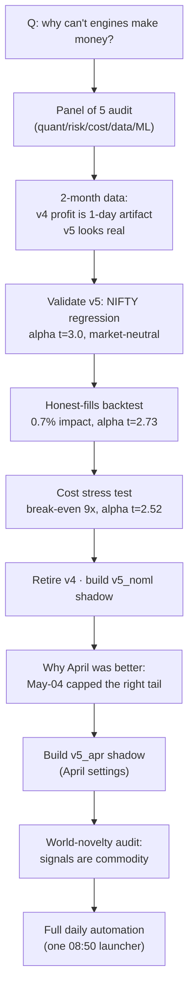

# TradePilot — Investigation & Hardening Session

*Foundation review, v5 validation, world-novelty audit, and full daily automation — June 11–14, 2026*

::: {.report-meta}

| | |
|:--|:--|
| **Project** | TradePilot (paper-trading engine suite) |
| **Period** | June 11–14, 2026 |
| **Status** | Complete — v5 validated, lineup consolidated, automation live |
| **Sprint** | `TP-CLEANUP-001` (active) — 5 done / 7 open |
| **Created** | 2026-06-14 |

:::

::: {.doc-author}

| | |
|:--|:--|
| **Author** | Sarathi (Claude) for Soumya Swain |
| **Email** | soumya@sidewall.in |
| **Source** | DevPilot `learnings` (project=tradepilot) + sprint `TP-CLEANUP-001` |

:::

---

## Executive summary

A question — *"why can't any engine make money?"* — turned into a full forensic audit of the
TradePilot platform. The honest conclusions, in one paragraph:

- **Most engines have no edge.** v4's two-month "+₹2.7L" was **72% one over-leveraged day**; its median day is ₹0 and it has no statistically significant alpha. It has been retired.
- **One engine is genuinely good.** **v5** has real, market-neutral alpha (**t ≈ 3.0**) that survives honest fill accounting (t = 2.73) and realistic costs (break-even at **9× current cost**). It is now the validated primary.
- **v5 is muzzled, not broken.** A 2026-05-04 change capped its winning behaviour; un-muzzling it is the path back to "April-class" days — now under live A/B test.
- **The strategy is not novel.** A world-literature audit confirms every signal is commodity; the defensible angle is execution + India-specificity, not invention — and the evidence bar for investors is a long live track, not 2 months of paper.
- **The daily ritual is now fully automated** — one scheduled launcher brings up the complete stack at 08:50 and tears it down with an EOD report at 15:35, hands-off.

\newpage

## The investigation arc

\newpage

## Part 1 — Foundation review (panel of 5)

Five adversarial critics audited the platform. Their root causes, all confirmed by data:

::: {.metrics-table}

| Lens | Verdict | Smoking gun |
|:--|:--|:--|
| Quant / edge | No validated edge | WFO out-of-sample Sharpe −0.10, DSR 0.12 |
| Risk / regime | No directional governor | Regime detector blind to single-day trends; v4 gate disabled |
| Cost / churn | Primary profit killer | 12bps model excludes slippage; real ≈ 18–30bps |
| Data quality | P&L partly artifact | Stops booked at last close; 404'd symbols dropped from risk |
| ML / scoring | Model unfit | Label ↔ exit mismatch; walk-forward IC 0.006 (coin flip) |

:::

**The unifying root cause:** the entry gate is *relative* (always buy the top 20%), not
*absolute* — the system was built to always trade, never to wait. On a good day the top
slice is decent; on a bad day it is garbage but still bought.

## Part 2 — v5 validation (three independent tests)

v5 was put through three adversarial tests and passed all three:

::: {.metrics-table}

| Test | Result | Verdict |
|:--|:--|:--:|
| Beta-neutralization vs NIFTY | α = ₹7,226/day, **t = 3.00**, β not significant, R² = 2.6% | Market-neutral skill |
| Honest fills (5-min replay) | only **0.7%** impact, α t = 2.73 | Not an accounting artifact |
| Cost realism (12→35bps ladder) | break-even **≈ 105bps (9×)**, α holds to 45bps | Robust to costs |

:::

**Two-month scoreboard (authoritative):**

::: {.metrics-table}

| Engine | 2-mo P&L | Median day | P&L without top-3 days | Verdict |
|:--|--:|--:|--:|:--|
| v5 | +250,883 | +840 | +116,077 | Validated — keep |
| v5_classic | +100,819 | +724 | +39,084 | Real alpha — keep |
| v4 | +272,882 | **0** | **−6,899** | Retired — no edge |

:::

**Capacity (TP-CLN-002):** under a square-root market-impact model with real per-stock
liquidity, v5 scales to **~₹29M** before slippage dents the edge (alpha t 2.77→2.68), with
0% of trades exceeding 10% of daily volume. It is **borrow-friendly** — 0% of trades are
overnight shorts (55% swing-long, 42% intraday-short = a naturally market-neutral structure).

\newpage

## Part 3 — Why April was a profit machine

The decline was **not** market luck. On **2026-05-04** the "Track A" tactical fixes
amputated v5's right tail. The exit-reason mix is the proof:

::: {.metrics-table}

| Month | Mean P&L/day | % trades reaching TARGET | % dying at TIME+FLAT exit |
|:--|--:|--:|--:|
| April | ₹13,738 | 48% | 6% |
| May | ₹3,411 | 17% | 34% |
| June | ₹716 | 7% | 52% |

:::

**Mechanism:** April let winners run to target and re-entered trending names (compounding).
The May-04 fixes (flat-force-exit + winner re-arm cap of 3) now kill >50% of trades before
target. v5's alpha (t ≈ 3) is fully intact — just muzzled. Reversing the two highest-impact
dampeners is the path back, now under live test as `v5_apr`.

## Part 4 — World-novelty audit (investor lens)

A deep-research sweep (24 sources, 18 adversarially-verified findings) answered: *is this a
machine nobody uses?* **No.**

- Every factor is commodity and peer-reviewed — cross-sectional momentum (Jegadeesh-Titman 1993), intraday momentum, ORB, multi-factor market-neutral, regime allocation — and reproduced on retail platforms (QuantConnect, WealthLab, Tradetron).
- Known constraints: momentum loses significance at ~1.5% cumulative round-trip cost, is capacity-bound ($1–5B), and published anomalies decay ~35% post-publication via crowding.
- **Flaw found:** ORB only survives costs on high-relative-volume "Stocks in Play"; v5 applies it flat across all 50 (action item TP-CLN-012).

**Verdict:** pitched as "a novel strategy nobody uses," a quant investor tears it apart.
Pitched as **"disciplined, integrated, accessible execution of proven factors for Indian
retail, with validated market-neutral alpha,"** it is a real story — *if* it clears the bar
of a long live, net-of-cost, multi-regime track record. The current 2-month / t=3 sample is
far too thin. The only potentially-differentiated components are the India-specific FII/DII
and open-interest factors, which remain to be validated.

\newpage

## Part 5 — What we built

::: {.changes-table}

| Item | What | Status |
|:--|:--|:--:|
| v4 retirement | Removed from `launch-market.sh` + watchdog (state preserved) | Done |
| `v5_noml` shadow | v5 with dead ML zeroed; same code, env-parameterized | Live Mon |
| `v5_apr` shadow | v5 with April settings (flat-exit off, re-arm 6) | Live Mon |
| Validation watchdogs | profit + missed-opps wired into launch | Done |
| Launcher cleanup | one 08:50 job; disabled 09:10 double-launch | Done |
| Telegram kill-switch | per-process silence for shadows | Done |

:::

**The ML A/B (TP-CLN-008):** zeroing the dead ML changes **zero** of v5's picks (rank
correlation 1.000, 0/200 direction changes) — it adds a uniform offset, never reorders.
Confirmed dead weight; removal is selection-neutral and de-risks v5.

**Monday's rotation = a 5-engine live A/B:** v5 · v5_noml · v5_apr · v5_classic · v7_regime
— current vs ML-removed vs April-settings, all risk-free paper books. Judge shadows on
**risk-adjusted** return (alpha/Sharpe), not raw P&L.

## Part 6 — Sprint status (`TP-CLEANUP-001`)

::: {.task-table}

| ID | Title | Priority | Status |
|:--|:--|:--:|:--:|
| TP-CLN-001 | Retire v4 from rotation | high | done |
| TP-CLN-002 | v5 capacity / slippage study | high | done |
| TP-CLN-005 | Wire validation watchdogs into launch | medium | done |
| TP-CLN-008 | Test v5 with ML weight = 0 | high | done |
| TP-CLN-009 | v5_noml shadow + forward confirm | medium | in progress |
| TP-CLN-011 | v5_apr shadow (April settings) | medium | in progress |
| TP-CLN-003 | Fill-accounting fix (stops at level) | medium | todo |
| TP-CLN-004 | Honest cost model 12→23bps | medium | todo |
| TP-CLN-007 | Absolute edge gate + regime governor | medium | todo |
| TP-CLN-010 | Compare v5 vs v5_noml (~Jun 26) | medium | todo |
| TP-CLN-012 | ORB stocks-in-play gate + FII/DII validation | medium | todo |

:::

## Next steps

1. **~Jun 26:** read the three-way shadow A/B → commit ML removal and/or April settings if risk-adjusted return improves (TP-CLN-010/011).
2. **Code correctness:** fill-accounting fix + honest cost model (TP-CLN-003/004).
3. **Edge work:** absolute edge gate + regime governor (TP-CLN-007); ORB gate + validate FII/DII as a genuine India edge (TP-CLN-012).
4. **For an investor story:** accumulate a long live, net-of-cost, multi-regime track on v5 — the only thing that converts "everyone does this" into a fundable result.
