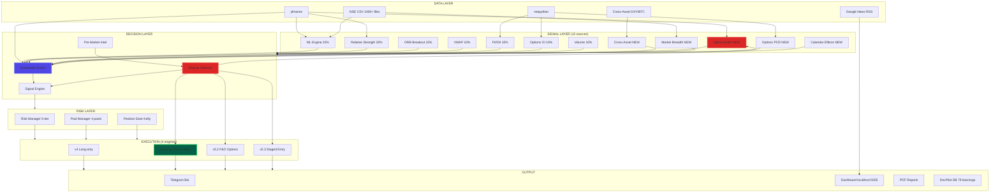
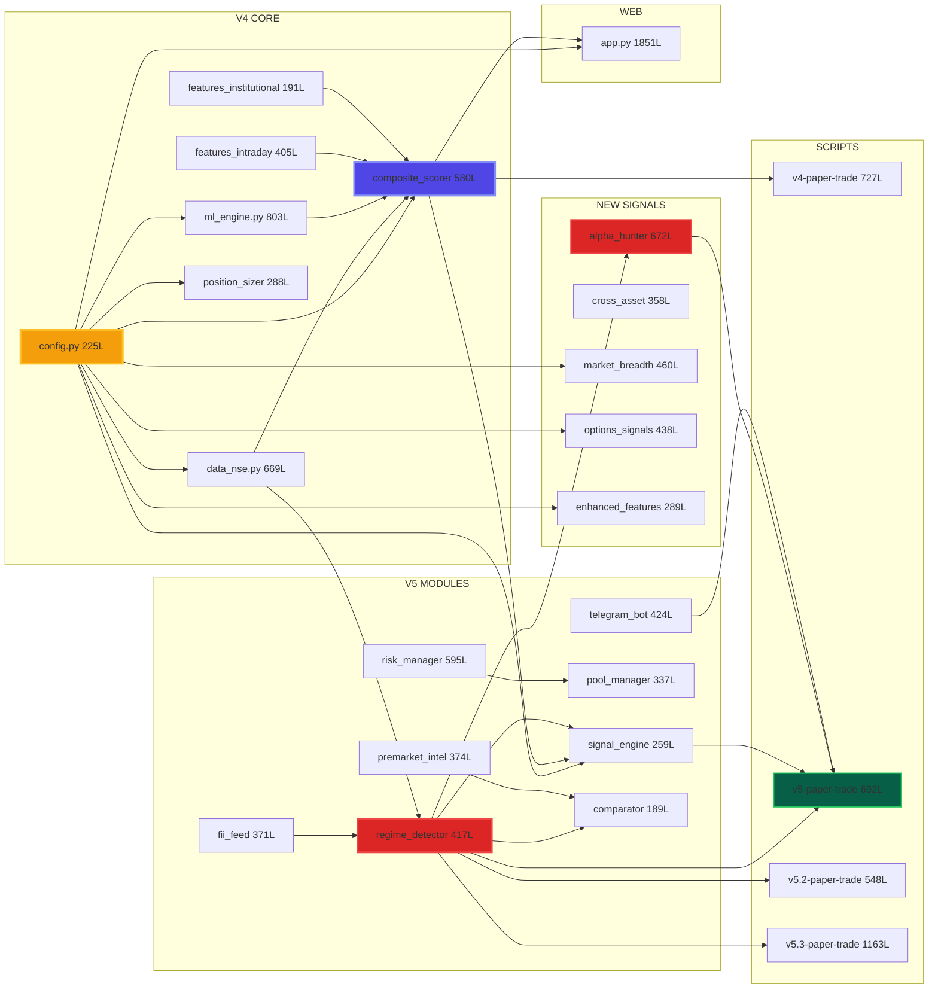
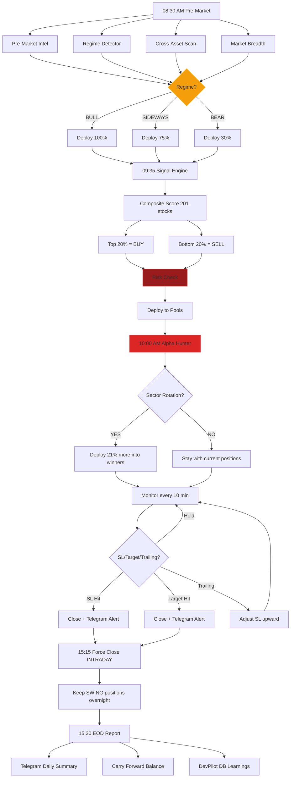
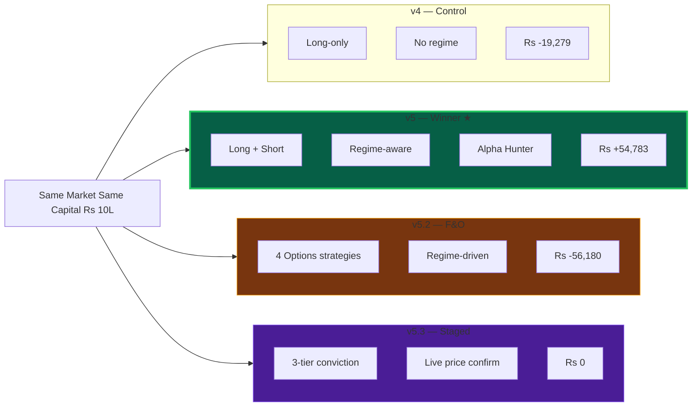

# TradePilot Dependency Graph (Mermaid)

Paste each diagram into **mermaid.live** to render.

---

## 1. System Flow (Top-Level)

---

## 2. Module Dependencies (Detailed)

---

## 3. Daily Trading Flow

---

## 4. Engine Comparison

---

## How to Render

1. **Markmap** (for mind map): Go to [markmap.js.org/repl](https://markmap.js.org/repl), paste `tradepilot_markmap.md`
2. **Mermaid Live** (for dependency/flow): Go to [mermaid.live](https://mermaid.live), paste any mermaid block above
3. **VS Code**: Install "Markdown Preview Mermaid" extension, open this file
4. **Obsidian**: Native mermaid rendering, just open this file
5. **GitHub**: Renders mermaid blocks automatically in .md files
