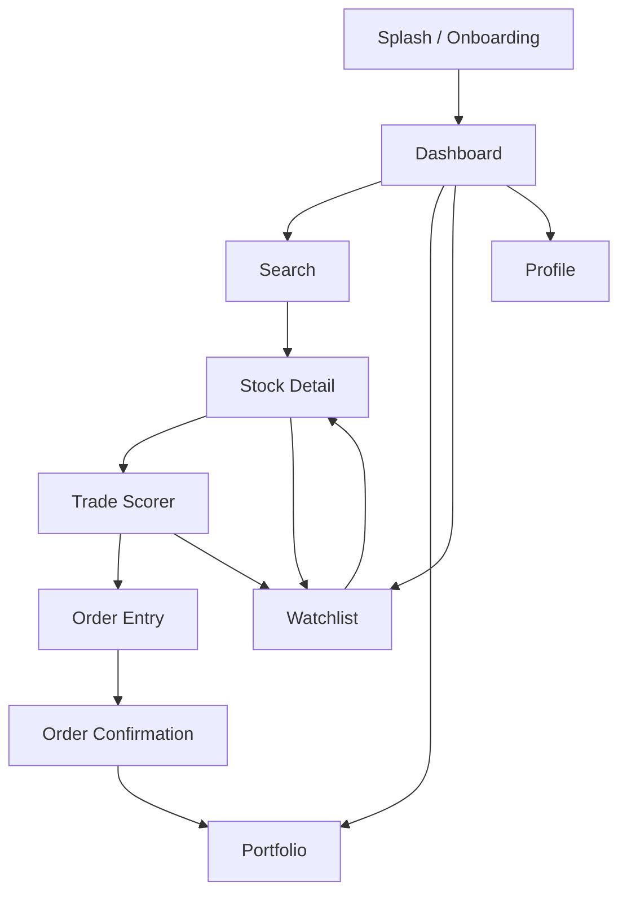

# TradePilot -- Product Brief (MVP v0.1)

*The platform that makes Indian traders profitable*

::: {.report-meta}

| | |
|:--|:--|
| **Project** | TradePilot |
| **Version** | `v0.1.0` (MVP) |
| **Status** | Planning |
| **Created** | 2026-04-02 |
| **Target Launch** | 8 weeks from sprint start |

:::

---

## 1. What We're Building

A mobile + web trading platform for beginner Indian traders that shows **AI-powered profit probability before every trade**. Integrated with Zerodha via Kite Connect API. Built with Flutter (frontend) + Rust (backend) + QuestDB (market data).

### 1.1 MVP Scope -- What's IN

| Feature | Priority | Sprint |
|:--------|:--------:|:------:|
| AI Trade Scorer (profit probability per trade) | P0 | 3 |
| Zerodha Kite Connect integration (auth + orders) | P0 | 1 |
| Real-time market data (WebSocket streaming) | P0 | 1 |
| Stock search + detail screen with charting | P0 | 2 |
| Order placement (market, limit, SL, SL-M) | P0 | 2 |
| Portfolio dashboard (positions, holdings, P&L) | P0 | 4 |
| Watchlist management | P1 | 2 |
| Risk guardrails (max loss alert, position sizing) | P1 | 3 |
| Basic educational tooltips for beginners | P1 | 4 |

### 1.2 What's OUT (v0.2+)

- Paper trading / simulator
- Backtesting engine
- Options strategy builder with Greeks
- Full educational content library
- Multi-broker support (Angel One)
- Social/community features
- Tax reporting
- Advanced charting (custom indicators)
- Push notifications
- Fractional investing

---

## 2. User Flow

### 2.1 First-Time User Journey

```
ONBOARDING (2 min)
  1. Download app / open web
  2. Sign up (phone + OTP)
  3. "Connect your Zerodha account"
     -> Redirect to Zerodha login (OAuth flow)
     -> Grant permissions -> return to TradePilot
  4. Welcome screen: "Your trading co-pilot is ready"

DISCOVER (browsing)
  5. Dashboard loads: Market overview + trending stocks
  6. Browse watchlist or search for a stock
  7. Tap stock -> Stock Detail screen

THE MONEY MOMENT (AI Trade Scorer)
  8. See the Trade Scorer panel:
     +--------------------------------------------------+
     |  RELIANCE @ Rs 2,845                             |
     |                                                    |
     |  AI Profit Score:  72%  [===========>   ]         |
     |  Suggested Action: BUY (short-term bullish)       |
     |  Risk/Reward:      1:2.4                          |
     |  Recommended Size: 5 shares (Rs 14,225)           |
     |  Max Risk:         Rs 1,500 (your daily limit)    |
     |                                                    |
     |  Why this score:                                   |
     |  - FII net buyers +1,200 Cr today                 |
     |  - RSI oversold (28.3), bounce likely              |
     |  - Sector momentum: Energy +1.8% today            |
     |  - Similar setups: 72% profitable (90-day)        |
     |                                                    |
     |  [BUY NOW]  [ADD TO WATCHLIST]  [LEARN MORE]      |
     +--------------------------------------------------+

TRADE (execution)
  9. Tap "BUY NOW"
  10. Order form pre-filled with recommended qty + SL
  11. Confirm -> order placed via Zerodha API
  12. See confirmation + position added to portfolio

TRACK (post-trade)
  13. Portfolio shows live P&L
  14. AI alerts if score changes significantly
  15. "Consider exiting" nudge when target hit
```

### 2.2 Daily Returning User

```
  1. Open app -> Dashboard
  2. See portfolio P&L (green/red)
  3. AI "Today's Opportunities" card (top 5 scored trades)
  4. Tap any -> Trade Scorer -> decide -> trade or skip
  5. Check watchlist for tracked stocks
```

---

## 3. Screen List (11 screens)

### 3.1 Core Screens

| # | Screen | Purpose | Key Elements |
|:-:|:-------|:--------|:-------------|
| 1 | **Splash / Onboarding** | First launch, sign up | Phone OTP, Zerodha connect |
| 2 | **Dashboard** | Home screen, market overview | Market indices, portfolio summary, AI picks, watchlist |
| 3 | **Search** | Find stocks/indices | Search bar, trending, sectors, recent |
| 4 | **Stock Detail** | Single stock deep dive | Chart (TradingView), fundamentals, news, AI score card |
| 5 | **Trade Scorer** | AI profit probability | Score gauge, reasons, recommended action/size/SL |
| 6 | **Order Entry** | Place a trade | Pre-filled from scorer, order type, qty, price, SL |
| 7 | **Order Confirmation** | Post-trade confirmation | Order ID, status, position link |
| 8 | **Portfolio** | Positions + holdings | Live P&L, positions, holdings, day's trades |
| 9 | **Watchlist** | Track stocks | Saved stocks with mini AI scores |
| 10 | **Profile / Settings** | Account, broker connection | Zerodha status, risk limits, preferences |
| 11 | **Learn** | Educational tooltips | Contextual learning cards (what is SL, what is P&L, etc.) |

### 3.2 Screen Flow Diagram



---

## 4. Data Model

### 4.1 PostgreSQL (User data, application state)

```sql
-- Users
CREATE TABLE users (
    id UUID PRIMARY KEY DEFAULT gen_random_uuid(),
    phone VARCHAR(15) UNIQUE NOT NULL,
    name VARCHAR(100),
    email VARCHAR(255),
    created_at TIMESTAMPTZ DEFAULT NOW(),
    updated_at TIMESTAMPTZ DEFAULT NOW()
);

-- Broker connections
CREATE TABLE broker_connections (
    id UUID PRIMARY KEY DEFAULT gen_random_uuid(),
    user_id UUID REFERENCES users(id),
    broker VARCHAR(20) NOT NULL DEFAULT 'zerodha',
    access_token TEXT,
    refresh_token TEXT,
    token_expires_at TIMESTAMPTZ,
    zerodha_user_id VARCHAR(20),
    is_active BOOLEAN DEFAULT true,
    connected_at TIMESTAMPTZ DEFAULT NOW()
);

-- Watchlists
CREATE TABLE watchlists (
    id UUID PRIMARY KEY DEFAULT gen_random_uuid(),
    user_id UUID REFERENCES users(id),
    name VARCHAR(50) DEFAULT 'Default',
    created_at TIMESTAMPTZ DEFAULT NOW()
);

CREATE TABLE watchlist_items (
    id UUID PRIMARY KEY DEFAULT gen_random_uuid(),
    watchlist_id UUID REFERENCES watchlists(id),
    instrument_token BIGINT NOT NULL,
    trading_symbol VARCHAR(50) NOT NULL,
    exchange VARCHAR(10) NOT NULL,
    added_at TIMESTAMPTZ DEFAULT NOW()
);

-- Trade scores (AI predictions)
CREATE TABLE trade_scores (
    id UUID PRIMARY KEY DEFAULT gen_random_uuid(),
    instrument_token BIGINT NOT NULL,
    trading_symbol VARCHAR(50) NOT NULL,
    exchange VARCHAR(10) NOT NULL,
    score DECIMAL(5,2) NOT NULL,           -- 0-100 profit probability
    direction VARCHAR(10) NOT NULL,         -- 'buy' or 'sell'
    risk_reward_ratio DECIMAL(5,2),
    recommended_qty INTEGER,
    recommended_sl DECIMAL(12,2),
    recommended_target DECIMAL(12,2),
    reasons JSONB,                          -- array of reason strings
    model_version VARCHAR(20),
    confidence DECIMAL(5,2),
    scored_at TIMESTAMPTZ DEFAULT NOW(),
    expires_at TIMESTAMPTZ                  -- score validity window
);

CREATE INDEX idx_trade_scores_symbol ON trade_scores(trading_symbol, scored_at DESC);
CREATE INDEX idx_trade_scores_score ON trade_scores(score DESC, scored_at DESC);

-- User risk preferences
CREATE TABLE user_risk_settings (
    user_id UUID PRIMARY KEY REFERENCES users(id),
    max_daily_loss DECIMAL(12,2) DEFAULT 5000,
    max_position_pct DECIMAL(5,2) DEFAULT 10,   -- % of capital per trade
    risk_level VARCHAR(20) DEFAULT 'moderate',   -- conservative, moderate, aggressive
    updated_at TIMESTAMPTZ DEFAULT NOW()
);

-- Order history (synced from Zerodha + our metadata)
CREATE TABLE order_history (
    id UUID PRIMARY KEY DEFAULT gen_random_uuid(),
    user_id UUID REFERENCES users(id),
    zerodha_order_id VARCHAR(50),
    trading_symbol VARCHAR(50) NOT NULL,
    exchange VARCHAR(10) NOT NULL,
    order_type VARCHAR(10),                 -- MARKET, LIMIT, SL, SL-M
    transaction_type VARCHAR(5),            -- BUY or SELL
    quantity INTEGER,
    price DECIMAL(12,2),
    trigger_price DECIMAL(12,2),
    status VARCHAR(20),
    trade_score_id UUID REFERENCES trade_scores(id),  -- link to AI score
    placed_at TIMESTAMPTZ DEFAULT NOW()
);
```

### 4.2 QuestDB (Market data, time-series)

```sql
-- OHLC candle data (ingested from Zerodha historical API)
CREATE TABLE ohlc (
    timestamp TIMESTAMP,
    instrument_token LONG,
    trading_symbol SYMBOL,
    exchange SYMBOL,
    open DOUBLE,
    high DOUBLE,
    low DOUBLE,
    close DOUBLE,
    volume LONG
) TIMESTAMP(timestamp) PARTITION BY DAY;

-- Live quotes snapshot (from WebSocket)
CREATE TABLE live_quotes (
    timestamp TIMESTAMP,
    instrument_token LONG,
    trading_symbol SYMBOL,
    ltp DOUBLE,
    open DOUBLE,
    high DOUBLE,
    low DOUBLE,
    close DOUBLE,
    volume LONG,
    buy_qty LONG,
    sell_qty LONG,
    oi LONG
) TIMESTAMP(timestamp) PARTITION BY HOUR;

-- AI model features (computed indicators)
CREATE TABLE indicators (
    timestamp TIMESTAMP,
    instrument_token LONG,
    trading_symbol SYMBOL,
    rsi_14 DOUBLE,
    macd DOUBLE,
    macd_signal DOUBLE,
    sma_20 DOUBLE,
    sma_50 DOUBLE,
    sma_200 DOUBLE,
    ema_9 DOUBLE,
    ema_21 DOUBLE,
    atr_14 DOUBLE,
    volume_sma_20 DOUBLE,
    vwap DOUBLE
) TIMESTAMP(timestamp) PARTITION BY DAY;
```

---

## 5. AI Trade Scorer -- How It Works

### 5.1 Input Features (per stock)

| Category | Features | Source |
|:---------|:---------|:-------|
| Price action | RSI, MACD, SMA crossovers, Bollinger Bands | Computed from OHLC |
| Volume | Volume vs 20-day avg, OBV, volume spikes | Computed from OHLC |
| Trend | SMA 20/50/200 alignment, ADX, price vs VWAP | Computed from OHLC |
| Volatility | ATR, historical volatility, day range % | Computed from OHLC |
| Market context | NIFTY trend, sector performance, VIX level | NSE data |
| Institutional | FII/DII net buy/sell (daily) | NSE published data |
| Historical patterns | Similar setups in last 90/180/365 days, win rate | QuestDB queries |

### 5.2 Scoring Pipeline

```
Every 5 minutes during market hours:
  1. Fetch latest OHLC (1-min candles) from QuestDB
  2. Compute technical indicators (RSI, MACD, SMA, etc.)
  3. Fetch market context (NIFTY, VIX, FII/DII)
  4. Run ML model (XGBoost for v0.1, upgrade to LSTM later)
  5. Output: probability score (0-100) + direction + confidence
  6. Store in trade_scores table
  7. Push to connected clients via WebSocket

On user request (stock detail page):
  1. Return latest score from trade_scores
  2. If score older than 5 min, recompute on-demand
  3. Include top 4 reasons (from feature importance)
```

### 5.3 Model Architecture (v0.1 -- Simple, Explainable)

**Why XGBoost, not deep learning for MVP:**
- Explainable (feature importance = "reasons" for the score)
- Fast inference (< 10ms per stock)
- Works well with tabular data
- Trainable on limited data
- Upgrade path to LSTM/Transformer in v0.2

**Training data:**
- Historical OHLC for NIFTY 500 stocks (5 years daily, 1 year intraday)
- Label: "Was this trade profitable?" (1-day, 3-day, 5-day forward returns)
- Features: 20+ technical indicators + market context

### 5.4 Risk Guardrails

| Guardrail | What It Does | Default |
|:----------|:-------------|:--------|
| Max daily loss | Alert when cumulative day loss hits limit | Rs 5,000 |
| Position size cap | Max % of capital per trade | 10% |
| Score threshold | Warn if placing trade with score < 40 | 40% |
| Volatility warning | Extra caution flag on high-VIX days | VIX > 20 |

---

## 6. Zerodha Integration Details

### 6.1 Auth Flow

```
1. User taps "Connect Zerodha"
2. Redirect to: https://kite.zerodha.com/connect/login?v=3&api_key={KEY}
3. User logs in + grants permission
4. Zerodha redirects back with request_token
5. Backend: POST /session/token with SHA256(api_key + request_token + api_secret)
6. Receive access_token -> store in broker_connections
7. Token valid until ~6 AM next day -> auto-refresh daily
```

### 6.2 API Usage Map

| TradePilot Feature | Kite API Endpoint | Rate Impact |
|:-------------------|:------------------|:------------|
| Portfolio positions | GET /positions | 1 req/refresh |
| Holdings | GET /holdings | 1 req/refresh |
| Place order | POST /orders/{variety} | 1 req/order |
| Live quotes | WebSocket (3K instruments) | Streaming |
| Historical OHLC | GET /instruments/historical | Batch nightly |
| Search instruments | GET /instruments (CSV) | 1 req/day |
| User profile | GET /user/profile | 1 req/session |
| Margins | GET /user/margins | 1 req/trade |

### 6.3 Constraints to Design Around

| Constraint | Impact | Our Solution |
|:-----------|:-------|:-------------|
| Token expires daily ~6 AM | User must re-auth | Auto-detect expired token, prompt re-login |
| 10 req/sec rate limit | Can't poll aggressively | WebSocket for live data, batch REST calls |
| 3,000 orders/day | Not an issue for retail | Monitor and warn at 2,500 |
| No bracket orders | Can't do entry + SL + target in one | Place separate SL order after main order |
| No tick data | Can't build tick-level models | Use 1-min candles as finest granularity |
| Historical data limits | 60 days for 1-min candles | Nightly batch download, store in QuestDB |

---

## 7. Tech Architecture

### 7.1 System Overview

```
                    +-------------------+
                    |   Flutter App     |
                    | (iOS/Android/Web) |
                    +--------+----------+
                             |
                        HTTPS/WSS
                             |
                    +--------v----------+
                    |   API Gateway     |
                    |   (Rust/Actix)    |
                    +--------+----------+
                             |
              +--------------+--------------+
              |              |              |
     +--------v---+  +------v------+  +----v--------+
     | Auth       |  | Trading     |  | AI Scoring  |
     | Service    |  | Service     |  | Service     |
     | (Rust)     |  | (Rust)      |  | (Python)    |
     +--------+---+  +------+------+  +----+--------+
              |              |              |
              |       +------v------+       |
              |       | Zerodha     |       |
              |       | Kite API    |       |
              |       +-------------+       |
              |                             |
     +--------v-----------------------------v--------+
     |              PostgreSQL                        |
     |  (users, orders, watchlists, settings)         |
     +------------------------------------------------+
     |              QuestDB                           |
     |  (OHLC, live quotes, indicators, scores)       |
     +------------------------------------------------+
```

### 7.2 Rust Backend Crates

```
tradepilot-api/          -- Actix-web API gateway, routes, middleware
tradepilot-auth/         -- JWT auth, Zerodha OAuth, session management
tradepilot-trading/      -- Order management, position sync, Kite API client
tradepilot-market/       -- WebSocket manager, quote streaming, OHLC ingestion
tradepilot-scoring/      -- Score cache, serving layer, Python bridge (PyO3)
tradepilot-models/       -- Shared types, DB models, DTOs
tradepilot-db/           -- PostgreSQL + QuestDB connection pools
```

### 7.3 Flutter App Structure

```
lib/
  main.dart
  app/
    routes.dart
    theme.dart
  features/
    auth/                -- login, Zerodha connect
    dashboard/           -- home screen, market overview
    search/              -- stock search
    stock_detail/        -- chart, fundamentals, AI score
    trade_scorer/        -- profit probability UI
    order/               -- order entry, confirmation
    portfolio/           -- positions, holdings, P&L
    watchlist/            -- manage watchlists
    settings/             -- profile, risk limits
    learn/               -- educational tooltips
  core/
    api/                 -- API client (Dio)
    websocket/           -- live data streaming
    models/              -- data models
    providers/           -- Riverpod state management
    widgets/             -- shared UI components
```

---

## 8. Design Principles

| Principle | What It Means |
|:----------|:-------------|
| **Beginner-first** | Every screen should be understandable by someone who's never traded |
| **Score-led** | AI Trade Score is visible everywhere -- dashboard, search results, watchlist |
| **Safe by default** | Risk guardrails ON by default, user must opt out (not opt in) |
| **Fast** | App loads in < 2 seconds, scores update in < 5 seconds |
| **Honest** | "72% probability" not "guaranteed profit". Always show confidence level |
| **Contextual learning** | "What is RSI?" tooltip appears when RSI is shown, not in a separate section |

---

## 9. Success Metrics (6-month target)

| Metric | Target | How We Measure |
|:-------|:------:|:---------------|
| Paying users (Pro) | 1,000 | Subscription count |
| Daily active users | 3,000 | App opens with trade/view activity |
| Avg trades per user/week | 5+ | Order count / active users |
| Trade score accuracy | > 60% | Scored trades that were profitable |
| App rating | > 4.2 | App Store / Play Store |
| Churn (monthly) | < 8% | Users who stop opening app |
| NPS | > 40 | In-app survey |
