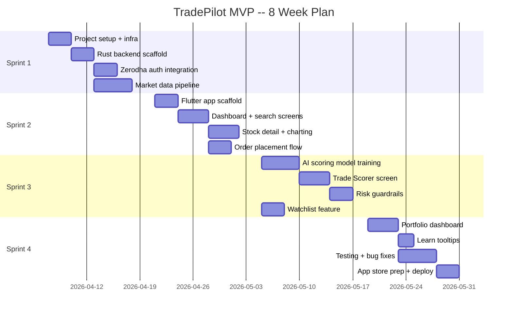
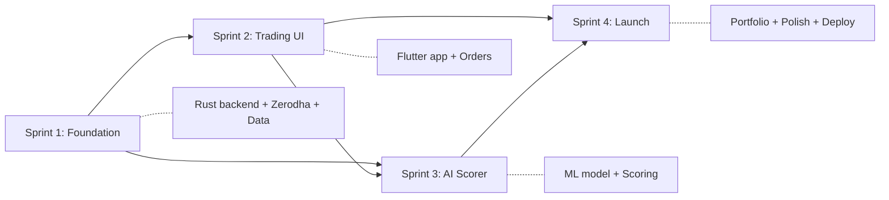

# TradePilot -- Sprint Plan (MVP v0.1)

*8-week plan to launch the AI-powered trading platform*

::: {.report-meta}

| | |
|:--|:--|
| **Sprints** | 4 sprints x 2 weeks each |
| **Team** | 2 (Soumya + Co-founder) + DevPilot AI |
| **Stack** | Flutter + Rust + QuestDB + PostgreSQL |
| **Broker** | Zerodha (Kite Connect API) |

:::

---

## Sprint Overview



---

## Sprint 1: Foundation (Week 1-2)

**Goal:** Backend running, Zerodha connected, market data flowing into QuestDB.

### Tasks

| ID | Task | Owner | Days | Depends On |
|:---|:-----|:------|:----:|:-----------|
| S1-001 | Project repo setup (monorepo: Rust workspace + Flutter) | Dev | 0.5 | -- |
| S1-002 | Docker Compose: PostgreSQL + QuestDB + Rust dev | Dev | 0.5 | S1-001 |
| S1-003 | PostgreSQL schema migration (users, broker_connections, watchlists, orders, risk_settings) | Dev | 1 | S1-002 |
| S1-004 | QuestDB schema (ohlc, live_quotes, indicators tables) | Dev | 0.5 | S1-002 |
| S1-005 | Rust workspace: tradepilot-api, tradepilot-auth, tradepilot-models, tradepilot-db crates | Dev | 1 | S1-001 |
| S1-006 | API gateway (Actix-web): health check, CORS, JWT middleware | Dev | 1 | S1-005 |
| S1-007 | Zerodha OAuth flow: login redirect, token exchange, store access_token | Dev | 1.5 | S1-006 |
| S1-008 | Zerodha token auto-refresh: detect expired token, prompt re-auth | Dev | 0.5 | S1-007 |
| S1-009 | Kite Connect client: instruments download, quote fetching | Dev | 1 | S1-007 |
| S1-010 | WebSocket manager: connect to Kite WS, subscribe instruments, parse binary | Dev | 2 | S1-009 |
| S1-011 | OHLC historical data ingestion: nightly batch for NIFTY 500 (1-min, daily) | Dev | 1.5 | S1-009, S1-004 |
| S1-012 | Technical indicator computation: RSI, MACD, SMA, EMA, ATR, VWAP | Dev | 1.5 | S1-011 |
| S1-013 | User signup API: phone + OTP (mock OTP for dev) | Dev | 0.5 | S1-006 |

### Sprint 1 Deliverables
- Rust backend serving API on localhost:8080
- Zerodha login flow working end-to-end
- Live market data streaming via WebSocket
- 5 years of daily OHLC for NIFTY 500 in QuestDB
- Technical indicators computed and stored
- User signup + JWT auth working

---

## Sprint 2: Core Trading UI (Week 3-4)

**Goal:** Flutter app with dashboard, stock search, charting, and order placement.

### Tasks

| ID | Task | Owner | Days | Depends On |
|:---|:-----|:------|:----:|:-----------|
| S2-001 | Flutter project setup: folder structure, Riverpod, Dio, theme | Dev | 1 | -- |
| S2-002 | Auth screens: phone login, OTP verification, Zerodha connect WebView | Dev | 1.5 | S2-001 |
| S2-003 | Dashboard screen: market indices bar, portfolio summary card, AI picks list | Dev | 2 | S2-002 |
| S2-004 | API: GET /dashboard (indices, portfolio summary, top AI picks) | Dev | 1 | S1-006 |
| S2-005 | Search screen: search bar, trending stocks, sector tabs, recent searches | Dev | 1.5 | S2-001 |
| S2-006 | API: GET /search?q={query} (instrument search from cached CSV) | Dev | 0.5 | S1-009 |
| S2-007 | Stock Detail screen: header (price, change), TradingView chart widget, fundamentals tab | Dev | 2 | S2-005 |
| S2-008 | TradingView Lightweight Charts integration (Flutter plugin or WebView) | Dev | 1.5 | S2-007 |
| S2-009 | API: GET /stock/{symbol} (quote, OHLC, basic fundamentals) | Dev | 1 | S1-010 |
| S2-010 | Order Entry screen: order type picker, qty, price, SL fields, confirm button | Dev | 1.5 | S2-007 |
| S2-011 | API: POST /orders (place order via Kite Connect, store in order_history) | Dev | 1 | S1-007 |
| S2-012 | Order Confirmation screen: success/failure, order details, link to portfolio | Dev | 0.5 | S2-010 |
| S2-013 | WebSocket client in Flutter: live price updates on dashboard + stock detail | Dev | 1.5 | S1-010 |
| S2-014 | Watchlist screen: add/remove stocks, show mini price cards | Dev | 1 | S2-005 |
| S2-015 | API: CRUD /watchlists, /watchlists/{id}/items | Dev | 0.5 | S1-006 |

### Sprint 2 Deliverables
- Flutter app running on iOS + Android + Web
- User can log in, connect Zerodha, see dashboard
- Search stocks, view charts, see live prices
- Place orders (market, limit, SL) via Zerodha
- Manage watchlist

---

## Sprint 3: AI Trade Scorer (Week 5-6)

**Goal:** The killer feature -- AI profit probability scoring live in the app.

### Tasks

| ID | Task | Owner | Days | Depends On |
|:---|:-----|:------|:----:|:-----------|
| S3-001 | Training data preparation: label OHLC with forward returns (1d, 3d, 5d) | Dev | 1.5 | S1-011 |
| S3-002 | Feature engineering: 20+ indicators as model inputs, normalize | Dev | 1 | S3-001 |
| S3-003 | XGBoost model training: binary classification (profitable yes/no) + probability | Dev | 2 | S3-002 |
| S3-004 | Model validation: backtest accuracy on holdout set, tune threshold | Dev | 1 | S3-003 |
| S3-005 | Python scoring service: FastAPI endpoint for batch + single scoring | Dev | 1 | S3-003 |
| S3-006 | Rust-Python bridge: tradepilot-scoring crate calls Python service (HTTP or PyO3) | Dev | 1 | S3-005 |
| S3-007 | Scoring pipeline: every 5 min, score top 200 active stocks, store in trade_scores | Dev | 1 | S3-006 |
| S3-008 | API: GET /scores/{symbol} (latest score + reasons + recommended action) | Dev | 0.5 | S3-007 |
| S3-009 | API: GET /scores/top (top 10 highest-scored stocks for dashboard) | Dev | 0.5 | S3-007 |
| S3-010 | Trade Scorer screen (Flutter): score gauge, reasons list, action buttons | Dev | 2 | S3-008 |
| S3-011 | Integrate Trade Scorer into Stock Detail screen (score card widget) | Dev | 0.5 | S3-010 |
| S3-012 | Risk guardrails: max daily loss check, position size warning, low-score warning | Dev | 1.5 | S3-010 |
| S3-013 | API: GET/PUT /settings/risk (user risk preferences CRUD) | Dev | 0.5 | S1-006 |
| S3-014 | FII/DII daily data ingestion (scrape NSE published data) | Dev | 1 | S1-011 |
| S3-015 | Add FII/DII sentiment as scoring feature | Dev | 0.5 | S3-014, S3-003 |

### Sprint 3 Deliverables
- XGBoost model trained on 5 years of NIFTY 500 data
- Scores updating every 5 min during market hours
- Trade Scorer screen live in app with profit probability
- Risk guardrails active (daily loss limit, position sizing)
- FII/DII sentiment integrated into scoring

---

## Sprint 4: Portfolio + Polish + Launch (Week 7-8)

**Goal:** Portfolio tracking, educational tooltips, testing, app store submission.

### Tasks

| ID | Task | Owner | Days | Depends On |
|:---|:-----|:------|:----:|:-----------|
| S4-001 | Portfolio screen: positions tab (live P&L), holdings tab, day's orders tab | Dev | 2 | S2-011 |
| S4-002 | API: GET /portfolio (merge Zerodha positions + holdings + our order_history) | Dev | 1 | S1-007 |
| S4-003 | P&L calculation: daily P&L, overall P&L, per-position P&L | Dev | 1 | S4-002 |
| S4-004 | Portfolio sync: periodic position refresh from Zerodha (every 30 sec) | Dev | 0.5 | S4-002 |
| S4-005 | Educational tooltips: "What is RSI?", "What is SL?", context-triggered | Dev | 1.5 | S3-010 |
| S4-006 | Settings screen: risk limits UI, Zerodha connection status, logout | Dev | 1 | S2-002 |
| S4-007 | Error handling: network errors, Zerodha token expired, API failures | Dev | 1 | -- |
| S4-008 | Loading states, empty states, skeleton screens across all pages | Dev | 1 | -- |
| S4-009 | End-to-end testing: full user flow (signup -> connect -> score -> trade -> portfolio) | QA | 2 | S4-001 |
| S4-010 | Performance optimization: app startup < 2s, score load < 1s | Dev | 1 | S4-009 |
| S4-011 | App icon, splash screen, app store screenshots | Design | 1 | S4-009 |
| S4-012 | Play Store listing: description, screenshots, privacy policy | Dev | 0.5 | S4-011 |
| S4-013 | App Store listing + TestFlight setup | Dev | 0.5 | S4-011 |
| S4-014 | Backend deployment: Docker + cloud VM (AWS Mumbai or DigitalOcean) | Dev | 1 | S4-009 |
| S4-015 | SSL, domain setup, production API configuration | Dev | 0.5 | S4-014 |
| S4-016 | Monitoring: basic health checks, error logging, uptime alerts | Dev | 0.5 | S4-014 |

### Sprint 4 Deliverables
- Portfolio dashboard with live P&L
- Educational tooltips for beginners
- App polished with loading/error/empty states
- Deployed to cloud (production-ready)
- Submitted to Play Store + App Store
- v0.1 LIVE

---

## Task Summary

| Sprint | Tasks | Focus | Key Deliverable |
|:------:|:-----:|:------|:----------------|
| 1 | 13 | Backend + Zerodha + Data | Market data flowing |
| 2 | 15 | Flutter UI + Trading | Users can trade |
| 3 | 15 | AI Scoring + Risk | Profit probability live |
| 4 | 16 | Portfolio + Polish + Launch | App on stores |
| **Total** | **59** | | **MVP v0.1 launched** |

---

## Dependencies Between Sprints



**Critical path:** S1 (Zerodha integration) -> S2 (Order flow) -> S3 (AI scoring) -> S4 (Launch)

**Parallel opportunities:**
- S3-001 to S3-004 (model training) can start during Sprint 2 since it only needs OHLC data from Sprint 1
- S4-005 (tooltips) and S4-011 (design) can start during Sprint 3

---

## Risk Mitigation

| Risk | Probability | Impact | Mitigation |
|:-----|:----------:|:------:|:-----------|
| Zerodha API changes / access issues | Medium | High | Have Angel One SmartAPI as backup |
| AI model accuracy < 55% | Medium | High | Start with simpler signals (RSI oversold + FII buying), iterate |
| App store rejection | Low | Medium | Follow guidelines strictly, no "guaranteed profit" language |
| Flutter WebView issues for Zerodha login | Medium | Low | Fallback to deep link / custom browser tab |
| QuestDB performance at scale | Low | Medium | Start with daily candles, add 1-min later |

---

## Dev Environment Setup (Day 0)

```bash
# Prerequisites
rustup install stable
flutter doctor
docker compose up -d  # PostgreSQL + QuestDB

# Project structure
tradepilot/
  backend/                # Rust workspace
    Cargo.toml
    tradepilot-api/
    tradepilot-auth/
    tradepilot-trading/
    tradepilot-market/
    tradepilot-scoring/
    tradepilot-models/
    tradepilot-db/
  app/                    # Flutter
    lib/
    ios/
    android/
    web/
  ai/                     # Python ML
    train.py
    serve.py
    models/
    data/
  docker/
    docker-compose.yml
  migrations/
    001_initial_schema.sql
```
