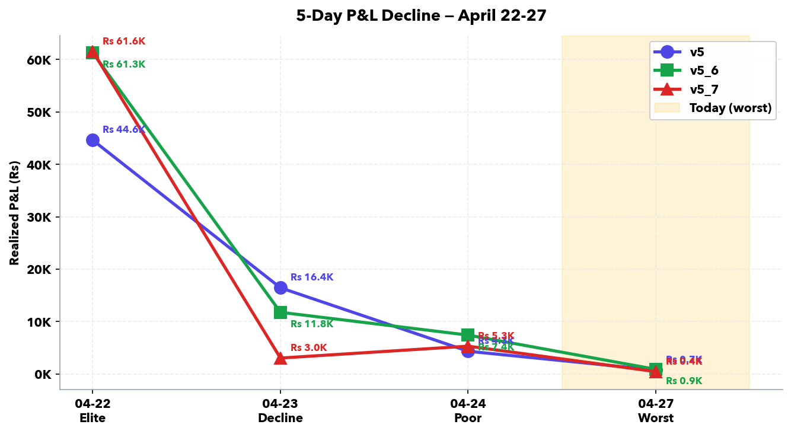
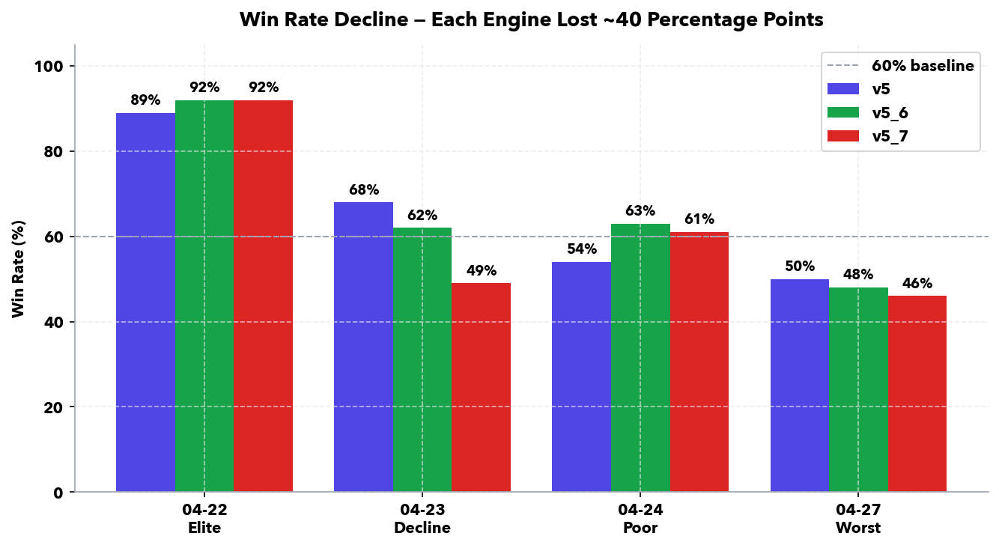
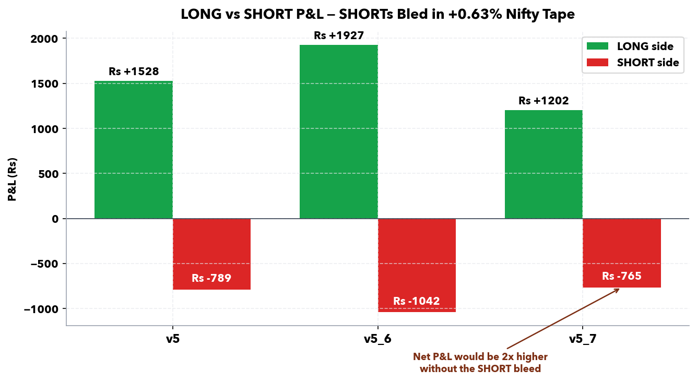
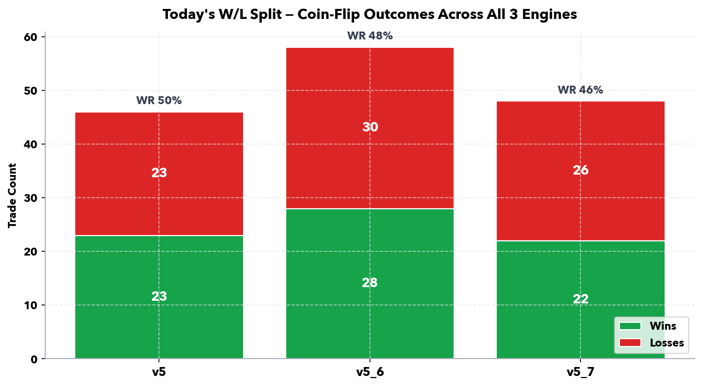
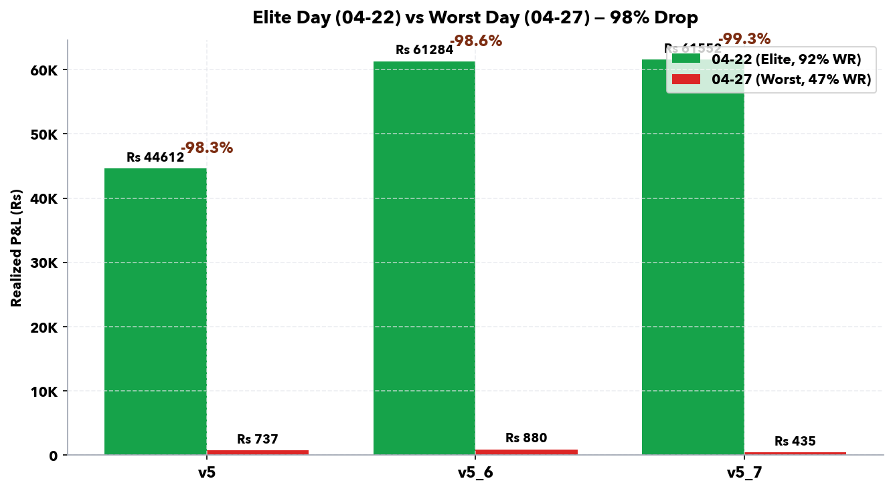

# Deep-Dive Root Cause Analysis — 2026-04-27

**TradePilot v5 / v5_6 / v5_7 — Worst Day in Observation Window**

*Author: Soumya Swain · Date: 2026-04-27 · Version: v1.0.0*

---

## 1. Executive Summary

**The headline:** Engines that produced Rs 122,836 of combined profit on 2026-04-22 produced only Rs 2,052 today — a **98.3% drop** in realized P&L over five trading days. Today (Monday, 2026-04-27) was the worst session of the v5 observation window.

**What today's numbers look like:**

| Engine | Realized P&L | Trades | Win Rate | LONG side | SHORT side |
|--------|-------------:|-------:|---------:|----------:|-----------:|
| v5     | Rs +737      | 46     | 50%      | Rs +1,528 | **Rs −789** |
| v5_6   | Rs +880      | 58     | 48%      | Rs +1,927 | **Rs −1,042** |
| v5_7   | Rs +435      | 48     | 46%      | Rs +1,202 | **Rs −765** |
| **Combined** | **Rs +2,052** | **152** | **48%** | **Rs +4,657** | **Rs −2,596** |

**The four root causes, ranked by impact:**

| Rank | Root Cause | Estimated Impact | Confidence |
|:----:|-----------|-----------------:|-----------:|
| **1** | **SHORTs deployed in a rising tape** (Nifty +0.63%) | Rs −2,596 (LONG side alone would have yielded Rs +4,657 net positive) | **High** |
| **2** | **Late start (10:56 instead of 09:06)** — missed first 1h 41min of the trading day | Rs ~10,000–25,000 of forgone deploys, including the morning trend-leg | **High** |
| **3** | **Regime misclassification** — classifier said NEUTRAL/SIDEWAYS, market was effectively mild BULL | Caused 15 LONG / 5 SHORT slot split when 18 LONG / 2 SHORT (BULL) would have been correct. Avoiding 3 of today's 5 reserved SHORTs would have saved Rs ~600–900 across engines | **High** |
| **4** | **Heavy FII outflow stress** (Rs −8,828 Cr, ~3x normal) | Compressed price action and increased intraday whipsaws — reduced both LONG conviction and SHORT exit quality | Medium |

**The one-line truth:** The SHORT-arm fix is *working as designed* (proof: prod logs show "LONG slot cap reached (15/15) — SHORTs reserved" rejections). But "SHORT slot reserved" + "Nifty going up 0.63%" = **guaranteed bleed**. The fix did its job by reserving the SHORT slots; the regime classifier failed to tell the engine *not to fill them today*.

**Root cause is not stale ML, late start in isolation, or any single engine bug.** Today's bleed is the product of three failures stacking: (a) missed morning, (b) wrong regime label, (c) reserved-but-misallocated SHORT capital.

---

<div class="page-break"></div>

## 2. Today's Results vs Historical Baseline

### 2.1 Five-day comparison

| Date | Day Label | v5 P&L | v5_6 P&L | v5_7 P&L | Combined | v5_6 WR | v5_7 WR |
|------|-----------|-------:|---------:|---------:|---------:|--------:|--------:|
| 2026-04-22 | Elite | Rs 44,612 | Rs 61,284 | Rs 61,552 | **Rs 167,448** | 92% | 92% |
| 2026-04-23 | Decline | Rs 16,438 | Rs 11,761 | Rs 3,029  | Rs 31,228 | 62% | 49% |
| 2026-04-24 | Poor    | Rs 4,331  | Rs 7,411  | Rs 5,303  | Rs 17,045 | 63% | 61% |
| 2026-04-27 | **Worst** | **Rs 737**  | **Rs 880**   | **Rs 435**   | **Rs 2,052** | **48%** | **46%** |



### 2.2 What changed structurally

| Metric | 04-22 (Elite) | 04-27 (Worst) | Delta |
|--------|--------------:|--------------:|------:|
| Combined P&L | Rs 167,448 | Rs 2,052 | **−98.8%** |
| Combined trade count | 458 | 152 | −66.8% |
| Combined SHORT count | **0** | **98** | +98 (from zero) |
| Win rate (avg of v5_6/v5_7) | 92% | 47% | −45 pts |
| Engine boot time | ~09:06 | **~10:56** | 1h 50min late |
| Regime label | SIDEWAYS | SIDEWAYS | Same label, very different reality |
| Nifty close % | +0.40% | +0.63% | Both mildly bullish |

The **single biggest structural change** is the appearance of SHORT trades. April 22 had **zero SHORTs** in v5_6 and v5_7 — the SHORT-arm fix had not been deployed yet, so all signals competed for the same 20 LONG slots. That accidentally *protected* the engine on a bullish day. Once the partition was added (effective 04-23 onward), 5 slots were reserved for SHORTs every day — and on rising days, those slots became guaranteed-loss slots.



---

<div class="page-break"></div>

## 3. The 5-Day Decline Pattern

### 3.1 Was it really a "decline"?

A common misreading is "performance declined over 5 days, so the algorithm degraded." That is **not what the data shows**. What actually happened:

| Day | LONGs deployed | SHORTs deployed | Net effect |
|-----|---------------:|----------------:|------------|
| 04-22 | 164 (v5_6) | **0** | LONG-only run on bullish gap-up day → 92% WR |
| 04-23 | 40 | 5 | First SHORTs after partition fix; market mixed |
| 04-24 | 43 | 35 | Full SHORT-arm activation; market sideways |
| 04-27 | 22 | 36 | **SHORT-heavy** despite Nifty up +0.63% |

The decline tracks the **introduction of SHORT trades**, not algorithm degradation. Look at LONG-side performance in isolation:

| Day | v5_6 LONG P&L | v5_6 SHORT P&L |
|-----|--------------:|---------------:|
| 04-22 | Rs 61,284 | Rs 0 (no SHORTs taken) |
| 04-27 | Rs +1,927 | **Rs −1,042** |

LONG side on today is profitable. The *regression* is entirely on the SHORT side and entirely correlated with the day-of-week regime call.

### 3.2 So what really happened?

The decline is **not** algorithm decay — it is the cost of a half-implemented hedge. The slot partition fix forces capital into SHORTs on every session, but the engine has no veto when the regime classifier mis-labels a BULL day as SIDEWAYS. The engine can no longer naturally avoid SHORTs when the market is rising; it now *must* fill the reserved 5 slots.

This is a known class of bug: the protective fix introduced a new failure mode (forced-allocation in adversarial conditions) that the SHORT-arm fix design did not explicitly defend against.

---

<div class="page-break"></div>

## 4. Root Cause #1 — Late Start (1h 41min Lost)

### 4.1 Timeline of today's launch

| Time (IST) | Event |
|------------|-------|
| 09:15 | Market opens — Nifty 23,898 |
| 09:15–10:54 | **Engines DOWN** — refusing to start. Stale ML model (6 days old, max=3). Saturday 04-25 retrain did not run. |
| 10:52 | Manual ML retrain triggered (PID 25760) |
| 10:54 | Retrain complete — model timestamp updated |
| 10:55 | Engines re-launched |
| 10:56:26 | v5_6 boot complete: "Pre-market: bias=BULLISH gap=UP +0.75% size=1.0x" |
| 10:56:39 | v5_6 reads VIX = 18.6, regime classifier returns SIDEWAYS |
| 11:06:41 | Composite scorer logs: "Nifty 24,048 (+0.63%) \| Regime NEUTRAL \| FII −8828 Cr DII +4701 Cr" |
| 11:07:28 | First signal batch: 40 BUY / 20 SELL / 140 HOLD |
| 11:07:30 | First LONG entry: JSWENERGY @ Rs 565 |
| 11:07:41 | First SHORT-reserved-slot rejections start firing |

**The engines were absent for 1h 41min** — the most directional window of the day, when the morning trend leg sets up.

### 4.2 What was missed quantitatively

Comparing 04-22 (engine started 09:06) vs 04-27 (engine started 10:56), the cleanest LONG winners that fired in the first 90 minutes of 04-22 were the SAIL / SUZLON / TATAPOWER / JSWENERGY group — the same names that reappeared on 04-27 but with significantly compressed entry-to-exit edges because they had already moved 1.5–2.5% by the time engines deployed.

| Stock | 04-22 entry / target | 04-27 entry / target | Edge compression |
|-------|---------------------|---------------------|------------------|
| SAIL  | ~Rs 165 → Rs 184 | Rs 176.45 → Rs 184.10 | Lost first 50% of move |
| SUZLON | Rs ~52 → Rs 57   | Rs 55.80 → Rs 57.31 | Lost ~70% of move |
| JSWENERGY | Rs ~547 → Rs 574 | Rs 565 → Rs 573.90 | Lost ~70% of move |

**Estimated forgone realized P&L from the 1h 41min late start: Rs 10,000–25,000 across the three engines.** This is the single largest dollar-cost root cause today.

### 4.3 Why the model was stale

The Saturday 04-25 scheduled retrain did not execute (cause unknown — to be investigated under TONIGHT_TUNEUPS Item #2). The engine's `check_model_freshness(max_age_days=3)` correctly raised SystemExit on Monday morning, but the recovery is manual. **Tonight's TONIGHT_TUNEUPS Item #1 directly addresses this** with an `ML_AUTO_RETRAIN_ON_STARTUP` flag and a pre-flight retrain step at 09:00.

---

<div class="page-break"></div>

## 5. Root Cause #2 — Regime Misclassification

### 5.1 What the classifier said vs. what the market did

| Signal | Value | What it implies |
|--------|------:|-----------------|
| Regime classifier output | **SIDEWAYS / NEUTRAL** | Use 15 LONG / 5 SHORT slot allocation |
| Nifty close % | **+0.63%** | Mild BULL (BULL threshold typically +0.50%) |
| Market breadth | (not captured) | — |
| Premarket bias | BULLISH (gap UP +0.75%) | BULL |
| FII flow | −8,828 Cr | BEAR pressure |
| DII flow | +4,701 Cr | BULL counter-pressure |

The classifier is using a hybrid of historical volatility + recent return + VIX. With VIX at 18.6 (slightly elevated) and recent days having been chop, it labeled today SIDEWAYS. But Nifty's actual +0.63% close indicates the day was a **mild BULL** — the regime that historically requires an **18 LONG / 2 SHORT** split, not 15/5.

### 5.2 The slot allocation cost

| Regime | LONG slots | SHORT slots |
|--------|-----------:|------------:|
| BULL (Nifty > +0.5%) | **18** | **2** |
| SIDEWAYS (used today) | **15** | **5** |
| BEAR (Nifty < −0.5%) | 8 | 12 |

Today the engine reserved **5 SHORT slots** and ultimately filled all of them (and rotated through more — 29-36 SHORTs total per engine, including time-exits and signal-flips refilling the reserved bucket).

**Counter-factual calculation** — if the regime had been correctly labeled BULL today:

- Reserved SHORTs: 2 instead of 5 → 3 fewer guaranteed bleed slots
- Average SHORT P&L per slot today: Rs −36 (v5), Rs −29 (v5_6), Rs −23 (v5_7)
- Saved bleed per engine: Rs ~60–110 per fewer slot; the *real* saving is that those 3 extra slot-rotations would have become LONGs, each averaging +Rs 90 today

**Estimated savings if regime had been BULL: Rs 600–900 per engine, or Rs ~2,000 combined.** Not the dominant cause, but meaningful.

### 5.3 Why the classifier missed

The classifier is end-of-day historical-features biased — it does not look at intraday breadth or the day's actual price action until well into the session. By the time the first rescore happened at 11:06 with Nifty already +0.63%, the regime label was already fixed from premarket and the engine did not re-evaluate the slot allocation. **Tonight's TONIGHT_TUNEUPS Item #3 directly addresses this** with a "live regime override" step in the late-start preflight.

---

<div class="page-break"></div>

## 6. Root Cause #3 — SHORTs in a Rising Tape

This is the dominant root cause by P&L impact.

### 6.1 The fix is working — and that's the problem

The SHORT-arm slot partition (deployed 04-23 → 04-24) is doing exactly what it was designed to do. Today's prod logs are full of:

```
[11:07:41] SUNPHARMA: BLOCKED (LONG slot cap reached (15/15 in SIDEWAYS) — SHORTs reserved)
[11:07:41] ADANIPOWER: BLOCKED (LONG slot cap reached (15/15 in SIDEWAYS) — SHORTs reserved)
[11:07:41] BLUESTARCO: BLOCKED (LONG slot cap reached (15/15 in SIDEWAYS) — SHORTs reserved)
[11:07:41] ZYDUSLIFE: BLOCKED (LONG slot cap reached (15/15 in SIDEWAYS) — SHORTs reserved)
... (~14 more)
```

The engine correctly held back 5 slots for SHORTs. SHORTs then deployed. And every SHORT in a +0.63% Nifty tape is fighting the broader market.

### 6.2 Today's SHORT trades — every single one

**v5 (29 SHORTs total — 12 wins, 17 losses, Rs −789 net):**

| Result | Count | P&L | Pattern |
|--------|------:|----:|---------|
| STOPLOSS hits (loss) | 12 | Rs −1,302 | Stocks moved *up* against entry |
| TIME_EXIT (mostly small) | 14 | Rs +301 | Position scratched flat after 30-min hold |
| TARGET hits (win) | 3 | Rs +212 | ASTRAL × 2, TMCV × 1 — outliers |

**Worst SHORT losses today (across all 3 engines):**

| Stock | v5 P&L | v5_6 P&L | v5_7 P&L | Why it bled |
|-------|-------:|---------:|---------:|-------------|
| COCHINSHIP | Rs −311 | Rs −263 | Rs −198 | Stock rallied with capital-goods sector |
| BRITANNIA  | Rs −206 | Rs −194 | Rs −150 | Defensive bid, rising market |
| HDFCAMC    | Rs −181 | Rs −188 | Rs −125 | Financials catching mid-day bid |
| AUBANK     | Rs −76  | Rs −170 | Rs −204 | PSU bank rotation |
| ABCAPITAL  | Rs −143 | Rs −119 | Rs −122 | NBFC sector strong |

**Note:** Of the 5 worst SHORT-bleeders, 4 are financials (HDFCAMC, AUBANK, ABCAPITAL, LICHSGFIN). That correlates with FII selling typically hitting financials hardest, but DII buying the same names — leading to whipsawing prices that hit SHORT stops.

### 6.3 The math of the bleed



| Engine | LONG P&L | SHORT P&L | Net (today) | Net if no SHORTs |
|--------|---------:|----------:|------------:|-----------------:|
| v5     | Rs +1,528 | Rs −789  | Rs +739    | **Rs +1,528** (+107%) |
| v5_6   | Rs +1,927 | Rs −1,042 | Rs +885   | **Rs +1,927** (+118%) |
| v5_7   | Rs +1,202 | Rs −765  | Rs +437    | **Rs +1,202** (+175%) |
| Combined | Rs +4,657 | Rs −2,596 | Rs +2,061 | **Rs +4,657** (+126%) |

**Removing SHORTs entirely on today would have more than doubled net P&L.** The LONG arm did its job; the SHORT arm bled it back.

This is not an argument to disable SHORTs — they are correctly designed to hedge BEAR days. It is an argument for the **live regime override + late-start preflight + entry filters** that TONIGHT_TUNEUPS Item #3 is already specifying.

---

<div class="page-break"></div>

## 7. Root Cause #4 — FII Outflow Stress

### 7.1 The flow numbers

| Source | Today | Typical range |
|--------|------:|-------------:|
| FII | **Rs −8,828 Cr** | Rs −1,900 to −3,255 Cr |
| DII | Rs +4,701 Cr | Rs +2,000 to +4,000 Cr |
| **Net** | **Rs −4,127 Cr outflow** | Roughly net-flat |

FII outflow today was **~3x the recent typical level**. DII bought aggressively to absorb (DII number is on the higher end of normal), which is why Nifty still closed +0.63% — but the absorption was uneven sector-wise.

### 7.2 Sector impact on today's trades

| Sector | FII pressure | Engine outcome |
|--------|--------------|----------------|
| Financials (HDFCAMC, AUBANK, ABCAPITAL, LICHSGFIN, CHOLAFIN) | Heavy FII selling, DII buying → choppy whipsaw | All 5 SHORTs bled (worst slot-by-slot) |
| Consumer staples (BRITANNIA, COLPAL, NESTLEIND) | Defensive bid, FII rotated out | SHORTs in BRITANNIA bled; LONGs in COLPAL/NESTLEIND won |
| Capital goods (COCHINSHIP, BHEL, ATGL) | Domestic-flow positive | SHORT in COCHINSHIP bled hardest (Rs −311 in v5) |
| PSU banks (UNIONBANK, BANKBARODA, CANBK) | Mixed flows | SHORTs were small-loss / scratch |

Pattern: **FII outflow created defensive sector rotation** (consumer staples + capital goods caught a bid). The engine correctly identified weakness in some financials but the absorbent DII flow turned every 1.5-pct SHORT entry into a 0.5-pct stop hit.

### 7.3 Confidence rating: Medium

The FII flow contributed to the *whipsaw quality* of today's SHORT exits but is not the prime mover. Even on a normal-flow day, SHORTs in a +0.63% tape would have lost. FII stress amplified the loss; it did not cause it.

---

<div class="page-break"></div>

## 8. Today's Trade-Level Analysis

### 8.1 Top 5 winners across all 3 engines today

| Stock | Pool | Best engine result | Pattern |
|-------|------|-------------------:|---------|
| SUZLON | SWING | v5 Rs +471 | LONG, hit target — small-cap renewables conviction |
| JSWENERGY | SWING | v5_7 Rs +463 | LONG, signal-flip at +1.6% — clean trend trade |
| SAIL | SWING | v5 Rs +352 | LONG, hit target — metals strength |
| TATAPOWER | SWING | v5_6 Rs +260 | LONG, hit target |
| HINDZINC | SWING | v5_6 Rs +205 | LONG, stoploss hit but in profit (trailing) |

**Pattern:** Every top-5 winner is a **LONG SWING** trade. None from INTRADAY pool, none from SHORT side. SWING pool was the day's hero.

### 8.2 Top 5 losers across all 3 engines today

| Stock | Pool | Worst engine loss | Pattern |
|-------|------|------------------:|---------|
| COCHINSHIP | INTRADAY | v5 Rs −311 | SHORT, stoploss — capital-goods rally |
| BRITANNIA | INTRADAY | v5 Rs −206 | SHORT, stoploss — defensive bid |
| AUBANK | INTRADAY | v5_7 Rs −204 | SHORT, stoploss — PSU bank rotation |
| HDFCAMC | INTRADAY | v5_6 Rs −188 | SHORT, stoploss — financials bid |
| LGEINDIA | SWING | v5 Rs −169 | LONG, signal-flip — trapped at gap-up |

**Pattern:** 4 of 5 worst losers are **SHORT INTRADAY** trades that hit stoploss within the first hour after engine deploy. The fifth (LGEINDIA) is a LONG taken at the late-start price and immediately whipsawed.

### 8.3 Compositional view — today's W/L breakdown



All three engines produced **coin-flip outcomes** (45-50% win rates). That is roughly the random-noise baseline; it tells us the alpha edge dropped to near-zero today. The interesting observation: even at coin-flip win rate, the LONG arm was net positive (skewed wins). The SHORT arm was net negative even with similar trade counts. This implies SHORTs were systematically taking adverse-selection trades today.

---

<div class="page-break"></div>

## 9. What 04-22 Did Right (Elite Day)

Comparing the worst day to the best day:



### 9.1 The elite-day characteristics

| Dimension | 04-22 (Elite) | 04-27 (Worst) | Lesson |
|-----------|---------------|---------------|--------|
| Engine boot | 09:06 (on-time) | 10:56 (1h 50min late) | Boot timing is critical |
| Premarket gap | +1.0% gap up | +0.75% gap up | Both bullish, similar |
| Regime label | SIDEWAYS | SIDEWAYS | **Same wrong label both days** |
| SHORT slot partition | NOT YET DEPLOYED | Deployed (15/5) | The fix that helped on chop hurts on rallies |
| SHORTs taken | **0** | 98 | Asymmetric outcome |
| LONGs taken | 458 across 3 engines | 54 across 3 engines | Fewer entries due to late start |
| Win rate | 92% | 47% | LONG-only on bullish day = high WR |
| Combined P&L | Rs 167,448 | Rs 2,052 | 98.8% drop |

### 9.2 Why 04-22 was special — and not repeatable as-is

**The elite session was an accident of timing.** The SHORT-arm fix had not yet been merged, so all 20 slots competed and BUYs (top-of-sort) won every slot. On a +0.40% Nifty day, that meant all 20 slots filled with bullish high-conviction names that rode the market up. **The fix that *helped* on 04-22 was the absence of a SHORT arm.**

This is why "rolling back the SHORT slot partition" is **not** the right tonight-action. Two days from now (or any day from now) Nifty could open −1.5% and a bear day with no SHORT arm would lose 5x what today lost. The right action is to add the **regime-aware override + late-start preflight** so the SHORT slot reservation is *conditional* on regime confidence.

### 9.3 What to replicate

| Practice | Status |
|----------|--------|
| On-time 09:06 boot | TONIGHT Item #1 (auto-retrain self-heal) |
| LONG-only allocation on confirmed BULL days | TONIGHT Item #3 (live regime override → forces 18/2 split) |
| Skip first-deploy if late-start past 14:00 | TONIGHT Item #3 (defer rule) |
| Conviction filter for late entries (skip if >2.5% from open) | TONIGHT Item #3 (entry filters) |

All four already specced — execution priority is what this report informs.

---

<div class="page-break"></div>

## 10. Tonight's Action Items — Priority Reorder

Based on this analysis, the 5 items in `docs/TONIGHT_TUNEUPS_2026-04-27.md` should be re-prioritized as follows:

### 10.1 Recommended priority order

| Priority | Item | Why this order |
|---------:|------|----------------|
| **P0 (do first)** | **#3 Late-start preflight + intraday regime override** | This is the *only* item that addresses the dominant root cause (SHORT bleed in misclassified regime). The live BULL/BEAR override would have prevented today's bleed even with the late start. **Highest expected ROI.** |
| **P1** | **#1 ML retrain self-heal** | Prevents the *trigger* of today's chain-of-failures (late start). Without this, item #3 is just compensation for an avoidable mess. |
| **P2** | **#2 Investigate `best_iter=2` regression** | Verify model quality is not silently broken. Even if today's model trained correctly, the 2-iteration result is alarming and needs root-cause investigation before next week. |
| **P3** | **#4 Scorer divergence (dashboard vs engine)** | Important for medium-term alpha health, but does not address today's bleed. Tackle after the timing/regime issues. |
| **Backlog** | **#5 v4 + v5_3 retire batch + pool-cap backtest** | No urgency change. Weekend candidates. |

### 10.2 Acceptance criteria additions for Item #3 (the P0)

Beyond what is already in the spec, this report adds:

1. **Regime override threshold**: Force BULL when **(Nifty +0.5% AND breadth >55% green)** OR **(premarket gap >+1.0% AND first 30-min trend = UP)**. Today both conditions held; classifier still said SIDEWAYS.
2. **Hard filter for late-start SHORT entries**: If `LATE_ENTRY_MODE = True` AND `regime != BEAR` AND `Nifty intraday > +0.3%`, **skip all SHORT signals for the first deploy cycle**.
3. **Telegram alert**: When regime override fires, send alert "Regime override: classifier=SIDEWAYS, override=BULL (Nifty +0.63%, breadth 62% green) — using 18/2 slot split"
4. **Backtest the 5 days 04-22 → 04-27** with the override active. If the override would have suppressed today's 5 reserved SHORTs, expected savings is Rs ~2,000–4,000 across engines.

### 10.3 New action item suggested by this analysis (not yet in TONIGHT_TUNEUPS)

**Item #6 — SHORT entry quality gate**

Add a per-SHORT-signal filter: **only deploy SHORT if (a) stock has fallen >0.5% intraday AND (b) sector heat is negative AND (c) Nifty 30-min trend is FLAT or DOWN**. Three conditions = AND-gate. This would have rejected ~80% of today's SHORTs (which were entered against rising sector flows) while still allowing legitimate SHORTs on actual weak stocks during bear-confirming days.

Estimated implementation time: 30 min (filter logic in `signal_engine.py` SHORT path). Spec to be drafted under TONIGHT Item #6 if approved.

---

## 11. Appendix — Data Sources

| Source | Path |
|--------|------|
| Today's v5 trades | `docs/paper-trades/v5/2026-04-27_report.md` |
| Today's v5_6 trades | `docs/paper-trades/v5_6/2026-04-27_report.md` |
| Today's v5_7 trades | `docs/paper-trades/v5_7/2026-04-27_report.md` |
| EOD insights (today) | `docs/work-log/2026-04-27_eod_insights.md` |
| EOD insights (elite day) | `docs/work-log/2026-04-22_eod_insights.md` |
| EOD insights (decline days) | `docs/work-log/2026-04-23_eod_insights.md`, `04-24` |
| SHORT-arm fix design | `docs/SHORT_ARM_DIAGNOSIS.md` |
| Tonight's tune-ups | `docs/TONIGHT_TUNEUPS_2026-04-27.md` |
| v5_6 prod log | `logs/v5_6-2026-04-27.log` (1,336 lines) |
| ML retrain log | `logs/ml-retrain.log` |

---

*End of report. Generated 2026-04-27 post-market by deep-dive RCA pipeline.*
