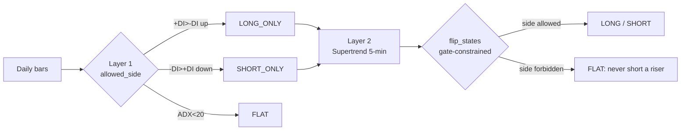
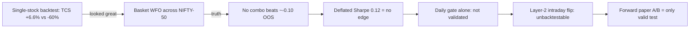

# TradePilot — Bear-Day Audit, Regime Engine & Learnings

*Session audit log + comprehensive learnings — 2026-06-08 to 2026-06-09*

::: {.report-meta}

| | |
|:--|:--|
| **Project** | TradePilot (paper-trading engines) |
| **Scope** | Trade-audit tooling · v7_regime engine · long/short research · data hygiene |
| **Branch** | `dev` (10 commits) |
| **Trigger** | Bear day (2026-06-08): v4 long-only bled, v5 short-tilted profited |
| **Status** | Complete — v7 live as paper A/B from 2026-06-09 08:45 IST |
| **Created** | 2026-06-09 |

:::

::: {.doc-author}

| | |
|:--|:--|
| **Author** | Soumya Swain |
| **Email** | soumya@sidewall.in |
| **Assistant** | Sarathi (Claude Opus 4.8) |

:::

---

## Executive summary

A bear session (Nifty −0.94%) exposed a structural flaw: TradePilot's scorer emits **zero SELL signals**, so the long-only engine (v4) piled 47 longs into a falling market and bled, while the short-tilted engine (v5) made money. We built a per-trade **counterfactual audit** that quantified the leak (Rs 52,221 left on the table; `LONG_IN_BEAR` alone −Rs 18,826), ran **adversarially-verified research** into long/short/flip systems, and shipped a **two-layer regime engine (v7_regime)** — a daily ADX/DMI gate that sets the *allowed side*, plus an intraday Supertrend flip within it.

The honest twist: **walk-forward optimization showed the daily gate has no historical edge** (Deflated Sharpe 0.12). Thresholds aren't the lever; the engine's real bet is the *intraday* flip, which has no history to backtest. So v7 went live as a **paper experiment** — the only valid way to test it — graded automatically each day by the audit tool. We also fixed 22 rotted NSE tickers in the universe and added a rot-guard.

::: {.metrics-table}

| Metric | Value | Note |
|:-------|:------|:-----|
| Realized P&L (2026-06-08) | −Rs 11,128 | 194 trades, 121 long / 73 short |
| Profit left on the table | Rs 52,221 | recoverable with right side + timing |
| Largest leak (`LONG_IN_BEAR`) | −Rs 18,826 | bigger than the whole net loss |
| Daily-gate WFO edge | none (DSR 0.12) | thresholds are not the fix |
| Universe tickers repaired | 22 of 29 | verified vs live Yahoo before applying |
| Commits shipped | 10 | all on `dev`, tests green |

:::

## Session audit log (chronological)

::: {.changes-table}

| # | Phase | What happened | Outcome |
|:--|:------|:--------------|:--------|
| 1 | Launch | Started the market stack for 2026-06-08 open | 3 engines + dashboard up |
| 2 | Triage | "v4 not scanning" → found it's the intentional 09:30 yfinance warm-up | not a bug |
| 3 | Audit build | Built `trade-audit.py` — 3-layer per-trade counterfactual | root cause found: 0 SELL signals |
| 4 | Observe | Started missed-opportunities + profit watchdogs (were never launched) | session recorded live |
| 5 | Diagnose | EOD audit: −Rs 11,128, Rs 52k on table, `LONG_IN_BEAR` dominant | quantified the leak |
| 6 | Research | Deep-research harness: 23 sources, 16 claims confirmed / 9 killed | two-layer spec |
| 7 | Build | v7_regime engine via TDD + subagent-driven dev | Layer 1 gate + Layer 2 flip, 10 tests |
| 8 | Intraday | Wired Layer 2 to live 5-min candles (daily fallback) | true intraday flip, 13 tests |
| 9 | Data | Refreshed daily CSVs (452 symbols) | NIFTY-500 current to 2026-06-08 |
| 10 | Validate | Walk-forward tuning + Deflated Sharpe | honest: no historical edge |
| 11 | Go live | v7 = 4th engine, paper A/B, armed for 08:45 auto-launch | first live evidence today |
| 12 | Hygiene | Resolved 22 renamed NSE tickers + rot-guard | universe 390/397 fresh |

:::

## The diagnosis — why the bear day bled

The audit classified every trade. One mistake class explains the entire loss:

::: {.metrics-table}

| Mistake class | Count | Realized | On table |
|:--------------|:------|:---------|:---------|
| LONG_IN_BEAR | 78 | −Rs 18,826 | Rs 37,650 |
| GOOD_TRADE | 57 | +Rs 8,245 | Rs 6,258 |
| EXIT_TOO_EARLY | 35 | +Rs 994 | Rs 5,205 |
| SHORTED_RISER | 22 | −Rs 1,535 | Rs 3,068 |
| IGNORED_SIGNAL | 2 | −Rs 7 | Rs 40 |

:::

The natural experiment proved the fix before we built it: **v4 (long-only) −Rs 8,325; v5 (short-tilted, 40 shorts) +Rs 465** on the same falling day. The problem was never stock-picking — it was the absence of a regime gate and a SELL signal.

## What we built — the two-layer regime engine

::: {.spec-table}

| Module | Lines | Purpose |
|:-------|:------|:--------|
| `prototype/v7/regime_gate.py` | ~70 | Layer 1: ADX/+DI/-DI + SMA50 slope → allowed_side |
| `prototype/v7/supertrend_flip.py` | ~70 | Layer 2: Supertrend SAR + gate-constrained flip machine |
| `scripts/v7_regime-paper-trade.py` | (v5 clone) | the engine — direction swapped for gate+flip on 5-min bars |
| `scripts/v7-regime-backtest.py` | ~60 | Layer-1 gated-vs-buy&hold backtest |
| `scripts/v7-wfo-tune.py` | ~150 | walk-forward ADX tuning + Deflated Sharpe |
| `scripts/trade-audit.py` | ~360 | per-trade counterfactual + bear-day solution |
| `scripts/fix-stale-tickers.py` | ~140 | universe rename resolver + rot-guard |

:::

Design intent: Layer 1 (slow, daily) decides *which side is even allowed*; Layer 2 (fast, intraday 5-min) decides *when to enter and flip* within it. A side the regime forbids collapses to FLAT — making "short a riser / long a faller" structurally impossible. 13 unit tests pass; the smoke gate stays green.

## The honest validation result

Walk-forward optimization across the 49-stock NIFTY-50 basket found **no ADX-threshold combination with a positive out-of-sample Sharpe** (best ≈ −0.10), and a Deflated Sharpe Ratio of **0.12** — essentially no evidence of skill. We did **not** fabricate a tuning win. v7 ships with 25/20 (least-bad) explicitly labelled *experiment, not validated edge*. Because the intraday Layer-2 flip cannot be backtested (no intraday history), the **forward paper A/B is the only honest validation path** — and the audit grades it daily.

## Learnings

::: {.metrics-table}

| # | Learning | Why it matters |
|:--|:---------|:---------------|
| 1 | The leak was **structural, not stock-picking** | No SELL signal + no regime gate → bear days are a long-only bloodbath regardless of which stocks are chosen |
| 2 | **Counterfactual auditing** beats P&L watching | "Rs on the table" + mistake-class breakdown points at the fix; raw P&L only says you lost |
| 3 | **Single-symbol backtests lie** | TCS "+6.6% vs −60%" was regime-cherry-picking; basket WFO + DSR exposed zero edge |
| 4 | **DSR is the honesty check** | A good-looking Sharpe across many tried variants is usually selection luck; DSR 0.12 said "no" |
| 5 | **Some theses can't be backtested** | Layer-2 needs intraday history that doesn't exist → forward paper is the only valid test; ship it labelled as an experiment |
| 6 | **Hardcoded universes rot** | 29 NSE tickers had renamed/demerged (ZOMATO→ETERNAL, TATAMOTORS demerger); added a `--audit` rot-guard |
| 7 | **Verify data mappings before applying** | A wrong ticker loads the wrong company — worse than a gap; tested all 22 renames vs live Yahoo first |
| 8 | **TDD pure modules first** | Layers 1 & 2 are pure functions with tests; the engine just wires them — fast, safe, reviewable |
| 9 | **Right side beats right timing** | Flipping every wrong-direction trade would have added +Rs 40,718 vs +Rs 26k from better timing alone |
| 10 | **Watchdogs must be in the launch path** | The observers existed but were never started; capture only began once launched mid-session |

:::

## Artifacts & commits

::: {.commit-table}

| Commit | Summary |
|:-------|:--------|
| `f4d000b` | trade-audit engine — per-trade counterfactual + bear-day solution |
| `295c4bb` | two-layer long/short/flip research spec |
| `b64979d` | directional indicators (ADX/+DI/-DI) |
| `0e11e45` | Supertrend SAR + gate-constrained flip machine |
| `1e92dc7` | Layer-1 walk-forward-lite backtest |
| `9f9d7cf` | regime-gated paper engine (opt-in) |
| `319472a` | Layer 2 flips on intraday 5-min candles |
| `76d3bdd` | walk-forward ADX tuner + Deflated Sharpe |
| `18aee44` | go live as paper A/B (4th engine) |
| `05e0554` | resolve 22 renamed tickers + rot-guard |

:::

**Reports rendered:** `docs/audit/2026-06-08_audit-report.pdf`, `docs/research/2026-06-08_long-short-flip-spec.pdf`, `docs/superpowers/plans/2026-06-08-v7-regime-engine.pdf`, and this document.

## Open items / next steps

::: {.task-table-3}

| ID | Item | Priority |
|:---|:-----|:---------|
| NEXT-1 | Review v7's first live A/B via tonight's auto-audit (15:35) | high |
| NEXT-2 | If v7 whipsaws, add Supertrend flat-line stand-aside (spec chop guard) | medium |
| NEXT-3 | Add a real SELL tier to the scorer (the actual root-cause fix) | high |
| NEXT-4 | Re-fetch the 7 unresolved tickers periodically (Yahoo coverage gaps) | low |
| NEXT-5 | Wire `fix-stale-tickers.py --audit` into the weekly cron | low |

:::

> **Bottom line:** We turned a losing bear day into a quantified diagnosis, a researched fix, a shipped experiment, and a cleaner data foundation — while staying honest that the edge is unproven and today is the first real test.
