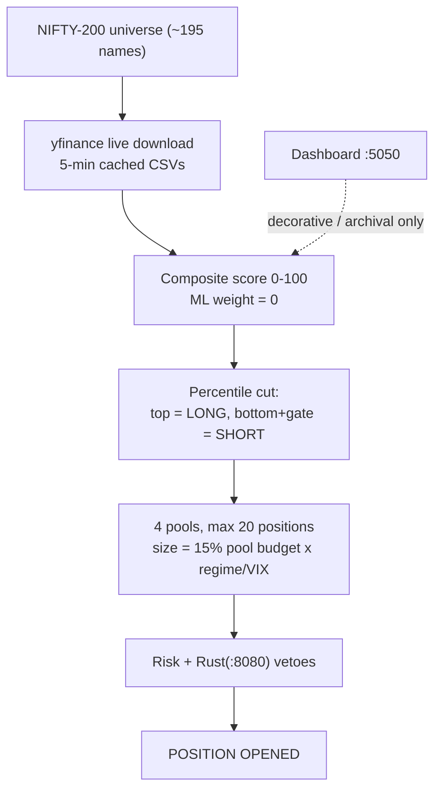

# TradePilot Root-Cause Analysis

*Why the complex engine underperforms the simple original — full mechanism, change history, and the real fix direction*

::: {.report-meta}

| | |
|:--|:--|
| **Project** | TradePilot (paper-trading, NSE intraday) |
| **Report** | Root-Cause Analysis — engine performance regression |
| **Version** | `v1.0.0` |
| **Status** | Complete |
| **Created** | 2026-06-24 |
| **Method** | 4 parallel read-only investigations (data path, trade lifecycle, git archaeology, loss correlation) |

:::

::: {.doc-author}

| | |
|:--|:--|
| **Author** | Soumya Swain |
| **Email** | soumya@sidewall.in |

:::

---

## 1. Executive Summary

The investigation answers four questions: where stocks come from, how trades are targeted, what the original profitable engine did, and why current performance lags it.

Three findings matter most:

1. **Stock data comes from live Yahoo Finance, not the dashboard.** The `localhost:5050` dashboard is decorative and archival — it is never in the live trade path.
2. **The original edge was selectivity and discipline, never the models.** On the best early day (82% win rate), winner and loser scores were statistically identical — the ML score was not picking winners. The tight bracket, long-only concentration, and end-of-day flat exit made the money.
3. **The complexity added since then diluted that edge.** Win rate fell from 82% to ~48% as trades-per-day rose from 17 to 45. That is the signature of over-diversification and over-trading regressing a selective alpha toward a coin flip.

A premise correction: the engine is **not currently losing money** — it is net positive over the last 12 sessions. The real problem is structural underperformance versus a far simpler version, and running at a fraction of target.

## 2. How Stock Selection Works Today

The live `v5` engine scores the NIFTY-200 (~195 names) off live Yahoo Finance downloads, ranks by a composite score, and opens positions through risk vetoes. The dashboard is not consulted.

### Data and selection facts

::: {.metrics-table}

| Element | Value | Source |
|:--|:--|:--|
| Universe | NIFTY-200 (~195 names) | `prototype/v4/config.py:97-99` |
| Data feed | Live yfinance, 5-min cache | `prototype/v4/data_nse.py:576` |
| Dashboard in trade path | No — archival only | `prototype/app.py` (separate process) |
| Score model | Composite 0-100, ML weight 0 | `prototype/v4/config.py:166-167` |
| Max positions | 20 across 4 pools | `prototype/v5/risk_manager.py:50` |

:::

## 3. How Trades Are Targeted

Stops and targets are fixed-percent, set at signal time. Entries are spread across the day (initial deploy, then rescore every 30 minutes).

::: {.metrics-table}

| Mechanic | Value | Source |
|:--|:--|:--|
| Stop-loss | -1.5% (-2.25% on gap mornings) | `scripts/v5-paper-trade.py:491-493` |
| Target | +2.0% | `scripts/v5-paper-trade.py:494` |
| Trailing | break-even at +1.0%, then 0.5% trail | `scripts/v5-paper-trade.py:642-658` |
| Position size | 15% of pool budget x regime/VIX mult | `scripts/v5-paper-trade.py:482` |
| Rescore interval | 30 min | `scripts/v5-paper-trade.py:46` |

:::

### Exit reasons (evaluated in this order)

::: {.gap-table}

| Exit | Trigger | When it fires | Risk |
|:--|:--|:--|:--|
| FLAT_FORCE_EXIT | 13:30-14:00 and abs(pnl) < 0.3% | Before stop/target are checked | Dumps recoverable near-flat positions at small loss + cost |
| STOPLOSS | Price crosses stop | Any scan | ~1.5-2.25% realized loss |
| TARGET | Price reaches target | Any scan | Marks symbol re-armable |
| SIGNAL_FLIP | 30-min rescore flips direction | After 60-min min-hold | Whipsaw if rescore is noisy |
| TIME_EXIT | 15:15 IST | End of day | Intraday positions force-closed |

:::

## 4. What the Original Engine Did

The first profitable engine (`scripts/paper-trade-engine.py @ 236d6e4`, April) was dramatically simpler. Its measured result on 2026-04-08 was net +0.72% at an 82% win rate over 17 trades.

::: {.gap-table}

| Dimension | Original (April) | Current (June) | Direction |
|:--|:--|:--|:--|
| Universe | NIFTY-50 | NIFTY-200 | 4x wider |
| Direction | Long-only | Long + short + flip | More exposure |
| Positions | 5 | 20 | 4x more |
| Trades/day | 17 | ~45 | 2.6x more |
| Bracket | +1.5% / -0.75% | +2.0% / -1.5% | Wider stops |
| Win rate | 82% | 44-53% | Collapsed |

:::

The complexity cascade was reactive: regime detection, kill switches, shorts, pools, the flip machine, and FLAT_FORCE_EXIT were each bolted on after a single bad day — most notably v4's -Rs 30,816 loss on 2026-04-09 (a bear day with no regime filter). None were added because the simple engine was failing.

## 5. The Root Cause

The original edge was **selectivity plus discipline, not intelligence**. Evidence: on the 82%-win-rate day, the average winner score (66.9) was effectively equal to the average loser score (69.2). The model was not separating winners from losers — the disciplined bracket and end-of-day flat exit on a concentrated long-only book did the work. This is corroborated twice: the ML information coefficient was 0.006, and ML is now weighted zero with no measured degradation.

Every complexity layer diluted that edge. As the engine widened to NIFTY-200, added shorts, grew to 45 trades/day, and spread capital across 20 positions in 4 pools, the win rate fell from 82% to ~48%. Rising trade count with falling win rate is the mathematical signature of over-diversification and over-trading: more bets on more marginal names, each paying ~12 bps round-trip cost, regressing the edge toward random.

The recurring SIDEWAYS-regime losses are a **symptom of the short book**, not a separate defect. The original was long-only and structurally could not lose on choppy days the way the current engine does — it had no shorts to short into the chop. Every recent red day was SIDEWAYS regime.

## 6. Premise Correction — The Engine Is Net Positive

The reported "5 consecutive losing days" is not supported by the result files. Over the last 12 sessions the live `v5` engine is net **+Rs 12,100 (+1.2% on Rs 10L)**. Red days are 4 of 12, scattered (not consecutive), and small (each <= 0.13% of capital). The two largest days are wins.

::: {.metrics-table}

| Red day | v5 (live) | v5_classic (frozen original) | Cause |
|:--|--:|--:|:--|
| 06-16 | -1,347 | -1,979 (worse) | Market / regime |
| 06-17 | -767 | +2,088 (green) | v5-specific |
| 06-18 | -331 | -1,605 (worse) | Market / regime |
| 06-22 | -1,050 | +274 (green) | v5-specific |

:::

On two of the four red days the frozen original lost more than the current engine — so the added safeguards are net-ambiguous (they hurt on 06-17 and 06-22, helped on 06-16 and 06-18). The real issue is not bleeding; it is **structural underperformance versus the simple original**, and running at a fraction of the Rs 40-50k/day target (Rs 1.6k on a good day).

## 7. Recommended Fix Direction

This is an architecture question, not a patch. The pattern — each fix revealing a new problem elsewhere — indicates the reactive complexity cascade should be questioned rather than extended. All steps below are reversible and measured against real money-equivalent shadows.

::: {.task-table-3}

| ID | Action | Priority |
|:--|:--|:--|
| RC-1 | Resurrect the original simple engine (`paper-trade-engine.py @ 236d6e4`) as a live shadow; run head-to-head vs v5 for 2 weeks | High |
| RC-2 | Gate off shorts in SIDEWAYS regime (one-line change) | High |
| RC-3 | Cut churn: drop position cap from 20 toward 5-8, tighten entry score threshold | Medium |
| RC-4 | A/B FLAT_FORCE_EXIT off; pull v5_apr's 2-week record before deciding | Medium |

:::

The single highest-value experiment is **RC-1**: it requires no rebuild (the blueprint is in git), risks nothing (paper shadow), and directly tests the core hypothesis — that the simple, concentrated, long-only engine beats the complex one on win rate and on profit per rupee at risk.

## 8. Key Learnings

::: {.gap-table}

| Theme | Learning | Application |
|:--|:--|:--|
| Edge source | The original edge was execution discipline (tight bracket + flat exit + concentration), not the ML score | Do not add model complexity to chase alpha that lives in execution |
| Over-trading | Win rate 82% to 48% as trades 17 to 45 = over-diversification regressing alpha to coin-flip | Fewer, higher-conviction trades; treat trade count as a cost, not a virtue |
| Reactive complexity | Each safeguard was bolted on after one bad day; net effect is ambiguous | Resist single-incident-driven feature additions; A/B every safeguard |
| Shorts and regime | SIDEWAYS losses are a symptom of shorting into chop, absent in the long-only original | Regime-gate shorts before adding more short logic |
| Premise discipline | Owner's "5 losing days" was not in the data; engine is net +1.2% | Verify the symptom against result files before debugging the cause |

:::
