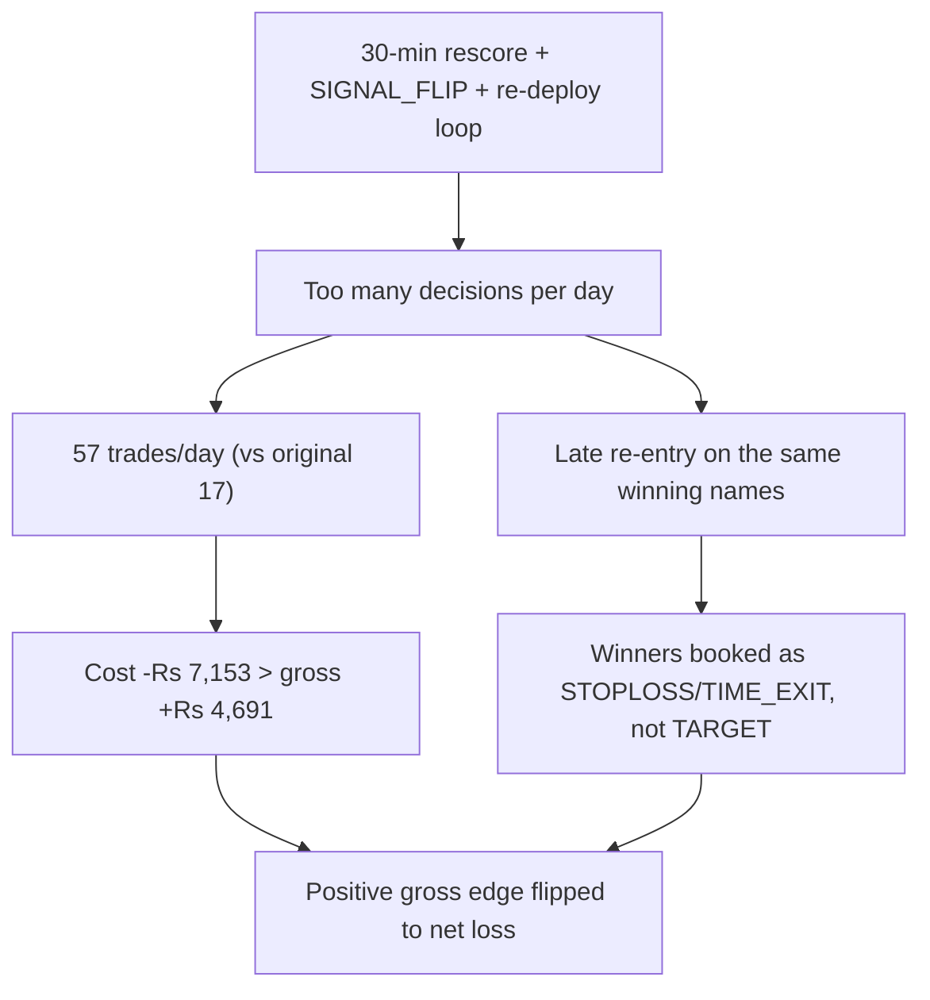

# TradePilot Root-Cause Analysis II

*Trade-level forensics — the real culprit is over-trading and late entry, not the safeguards*

::: {.report-meta}

| | |
|:--|:--|
| **Project** | TradePilot (paper-trading, NSE intraday) |
| **Report** | Root-Cause Analysis II — forensic deep-dive (companion to 2026-06-24) |
| **Version** | `v2.0.0` |
| **Status** | Complete |
| **Created** | 2026-06-26 |
| **Method** | 3 parallel read-only investigations: trade-level forensics, FLAT_EXIT A/B, churn-cost reconciliation |

:::

::: {.doc-author}

| | |
|:--|:--|
| **Author** | Soumya Swain |
| **Email** | soumya@sidewall.in |

:::

---

## 1. The Reframe

The first report suspected the bolted-on safeguards — especially FLAT_FORCE_EXIT — were the down-day bleed. Trade-level forensics **refute that.** Three independent investigations now converge on a different, simpler cause:

**The engine trades too often and enters too late. A positive gross edge is consumed entirely by transaction cost and missed-by-late-entry profit.**

- FLAT_FORCE_EXIT is **innocent** — on the two worst v5-specific days it actually protected capital.
- The real bleed is **entry timing**: on the same names, same direction, v5 enters 30–60 minutes later than the simple engine and captures far less.
- **Transaction cost flips a winning book into a losing one**: gross +Rs 4,691, cost −Rs 7,153, net −Rs 2,462 over 8 days. Excess churn alone was 205% of net P&L.

## 2. Evidence Stream A — Forensic Audit (06-17 and 06-22)

On both days the frozen original (v5_classic) made money while live v5 lost, on the same signals.

::: {.metrics-table}

| Day | v5 gross | v5_classic gross | Gap |
|:--|--:|--:|--:|
| 06-17 | -766.71 | +2,088.32 | -2,855.03 |
| 06-22 | -1,050.47 | +273.99 | -1,324.46 |

:::

Attribution of the gap (reconciles exactly to the totals):

::: {.gap-table}

| Suspect | 06-17 verdict | 06-22 verdict | Conclusion |
|:--|:--|:--|:--|
| FLAT_FORCE_EXIT | helped +30 vs classic | helped +299 vs classic | **Innocent — protected capital** |
| SHORT_BLOCK | saved +190 (suppressed losers) | inactive | **Innocent / helpful** |
| Wide 2.25% gap-stop | never fired | -764 (HUDCO, GVT&D) | **Minor real cost, one day only** |
| **Late entry (same name/side)** | **-1,969 of -2,855** | **-1,092 of -1,324** | **The dominant culprit** |

:::

The killer is the bottom row. v5 entered later than v5_classic on 16 of 35 shared positions (06-17) and 21 of 38 (06-22) — late enough that winners classic rode to TARGET (COFORGE, TMPV, DIXON, TATACAP) were booked by v5 as STOPLOSS, SIGNAL_FLIP, or TIME_EXIT instead. The 30-minute rescore-and-redeploy loop fragments and delays entries.

## 3. Evidence Stream B — FLAT_EXIT A/B (v5_apr, 9 days)

v5_apr runs identical v5 code with FLAT_EXIT disabled (and winner re-arm raised 3 to 6).

::: {.metrics-table}

| Basis | v5 | v5_apr | Difference |
|:--|--:|--:|--:|
| Net P&L (9 days) | -341 | +967 | +1,308 |
| Gross P&L (9 days) | +7,737 | +7,817 | +80 |

:::

Two conclusions: (1) disabling FLAT_EXIT helps net and wins 6 of 9 days; (2) on a gross basis the engines are a coin-flip — **the entire +1,308 edge is cost/efficiency, not raw alpha.** Confound stated honestly: winner-rearm also changed, so this is a directional signal to run a clean single-variable test, not a settled verdict. n=9 is too small for significance.

## 4. Evidence Stream C — Churn-Cost (8 days, reconciled to the rupee)

::: {.metrics-table}

| Metric | Value |
|:--|--:|
| Gross P&L | +4,691 |
| Round-trip cost paid (12 bps x 454 trades) | -7,153 |
| Net P&L | -2,462 |
| Excess cost vs original 17-trades/day cadence | -5,046 (205% of net) |
| Counterfactual net at 17 trades/day | +2,584 |

:::

Actual cadence is ~57 trades/day, not the 45 estimated earlier. The cost model is verified exactly — recomputing all 454 trades reproduces the reported Rs 7,153 to the rupee. A separate discovery: average position notional is **Rs 13,130, ~10x smaller** than the 15%-of-pool rule implies — so capital is barely deployed (~Rs 260k working on Rs 10L) and sliced into tiny lots churned 57x/day.

## 5. Unified Root Cause

The original engine entered early, held, and exited on a tight bracket — ~17 trades/day, catching moves at the start. The current engine's re-evaluation machinery generates constant churn: it re-scores, flips, fragments, and re-enters, which (a) delays entry past the profitable window and (b) racks up cost that exceeds the gross edge. The safeguards we suspected are not the problem; **over-activity is.**

## 6. Revised Fix Priorities

::: {.task-table-3}

| ID | Action | Priority |
|:--|:--|:--|
| RC-1 | Resurrect the original simple engine as a live shadow; 2-week head-to-head | High |
| RC-5 | Slow or disable the 30-min rescore/SIGNAL_FLIP loop; enter early and hold to bracket | High |
| RC-3 | Cut trade count / concentrate capital (fewer, larger positions) | High |
| RC-6 | Clean single-variable A/B: FLAT_EXIT=0 with rearm kept at 3 | Medium |
| RC-2 | Gate shorts off in SIDEWAYS regime | Medium |
| RC-4 | Tighten or remove the 2.25% gap-day stop | Low |

:::

FLAT_FORCE_EXIT is dropped from the priority list — the evidence clears it. The high-value levers are all about **doing less**: trade less often, enter once and hold, concentrate capital. That is precisely what the profitable original did.

## 7. Key Learnings

::: {.gap-table}

| Theme | Learning | Application |
|:--|:--|:--|
| Evidence over plausibility | The diff-obvious suspect (FLAT_FORCE_EXIT) was exonerated by rupee-level audit; it helped, not hurt | Always attribute losses trade-by-trade before fixing a suspected mechanism |
| The real bleed | Late entry on the same winning names cost -1,969 and -1,092 on the two audited days | Enter at signal, hold; do not let a rescore loop delay or fragment entries |
| Cost is the killer | Gross +4,691 but cost -7,153 = net -2,462; excess churn = 205% of net | Trade count is a direct cost; cut cadence from 57 toward 17/day |
| Under-deployed capital | Avg position Rs 13,130 vs Rs 135k implied; ~Rs 260k working on Rs 10L | Fewer, larger positions — concentration, not fragmentation |
| Edge is intact | On gross terms the edge still exists; the loss is pure execution drag | The strategy is not broken; the trading frequency is |

:::
