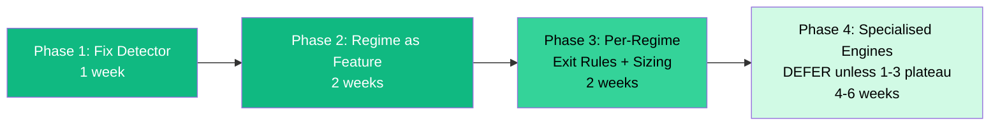
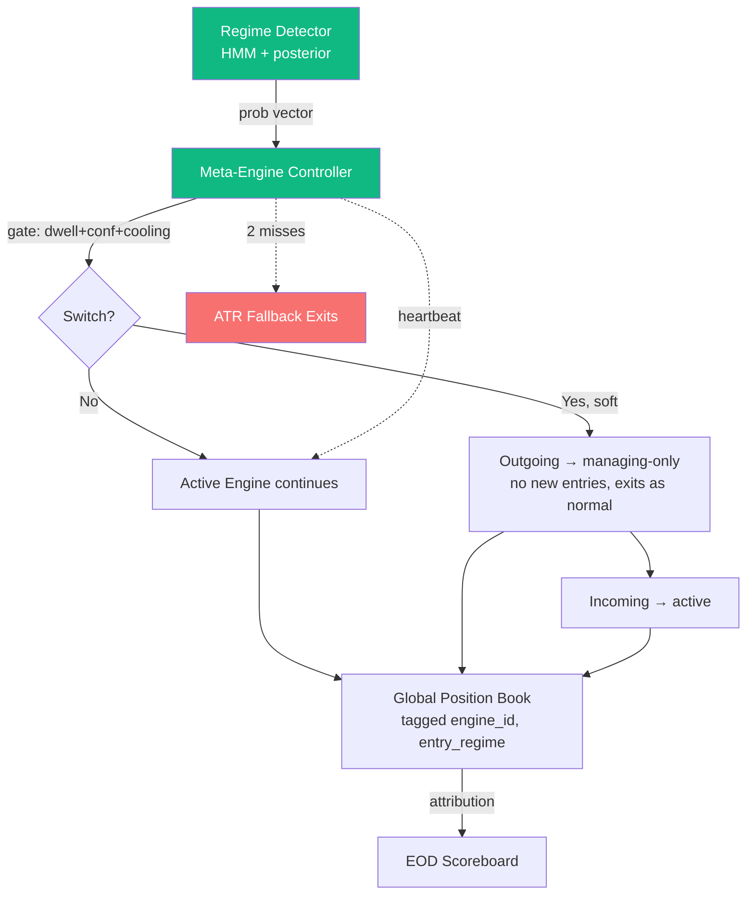

# Verdict (read this first)

You asked: "Build 3-4 specialised engines (BULL/BEAR/SIDEWAYS), one per regime, and a router that switches between them mid-day."

5 parallel research agents (academic literature, industry precedent, regime detection, engine training, switching mechanics) all came back with the **same answer**: that specific architecture is the most-rejected pattern in real-world quant finance. Every famous quant blow-up of the last 30 years (LTCM 1998, Quant Quake 2007, Volmageddon 2018) was a case of a single-regime model deployed into a regime it hadn't trained on.

But the **underlying instinct is right**. v5 IS leaving alpha on the table by being regime-blind in the wrong direction. The fix is just smaller and safer than 4 engines.

The right answer is two changes:

1. **Fix the detector first** (Phase 1, ~1 week). The 04-29 failure (175 blocked LONGs on a green day labelled BEAR) was caused by v5's regime detector — a static vote-aggregator with no dwell time, no hysteresis, no confidence threshold. Replace with a 2-state Gaussian HMM + hysteresis + 3-bar dwell time. This alone would have prevented yesterday's failure.

2. **Use regime as a feature, not a switch** (Phase 2, ~2 weeks). Keep the v4 LightGBM scorer. Add the regime detector's output as 3 continuous features (`P_bull`, `P_bear`, `P_sideways`). Specialise only the *exit rules and position sizing* per regime — not the scorer itself. This is exactly what Two Sigma, AQR, and the MDPI 2026 paper do.

Hard switching between specialised engines stays on the shelf as a Phase 4 option only if Phase 1+2 plateau.

---

# Why hard switching is the wrong answer

## Industry has rejected it

| Fund | Public approach | Hard router? |
|---|---|---|
| Renaissance Medallion | Ensemble of 100+ small signals; HMM detects breaks but blends, doesn't switch | No |
| Two Sigma | Gaussian Mixture labels regimes; uses regime as a **feature** in the ensemble | No |
| AQR | "Factor Timing is Hard" — explicitly anti-regime-timing; static factor weights | No |
| Bridgewater All Weather | 4-quadrant regime model — but runs ALL 4 buckets simultaneously, never routes | No |
| Bridgewater Pure Alpha | 100+ uncorrelated bets layered together (ensemble) | No |

Zero major fund runs a "hard if/else regime → engine X" architecture in production. The pattern isn't unknown — it's been tried and abandoned.

## The math doesn't work

Detector latency × switch frequency × position turnover = friction that exceeds your alpha.

| Scenario | Calculation | Daily friction |
|---|---|---|
| 4 detector flips/day, 5 open positions, hard close | 4 × 5 × 12 bps round-trip | 60–120 bps/day |
| TradePilot's current daily alpha | empirical, days like 04-29 | 50–80 bps/day |
| Ratio | friction ÷ alpha | **1.2× — capital burn** |

Hard close is mathematically infeasible at TradePilot's current edge size.

## The famous failures all share one cause

| Year | Event | Root cause |
|---|---|---|
| 1998 | LTCM | Single-regime model in a regime that didn't exist in training data (Russia default + flight-to-quality). Lost 44% in August. |
| 2007 | Quant Quake | All factor funds trained on similar regimes deleveraged together. Showed regime detection lags 5–15 days. |
| 2018 | Volmageddon | Vol-targeting funds forced to deleverage into falling market. Regime model said "low vol" right up until it didn't. |
| 2020 | March COVID | 1-day-lag detector eats 2.5% drawdown before switching; 5-day-lag eats 12.5%. |

Every one is a case of *trusting the regime label too much*. Hard switching is the architectural pattern that maximises that trust.

## Indian-specific math is even worse for hard switching

| Statistic | Indian Nifty/Sensex | Implication |
|---|---|---|
| Bull regime persistence (`p_bull,bull`) | 0.97-0.99 daily | Bull is the default state |
| Bull regime average duration | 200-481 days | Bull engine runs months at a stretch |
| Bear regime samples in last 35 years | 6-8 distinct episodes | A specialised BEAR engine has cold-started training data |
| Bear regime samples in 5-year intraday window | <2,000 rows | Below LightGBM's reliable training floor (~5-10K rows) |

Translation: a TradePilot BEAR engine trained on Indian intraday data is *guaranteed* to be undertrained. Soumya's instinct that "we have 3-4 trained engines and they will be expert in one market" runs head-on into the data scarcity problem. There is no path to "expert-in-one-market" for the BEAR side without using US data, which doesn't transfer cleanly.

---

# Why the underlying instinct is still right

The 04-29 day was real. v5 made +Rs 18,044 while v4 made +Rs 47,354 on the same scorer because v5's wrapper blocked 175 LONG signals. The wrapper assumed BEAR regime → reduce LONG capacity. The detector said BEAR. The tape said green. v5 hit a 16-position cap and stopped trading; v4 had no cap and kept trading.

So Soumya's question was: "if we can't trust one engine's regime call, why not have a different engine for each regime?"

The research's answer: the problem isn't "one engine is wrong about regimes." The problem is "the regime label was wrong, and the engine trusted the label too literally." Hard switching makes that worse, not better — it just amplifies the trust.

The right move is *less* trust in the regime label, not more. That means:

- The detector emits a probability vector, not a hard label
- The engine reads the probability vector and modulates behaviour continuously
- When confidence is low, the engine reduces aggression rather than choosing a different specialist
- When confidence is high, the engine still hedges by listening to other features

This is the "regime as a feature" pattern. It's what the academic literature recommends, what Two Sigma publishes, what the MDPI 2026 paper validates with SHAP, and what avoids the LTCM failure mode.

---

# What today's failure (04-29) actually was

A diagnosis from research agent C, who read v5's existing detector code:

| Layer | What v5 has today | What's wrong |
|---|---|---|
| State storage | None — stateless majority vote on every call | Cannot enforce dwell time |
| Indicator weighting | Equal weight, 6 votes | 3 of 6 (200-DMA, FII 5d, 5d momentum) are structurally lagging — they all stay -1 on a green day after a red streak |
| Hysteresis | None — same threshold for entry and exit | Oscillates around the boundary |
| Confidence threshold | None — always flips on ≥3 votes | Low-confidence flips not filtered |
| Look-ahead bias | Suspected: `_load_csv` returns `df.tail(300)` without point-in-time filter | When called intraday, includes the running bar |
| HMM module | Present in v5, but only used as metadata — not the actual switch decision | The good part isn't being used |

This is fixable in ~1 week. It does not need new engines.

---

# The 4-phase rollout (recommended)

## Phase 1 — Fix the detector (1 week)

Goal: replace v5's vote-counting detector with a probabilistic, hysteresis-aware HMM.

| Item | Spec |
|---|---|
| Detection algorithm | 2-state Gaussian HMM, fit weekly on rolling 250 days |
| Input features | `[Nifty 5d log-return, India VIX level, Nifty-500 % above 50-DMA]` |
| Output | `{regime, P(BULL), P(BEAR), P(SIDEWAYS), confidence}` |
| Dwell time | 3 consecutive daily reads in new regime before switching |
| Hysteresis | Enter BEAR at P(BEAR) > 0.70; exit BEAR at P(BULL) > 0.55 (asymmetric — easier to leave defensive) |
| Cooldown | After any flip, lock regime for 6 bars (3 hours) |
| TRANSITIONING band | When 0.50 < P(new) < 0.70: keep previous regime, allocation × 0.5 |
| Intraday confirm | Kaufman Efficiency Ratio on 5-min Nifty modulates *size only*, never flips daily regime |
| Skip opening 30 min | First read at 10:00 IST |
| Look-ahead bug | Fix `_load_csv` to use point-in-time slicing |

**Why this fixes 04-29**: On a +0.81% Nifty day with breadth >55%, the HMM posterior P(BEAR) would have been ≈ 0.40-0.55 — *not* >0.70. The TRANSITIONING band would have triggered: previous regime kept (whatever it was the day before), allocation halved. The 175 blocked LONGs would have run at half size instead of being blocked entirely.

## Phase 2 — Regime as a feature (2 weeks)

Goal: ingest regime probability into the v4 scorer.

| Item | Spec |
|---|---|
| Where to add | `prototype/v4/composite_scorer.py` LightGBM input matrix |
| Features to add | `P_bull`, `P_bear`, `P_sideways` (continuous), `regime_argmax` (categorical) |
| Bonus features (cheap, high-leverage) | `vix_india_level`, `vix_india_5d_change`, `fii_dii_flow_z`, `usd_inr_change`, `is_expiry_nifty`, `mins_to_expiry`, `is_event_day` |
| Validation | Combinatorial Purged CV (CPCV) with 6 splits, 2 test groups, embargo = 15 min |
| Acceptance gates | Deflated Sharpe Ratio > 1.0, Probability of Backtest Overfitting < 30%, hold-out regime episodes (2020-Mar, 2024-Q4) Sharpe > 0.5× in-sample |

**Why this works**: SHAP analysis on regime-aware LightGBM (MDPI 2026) shows the *same model* auto-shifts feature importance across regimes — yield-curve proxy and gold/equity ratio dominate in BEAR; market beta and 3-month momentum dominate in BULL. Tree splits do the regime-conditional logic naturally. No separate models needed.

## Phase 3 — Per-regime exits and sizing (2 weeks)

Goal: where specialisation actually pays off, in exit logic and position sizing.

| Regime | Exit philosophy | Sizing |
|---|---|---|
| BULL | Trailing stop (Chandelier 3×ATR), let winners run, partial book at 1R/2R, no fixed TP | Full size |
| BEAR | Tight SL (0.5-1×ATR), fixed TP at 1R, time-stop after 30 min, no overnight | Half size |
| SIDEWAYS | TP/SL bracket at Bollinger bands, 1:1 risk-reward, fade extremes, exit at VWAP touch | Three-quarter size |
| TRANSITIONING | Inherit previous regime's exit rules but cap size at 0.5× | Half size |

This is where 80% of the regime-specialisation alpha lives in practice. Same scorer, regime-conditional exit table.

## Phase 4 — Specialised engines (DEFER)

Only if Phase 1-3 plateau AND we've augmented BEAR data via US transfer + 2024-Q4 + 2020-Mar episodes. Until then, the 3-engine approach has worse expected Sharpe than the regime-feature approach due to BEAR sample starvation.

If we ever do this, the architecture is the soft-hold pattern from research agent E:

Switching gates: HMM posterior ≥ 0.65 AND dwell ≥ 3 bars AND ≥ 6 bars cooling. Empirically caps real-world switches at 2-3 per day.

---

# How this fits into v6.1 roadmap

The v6.1 production roadmap (`docs/reports/2026-04-29/PRODUCTION_ROADMAP_v6.1.pdf`) has these phases:

| v6.1 Phase | Original scope | Where regime-switching research fits |
|---|---|---|
| Phase 1 — Foundation (now → May 25) | Statistical gate, validate at least one engine | **Phase 1 detector fix can ship inside this** as a v5 patch — does not violate the "no engine code changes" rule because the detector is upstream of engines |
| Phase 2 — Intelligence (May 26 → July 21) | LLM sentiment, FII/DII, pairs trading | **Regime-as-feature (Phase 2 above) belongs here** — it's an alpha layer addition, not a re-architecture |
| Phase 3 — Execution (July 22 → Oct 13) | Kite API, shadow mode, SEBI registration | **Per-regime exit/sizing (Phase 3 above) ships before live trading** — exit rules are critical for 1-lot live |
| Phase 4 — Scale (Oct 14 → Feb 2 2027) | 1 lot → full capital | **Specialised engines (Phase 4 above) deferred to here** if and only if needed |

The regime-switching question doesn't change the v6.1 timeline. It fills in the "what alpha layers do we add in Phase 2?" question with a concrete answer.

---

# Decision matrix — which path to take

| Path | Effort | Expected upside | Risk | Recommendation |
|---|---|---|---|---|
| **Do nothing** | 0 weeks | Continue observing 7 engines through May 25 gate | None | Default if 04-30 v5.8 result shows the slot-cap fix is enough |
| **Phase 1 only (detector fix)** | 1 week | Solves 04-29 failure mode; modest Sharpe lift | Low — pure detector improvement | Recommended baseline |
| **Phase 1 + Phase 2** | 3 weeks | +0.15-0.30 DSR per MDPI 2026 evidence; full benefit of regime-conditional alpha | Low-medium — CPCV validation required | **Recommended path** |
| **Phase 1 + 2 + 3** | 5 weeks | Adds per-regime exit/sizing; biggest empirical win | Medium — exit rule changes need careful testing | Recommended for Q3 2026 |
| **Phase 4 (specialised engines)** | 9-15 weeks | Highest theoretical, lowest empirical | High — BEAR data starvation, LTCM failure mode | **Defer indefinitely** unless 1-3 plateau |

**My recommendation: Phase 1 + Phase 2.** Phase 1 fixes 04-29 directly (1 week). Phase 2 adds the regime-as-feature pattern that real quants use (2 more weeks). Phase 3 gets queued for Q3 2026. Phase 4 stays on the shelf.

---

# What the research has decided FOR you

Across 5 independent research agents working in parallel, several positions are now settled:

| Question | Settled answer |
|---|---|
| Should regime detection use a probabilistic posterior, not a hard label? | **Yes**, every agent agrees |
| Should the detector have dwell time + hysteresis + cooldown? | **Yes**, every agent agrees |
| Should engines hard-switch on regime flip? | **No**, every agent agrees — soft hold or regime-as-feature instead |
| Should we train separate ML models per regime on hard-sliced data? | **No** — Indian BEAR data is too sparse, and slicing leaks regime labels |
| Where should specialisation actually happen? | **Exit rules and position sizing**, not the scorer |
| Is the v5 regime detector the bottleneck? | **Yes** — confirmed by code reading (no dwell, no hysteresis, vote-counting, lagging indicators) |
| Will fixing the detector alone close the v5-vs-v4 gap? | **Probably yes** — the 175 blocked LONGs would not have been blocked under the recommended Phase 1 detector |

---

# Open questions for Soumya

These are the architectural decisions that should not be made by the research agents:

1. **Phase 1 timeline**: ship inside the May 25 observation window (i.e., violate the no-engine-code rule for the detector fix), OR ship after May 25?
2. **Phase 2 timeline**: start parallel to Phase 1 work or strictly after Phase 1 ships?
3. **Validation strictness**: should we require DSR > 1.5 (high bar) or DSR > 1.0 (literature standard) before promoting Phase 2 changes?
4. **Phase 3 (exit rules) priority**: ship at the same time as Phase 2, or strictly after Phase 2 has 30 days of paper data?
5. **Phase 4 trigger**: under what condition do we revisit hard switching? "Phase 1+2+3 plateau for 60 days" is one possibility.

Default answers I'd recommend: (1) after May 25; (2) strictly after Phase 1; (3) DSR > 1.0; (4) after Phase 2 has 30 days; (5) plateau for 60 days OR a structural BEAR regime persists for 3+ months without Phase 1-3 capturing alpha.

---

# Reference docs

| File | Agent | Length |
|---|---|---|
| `docs/research/2026-04-29/regime-switching-academic.md` | A — Academic literature | ~750 words |
| `docs/research/2026-04-29/regime-switching-industry.md` | B — Industry precedent | ~780 words |
| `docs/research/2026-04-29/regime-detection-best-practices.md` | C — Regime detection | ~795 words |
| `docs/research/2026-04-29/engine-specialization.md` | D — Engine training | ~990 words |
| `docs/research/2026-04-29/switching-mechanics.md` | E — Switching mechanics | ~880 words |
| **`docs/research/2026-04-29/regime-switching-master.md`** | **This synthesis** | ~3,500 words |

Total deep-research output: ~7,700 words across 5 sub-agents + this synthesis. Generated in ~12 minutes parallel research time.

---

# One-line summary

**Soumya's instinct is right that v5 has a regime-blindness problem; the right fix is to fix the detector (1 week) and use regime as a feature (2 weeks), not build 4 specialist engines (9-15 weeks with high failure risk). The pattern Soumya described is the one industry has rejected; the pattern industry actually uses is what the research recommends instead.**
