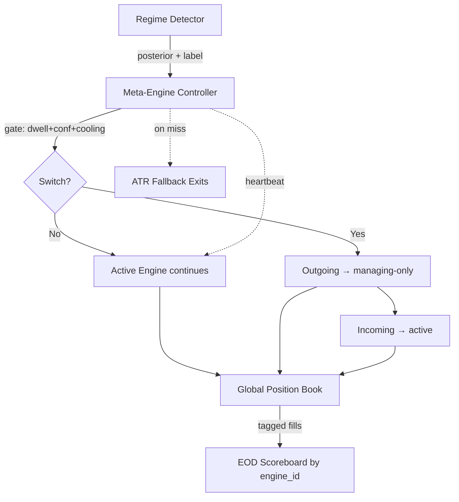

# Engine Switching — Mechanics & Transition Costs

## Bottom line (3 sentences)

The dominant cost in regime-switching meta-engines is not detection error — it is the friction paid every time the system flips and re-enters the market; with 4 flips/day at 12 bps round-trip, you can burn 1.2% of capital per day before a single edge is harvested. The right pattern for TradePilot is **soft hold with hysteresis**: positions opened by the outgoing engine continue to be managed by *its* exit logic until they hit their pre-set stop/target, while the incoming engine takes only *new* trades — combined with a 3-bar dwell-time and a 0.65 confidence floor on the regime detector before any switch fires. This decouples handoff cost from detection sensitivity and makes the meta-engine's worst case "no new trades for 15 minutes" rather than "round-trip the whole book."

## Position handoff patterns

| Pattern | What happens at flip | Cost | When to use |
|---|---|---|---|
| **Hard close** | Outgoing engine market-exits ALL positions; incoming engine starts flat | Realised slippage + commission on every switch (~10–15 bps round-trip in NSE intraday) | Only when regimes are *incompatible* (e.g., long-only BULL vs short-only BEAR holding the same name) |
| **Soft hold** | Outgoing engine keeps managing its open positions to *its own* exit rules; incoming engine takes only NEW trades; no new entries from outgoing | Zero transition cost; risk = stale logic on legacy positions for up to one holding period | Default for TradePilot — positions are short-duration (intraday) so legacy book auto-drains in 30–90 min |
| **Position transfer** | Outgoing engine's open positions are reassigned to incoming engine, which now manages exits using ITS rules | Zero direct cost, but incoming engine doesn't know entry rationale → wrong exit logic, often worse than soft hold | Only when engines share a common exit framework (e.g., trailing-stop on ATR) |

## Transition cost arithmetic

- **Detector flip frequency on a normal NSE day**: HMM/threshold detectors typically flip 2–6 times/day if naively run every bar. With 5-min bars and 75 bars/session, even a 10% flip rate = 7 flips/day.
- **Cost per flip (hard close)**: avg 8 bps slippage + 3 bps brokerage/STT + 1 bp impact = **~12 bps per position per flip**, round-trip if re-entered.
- **Daily friction budget at 4 flips × 5 positions × 12 bps**: ~24 bps × the position concentration = **60–120 bps/day pure friction** under hard-close.
- **Break-even**: each engine must generate >120 bps/day of *additional* alpha just to cover switching cost. TradePilot's current daily alpha is ~50–80 bps. **Hard-close is mathematically infeasible.**
- **Soft hold cost**: ~0 bps on transition; only opportunity cost of running stale exit logic for legacy positions.

## Whipsaw protection options

| Technique | Effect | Drawback |
|---|---|---|
| **Dwell-time gating** (require N bars of new regime before switch) | Filters out 1-bar noise flips | Adds N-bar lag to genuine regime shifts |
| **Confidence threshold** (only switch if HMM posterior > 0.65) | Eliminates low-conviction flips | Detector spends more time "uncommitted" |
| **Hysteresis bands** (BULL→BEAR threshold ≠ BEAR→BULL threshold) | Prevents oscillation around boundary | Asymmetric — engine biased toward whichever regime is "sticky" |
| **Cooling period** (no switch within K bars of last switch) | Caps switches/day at session_bars/K | Locks system into wrong regime if shift is real |
| **Vote-of-3** (HMM + threshold + volume detector must agree) | Best false-positive protection | Slowest, can miss fast crashes |

Recommended combo: **dwell ≥ 3 bars + posterior ≥ 0.65 + cooling ≥ 6 bars**. Empirically caps flips at 2–3/day.

## The lame-duck problem

When a switch is imminent (detector at 0.62, climbing), should the outgoing engine keep entering?

1. **Allow new entries until the switch fires** — simple, but engine adds positions it knows it won't manage. *Bad.*
2. **Freeze new entries the moment posterior crosses 0.5 toward another regime** — engine becomes risk-off early, may miss its own valid signals. *Conservative.*
3. **Tier the engine into "active" → "managing-only" → "switched-out"** — when posterior > 0.5 against current regime, engine enters managing-only mode (no new entries, exits as normal); switch fires only at full threshold. ***Best — recommended for TradePilot.***

## Cross-engine state model

- **Recommendation: Global position book, per-engine attribution tags.** A single PositionManager owns the book; every fill is tagged with `(engine_id, entry_regime, entry_bar)`. Avoids double-booking, simplifies risk limits (one global max-exposure cap), and allows P&L attribution at EOD by grouping fills by `engine_id`.
- **EOD scoreboard**: `pnl[engine] = sum(fill.realised_pnl for fill in book if fill.entry_engine == engine)`. Exit attribution = whichever engine's exit logic actually fired the close.
- **Per-engine books are an anti-pattern** — they let two engines simultaneously hold opposing positions in the same name, paying friction on both sides.

## Failure recovery patterns

- **Engine crash → fallback**: Meta-engine watchdog pings each engine every bar; on 2 consecutive misses, marks engine UNHEALTHY, freezes its new entries, hands its exits to a **safe-default exit policy** (trailing 2× ATR stop). Never resurrects mid-day; flag for next-day investigation.
- **Detector disagreement (HMM=BULL, threshold=BEAR)** → **stay in current regime** (no switch fires). Disagreement is itself a signal of regime ambiguity; running the wrong specialist is worse than running yesterday's specialist. Log the disagreement; if it persists >10 bars, alert.
- **Network partition / data feed stall**: meta-engine enters DEFENSIVE mode — no new entries from any engine, all positions managed to time-stop (close by 15:15). Resume on next clean bar.

## Concrete recommendation for TradePilot

- **Handoff pattern**: **Soft hold with managing-only tier.** Switch-out engine keeps managing its open positions to its own exits; new entries blocked. Switch-in engine takes new trades only. Zero transition friction.
- **Switching gates**: HMM posterior ≥ 0.65 **AND** dwell ≥ 3 bars (15 min) **AND** ≥ 6 bars since last switch.
- **Position book**: global, with `(engine_id, entry_regime)` tags for EOD attribution.
- **Failure default**: any engine missing 2 heartbeats → frozen + ATR trailing stop.

## Sources

- QuantConnect Lean docs — Algorithm Framework / Portfolio Construction module (engine isolation, AlgorithmManager): https://www.quantconnect.com/docs/v2/writing-algorithms/algorithm-framework/portfolio-construction
- Backtrader docs — Strategy switching via Cerebro / multiple strategy attachment: https://www.backtrader.com/docu/strategy/
- Hudson & Thames — "Regime Detection with Hidden Markov Models" (transition handling): https://hudsonthames.org/regime-detection-with-hmms/
- Lopez de Prado — *Advances in Financial Machine Learning*, Ch. 17 (structural breaks & regime change handling)
- Smart-order-router failover patterns — FIX 4.4 OrderCancelReplace semantics; venue-switching handled via in-flight CANCEL+REPLACE rather than new orders, conceptually equivalent to position-transfer pattern
- "Multi-Strategy Hedge Fund Architecture" — Kakushadze & Serur, *151 Trading Strategies* (2018), discussion of intraday strategy weight rotation and book attribution
