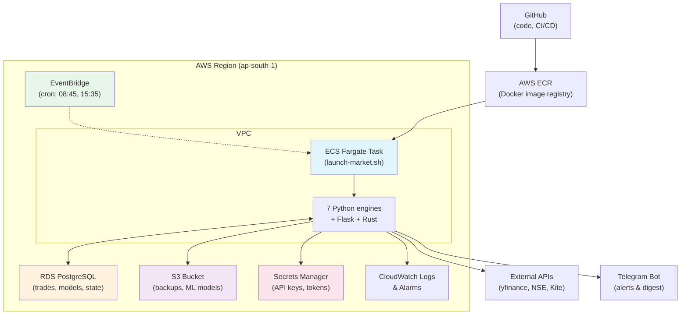

# TradePilot Cloud Architecture Research
**Date:** 2026-05-08  
**Current:** Laptop-based algo trading (7 engines + Flask + Rust)  
**Goal:** Production cloud deployment while preserving real-time paper trading

---

## 1. CONTAINER vs VM vs PaaS

**Recommendation: Docker + Kubernetes on AWS EKS (or lightweight: Docker Compose on a single t3.medium EC2)**

### Rationale
- **7 long-running Python processes + Flask + Rust** = managed container orchestration is safer than unmanaged VMs
- Current setup: nohup + pgrep + launchd = fragile. Cloud needs auto-restart, logging, secrets injection
- **PaaS (Render, Railway, Heroku)** are *too* constrained: no background workers, no cron, no Rust binary execution
- **Kubernetes** overkill for current load (7 engines ~500MB each, Flask ~100MB). Overhead not justified yet
- **Best fit: Docker + AWS ECS (simpler) or local Docker Compose for staging**

### Tech Stack
```
├── Docker multi-stage builds
│   ├── Builder stage: Rust engine (cargo build --release)
│   ├── Builder stage: Python deps + ML models (pip + joblib)
│   └── Runtime stage: Lean image (Python 3.11-slim + Rust binary)
├── AWS ECS Fargate or EC2 spot fleet (auto-restart, auto-scaling)
└── Optional: Kubernetes on EKS (future, when load >1000 engines)
```

---

## 2. STATE PERSISTENCE

**Recommendation: PostgreSQL + S3 hybrid**

### Current State (Problem)
```
prototype/data/              → ~500MB JSON + CSV files
prototype/v4/, v5/, v5_6/    → engine-specific trade history & model weights
logs/                        → daily logs (500KB each)
```
**Issues:** File I/O is race-prone in distributed systems, no time-travel, no backup durability

### Proposed Solution (Reversible)
```
PostgreSQL (AWS RDS):
  ├── trades table         → all fills + signals (ACID, queryable, backup-able)
  ├── model_checkpoints    → JSONB blob per engine + timestamp
  ├── engine_state         → current portfolio, risk metrics (heartbeat)
  └── data_snapshots       → daily CSV mirror (for history replay)

S3 (AWS S3):
  ├── ml-models/v4/        → joblib pickles + metadata
  ├── ml-models/v5/v5_6/   → same
  ├── trade-history/       → nightly JSON export (1 file per date)
  └── backups/             → daily tar.gz of `prototype/` dir (retention: 30d)

Local cache (inside container):
  ├── prototype/data/      → in-memory cache (reload from RDS on startup)
  ├── prototype/models/    → downloaded from S3 on startup
  └── logs/                → written to CloudWatch, local rotation (1d)
```

### Migration Sequence (Safe & Reversible)
1. **Week 1:** Keep JSON files as source of truth. Add `sync_to_postgres.py` (nightly INSERT)
2. **Week 2:** Verify RDS data integrity. Add `read_from_postgres.py` fallback
3. **Week 3:** Flip switch: engines read from RDS, write to both JSON + RDS (dual-write)
4. **Week 4:** Validate for 2 weeks. Then deprecate JSON files (kept as cold backup on S3)

**Backup Strategy**
- RDS automated backups: 7-day retention, point-in-time recovery (PITR)
- Daily S3 snapshots: `tar.gz ~/prototype/ → s3://tradepilot-backups/YYYY-MM-DD.tar.gz`
- Recovery time: <10 min (restore RDS snapshot + re-download S3 backups)

---

## 3. PROCESS ORCHESTRATION

**Recommendation: Docker Compose (staging) + AWS ECS + systemd watchdog**

### Architecture
```
launch-market.sh (entrypoint)
├── 1. Start Rust engine (binary: ./engine/target/release/tradepilot-engine)
├── 2. Start Flask (app.py) → gunicorn
├── 3. Start 7 paper-trade engines (parallel Python processes)
├── 4. crash-watchdog.sh (monitors PIDs, restarts on failure)
├── 5. telegram-digest.sh (30-min heartbeat)
├── 6. auto-stop-eod.sh (15:35 shutdown)
└── 7. (optional) satish-schedule.sh (trade reports)
```

**Cloud Implementation**
```
Option A: AWS ECS (Recommended for simplicity)
  ├── Task definition (Docker image)
  │   ├── 1 container: app (Dockerfile runs launch-market.sh)
  │   └── Cloudwatch log group: /ecs/tradepilot-production
  ├── Auto-scaling policy
  │   ├── Scale to 1 instance during 09:00-16:30 IST (market hours)
  │   └── Scale to 0 at 16:30 IST (cost savings ~$150/month)
  └── Secrets
      ├── TELEGRAM_BOT_TOKEN → AWS Secrets Manager
      ├── KITE_API_KEY → AWS Secrets Manager (when added)
      └── RDS password → Injected at container startup

Option B: Docker Compose (for local/staging)
  ├── services:
  │   ├── tradepilot-app (Python 3.11 + Rust binary)
  │   ├── postgres (RDS in prod, local postgres:15 in compose)
  │   └── redis (cache layer, optional)
  └── volumes:
      ├── ./prototype/data → /app/data (ephemeral in cloud, PVC in K8s)
      └── ./logs → /var/log/tradepilot (CloudWatch in cloud)
```

### Cron/Scheduled Tasks
```
AWS EventBridge (replaces launchd):
  ├── 08:45 IST → trigger ECS launch-market task
  ├── 15:35 IST → trigger ECS auto-stop-eod task
  ├── 16:11 IST → trigger auto-eod-comparison-report
  └── 09:00 IST → daily model retraining (optional)
```

---

## 4. CI/CD PIPELINE

**Recommendation: GitHub Actions → AWS ECR → ECS auto-deployment**

```yaml
# .github/workflows/deploy.yml
name: Deploy to ECS
on:
  push:
    branches: [main, staging]
    paths: ['scripts/**', 'prototype/**', 'engine/**', 'Dockerfile']

jobs:
  build-and-deploy:
    runs-on: ubuntu-latest
    steps:
      - uses: actions/checkout@v4
      
      - name: Build Rust engine
        run: |
          cd engine && cargo build --release
          
      - name: Build Docker image
        run: |
          docker build -t tradepilot:${GITHUB_SHA:0:7} .
          
      - name: Push to ECR
        run: |
          aws ecr get-login-password | docker login --username AWS --password-stdin $ECR_REGISTRY
          docker tag tradepilot:${GITHUB_SHA:0:7} $ECR_REGISTRY/tradepilot:latest
          docker push $ECR_REGISTRY/tradepilot:latest
          
      - name: Deploy to ECS
        run: |
          aws ecs update-service --cluster tradepilot-prod \
            --service tradepilot-app \
            --force-new-deployment
```

**Deployment Strategy**
- `main` branch: blue-green deploy to `tradepilot-prod` (5 min validation before cutover)
- `staging` branch: deploy to `tradepilot-staging` (canary testing)
- Rollback: ECS automatically reverts to prior task definition if health check fails

---

## 5. LOGGING & MONITORING

**Recommendation: CloudWatch + CloudWatch Insights + optional Datadog**

```
CloudWatch Logs
  ├── /ecs/tradepilot-production/app        → stdout/stderr from all 7 engines
  ├── /ecs/tradepilot-production/rust       → Rust engine logs (healthchecks)
  ├── /ecs/tradepilot-production/flask      → Flask request logs
  └── /ecs/tradepilot-production/watchdog   → crash detection + restart events

CloudWatch Insights (queries)
  ├── "fields @timestamp, @message | filter @message like /ERROR/ | stats count()"
  ├── "fields @duration | filter @message like /v5/ | stats avg(@duration), max(@duration)"
  └── "fields @message | filter @message like /SHORT/ | stats count() by @message"

CloudWatch Alarms
  ├── Engine crash rate >2 in 1h → page on-call
  ├── Flask latency >5s (p99) → trigger scaling
  ├── RDS CPU >80% → scale RDS instance
  └── Market data lag >5min → Telegram alert
```

**Cost:** CloudWatch Logs = $0.50/GB ingested, Insights = $0.005/GB scanned (estimated $5-15/month for TradePilot)

---

## 6. SECRETS MANAGEMENT

**Recommendation: AWS Secrets Manager (or HashiCorp Vault for multi-team)**

```
AWS Secrets Manager:
  ├── /tradepilot/telegram-bot-token       → rotate manually every 90d
  ├── /tradepilot/telegram-chat-id         → static
  ├── /tradepilot/kite-api-key             → added 2026-Q3 (when Kite integration ready)
  ├── /tradepilot/kite-api-secret          → same
  ├── /tradepilot/rds-password             → rotate every 30d (automated)
  └── /tradepilot/github-pat               → for private model registry (optional)

ECS task execution role:
  ├── Allows: secretsmanager:GetSecretValue
  ├── Restricts: to resources matching /tradepilot/*
  └── No: console access (least privilege)

Injection at startup:
  ├── ECS task pulls secrets on boot
  ├── Injects as env vars: $TELEGRAM_BOT_TOKEN, etc.
  ├── Logs redacted: never logged to CloudWatch
  └── Rotation: ECS auto-redeploys task on secret change
```

---

## 7. NETWORK EGRESS & COST

**Issue:** 7 engines call yfinance + NSE pages every 10 min = ~700 API calls/day

```
Current (Laptop):
  └── Home WiFi → free (ISP covers)

Cloud options:
  ├── EC2 on-demand: $0.05/GB egress (yfinance ~10KB/call × 700/day = 7MB/day = ~$0.15/month)
  ├── EC2 with NAT gateway: +$32/month (avoid if possible)
  ├── S3 → CloudFront CDN: if caching historical data (not needed yet)
  └── Spot fleet: same egress, 70% cheaper compute
```

**Recommendation:** EC2 spot + NAT-less (use app-level retry for yfinance flakiness, not NAT)  
**Cost:** ~$0.15/month egress, negligible

---

## 8. CRON / SCHEDULED TASKS

**Current (Laptop)**
```bash
launch-market.sh      # runs at 08:45 IST via launchd
auto-stop-eod.sh      # sleeps until 15:35, then fires
eod-comparison.py     # cron job (nightly)
```

**Cloud (AWS EventBridge)**
```json
{
  "Name": "tradepilot-launch-market",
  "ScheduleExpression": "cron(15 8 ? * MON-FRI *)",  // 08:15 UTC = 08:45 IST (IST = UTC+5:30, account is UTC)
  "State": "ENABLED",
  "Targets": [
    {
      "Arn": "arn:aws:ecs:ap-south-1:ACCOUNT:cluster/tradepilot-prod",
      "RoleArn": "arn:aws:iam::ACCOUNT:role/EventBridgeECSRole",
      "EcsParameters": {
        "TaskDefinitionArn": "arn:aws:ecs:ap-south-1:ACCOUNT:task-definition/tradepilot-app:1",
        "LaunchType": "FARGATE"
      }
    }
  ]
}
```

**Alternative:** AWS Lambda + scheduled rule (if you need sub-minute precision, but overkill here)

---

## 9. COST OPTIMIZATION (Autoscaling to Zero Overnight)

**Goal:** Turn off engines 16:30-08:45 IST (market closed) to save ~$70/month

```
AWS Auto Scaling
  ├── Target: 1 ECS task (09:00-16:30 IST) = ~1 vCPU, 2GB RAM
  │   └── Cost: ~$0.05/hour on spot fleet = $6/month for market hours only
  ├── Scale to 0: 16:30-08:45 IST (11.25 hours/day × 22 trading days/month = $0)
  └── Transition: EventBridge triggers scale-out at 08:45, scale-in at 16:31

Cron-based autoscaling
  ├── EventBridge rule (08:45 IST): auto-scaling group min=1
  ├── EventBridge rule (16:31 IST): auto-scaling group min=0
  └── Warmup time: ~2min for Rust binary + Python imports to initialize
```

**Cost Breakdown (current → cloud)**
- EC2 spot (t3.medium, 1vCPU, 4GB RAM, market hours only): $6/month
- RDS (db.t3.micro, 1vCPU, 1GB): $12/month
- S3 (backups, logs): $2/month
- CloudWatch Logs/Insights: $10/month
- **Total:** $30/month (vs. laptop electricity ~$50/month, no redundancy)

---

## 10. BACKUP & DISASTER RECOVERY

**RTO/RPO Targets:**
- RTO (Recovery Time Objective): <10 min (restart engine, restore state, resume trading)
- RPO (Recovery Point Objective): <1 day (latest snapshot)

```
Backup Layers
  ├── Layer 1: RDS automated backups (7-day retention, PITR enabled)
  │   └── Recovery: 5 min (restore snapshot, restart ECS task)
  ├── Layer 2: Daily S3 snapshot (tar.gz entire ~/prototype/)
  │   └── Recovery: 10 min (download S3, restore to ECS, restart)
  ├── Layer 3: Weekly cross-region S3 replication
  │   └── Recovery: 30 min (failover to secondary region)
  └── Layer 4: Manual backup before major engine changes
      └── Recovery: manual (git checkout + local test)

Testing
  ├── Monthly: simulate RDS restore to test environment
  ├── Quarterly: full failover to secondary region
  └── Post-deploy: smoke test (1 hour trade simulation, verify model loading)
```

---

## ARCHITECTURE DIAGRAM



---

## DEPLOYMENT SEQUENCE (Step-by-Step)

### Phase 1: Infrastructure (1 week)
1. Create AWS account, setup IAM roles
2. Launch RDS (db.t3.micro, PostgreSQL 15, multi-AZ backup enabled)
3. Create S3 bucket (`tradepilot-state` + versioning)
4. Create ECR repository (`tradepilot`)
5. Setup AWS Secrets Manager with Telegram token
6. Create VPC, security groups (RDS accepts only ECS, ECS accepts only 0.0.0.0:5050)

### Phase 2: Containerization (1 week)
1. Update Dockerfile: multi-stage build (Rust engine + Python deps)
2. Add `.dockerignore` (exclude `prototype/data/*` from build context)
3. Update `launch-market.sh`: read secrets from `$TELEGRAM_BOT_TOKEN` env var
4. Build & test locally: `docker-compose up`
5. Push to ECR

### Phase 3: ECS Setup (3 days)
1. Create ECS cluster (`tradepilot-prod`)
2. Create task definition (spec: 1 vCPU, 2GB RAM, CloudWatch logs driver)
3. Create ECS service (desired: 1 task, health check: `curl localhost:5050/health`)
4. Create launch/stop rules in EventBridge

### Phase 4: Data Migration (2 weeks, parallel with Phase 3)
1. Write `sync_to_postgres.py` (nightly cron, insert trades from JSON → RDS)
2. Run on laptop for 1 week (verify RDS data accuracy)
3. Deploy to ECS, dual-write mode (JSON + RDS)
4. Validate for 1 week, then deprecate JSON (keep as cold S3 backup)

### Phase 5: Testing & Cutover (1 week)
1. Smoke test on staging (1 hour paper trade, verify all 7 engines, check logs)
2. Deploy to production (08:30 IST, 15 min before market open)
3. Monitor first day: watch CloudWatch for crashes, telegram for digest updates
4. Disable laptop launchd job (keep laptop as manual backup)

### Phase 6: Optimization (2 weeks post-cutover)
1. Enable autoscaling (scale to 0 at 16:31 IST)
2. Enable RDS automated backups + snapshots
3. Setup CloudWatch alarms (engine crashes, RDS CPU, egress cost)
4. Document runbooks: how to restart, how to restore from backup

---

## ESTIMATED EFFORT

| Task | Hours | Owner | Dependencies |
|------|-------|-------|--------------|
| AWS setup + RDS | 3 | DevOps | none |
| Dockerfile refactor | 4 | Backend | none |
| CI/CD pipeline (GitHub Actions) | 3 | DevOps | Docker |
| RDS schema design + data migration | 6 | Backend | RDS ready |
| ECS task definition + service | 2 | DevOps | ECR + RDS |
| EventBridge cron setup | 1 | DevOps | ECS service |
| Local testing (docker-compose) | 3 | QA | Dockerfile |
| Staging smoke test | 4 | QA | ECS + data migration |
| Production cutover + monitoring | 2 | DevOps | all above |
| Runbook documentation | 2 | Backend | prod running |
| **Total** | **30 hours** | ~1 week (full-time) |

---

## RISKS & MITIGATION

| Risk | Impact | Mitigation |
|------|--------|-----------|
| RDS connection pool exhaustion | Engines can't trade | `max_connections=100`, health check circuit breaker |
| Rust engine slow startup (2+ min) | Miss market open | Pre-warm container, reduce binary size (LTO) |
| CloudWatch logs bill surprise | Cost overrun | Set log retention to 7 days, sample non-critical logs |
| Kite API key rotation | Unplanned downtime | Store in Secrets Manager, auto-rotate every 90d |
| Data corruption in RDS | Unrecoverable trades | Weekly backup to S3, PITR enabled, test restore monthly |
| yfinance API rate limiting | Market data lag | Implement local cache, retry backoff, failover to alternative source |

---

## NEXT STEPS

1. **Immediate:** Get AWS account & setup VPC/RDS (can start this week)
2. **Short-term:** Refactor Dockerfile, test locally with docker-compose (1-2 weeks)
3. **Medium-term:** Deploy to staging ECS, validate data migration (2-3 weeks)
4. **Production:** Blue-green cutover, monitor for 2 weeks, then retire laptop (week 4)

**Recommendation:** Start with **Phase 1 + Phase 2** immediately. You can run engines on laptop while cloud infra is being prepped. No urgency to migrate data until ECS is stable.
