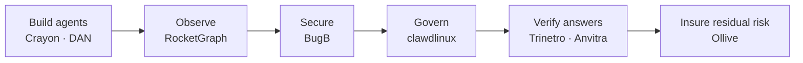

# Agentic Summit BLR — Stall Research

*Field research from booth photos + desk research on 8 exhibiting startups — July 22, 2026, Bengaluru*

::: {.report-meta}

| | |
|:--|:--|
| **Event** | Agentic Summit BLR ("Bring Your Own Agent") |
| **Date attended** | Wednesday, July 22, 2026 |
| **Organizers** | The Generative Beings (TGB) × Magicball |
| **Sponsors observed** | Google Cloud, Testsigma, Grayscale Ventures |
| **Primary sources** | 12 booth photos (DNG) + 1 talk video (MOV) |
| **Report date** | July 23, 2026 |
| **Version** | `v1.0.0` |

:::

::: {.doc-author}

| | |
|:--|:--|
| **Author** | Soumya Swain |
| **Email** | soumya@suryaai.co.in |

:::

---

## 1. Executive Summary

Agentic Summit BLR was a free, half-day (9:30 AM–1:30 PM), invite-curated showcase run by Bangalore's two largest GenAI communities — The Generative Beings ("Asia's #1 GenAI community") and Magicball ("India's largest community of AI Engineers", 15k+ members) — with roughly 30 startup demo booths and speaker sessions.

The 8 stalls captured in the photos map cleanly onto the emerging **agentic-AI stack**:

::: {.metrics-table}

| Layer | Startup | Stage |
|:------|:--------|:------|
| Observability / AI triage | RocketGraph | Early OSS, pre-1.0, unfunded |
| Offensive security / auto-patch | BugB | Open-core, shipping, unfunded |
| Agent governance (K8s) | clawdlinux | Stealth, pilot onboarding |
| AI risk + liability insurance | Ollive | Seed (~$5M closing), SF MGA |
| Data → decisions (verified answers) | Trinetro Labs | Pre-launch, unverifiable |
| AI data analyst agent | "DAN" (booth F-14) | Stealth, unidentifiable |
| Retail investing intelligence | Anvitra.ai | 5 months old, waitlist |
| AI game creation | Crayon (usecrayon.ai) | Free beta |

:::

**Headline takeaways:**

1. **The agent-trust stack is forming fast.** Five of eight booths (RocketGraph, BugB, clawdlinux, Ollive, Trinetro) sell some form of *trust* — observability, security, governance, insurance, or answer verification. The market has moved past "build an agent" to "control the agent."
2. **Most exhibitors are pre-funding and pre-traction.** Only Ollive has trade-press coverage and a reported round. Several (Trinetro, clawdlinux, DAN) have essentially no public footprint — booth-first, internet-second launches.
3. **Marketing claims outran verifiable reality at several booths.** BugB's "XBOW 91.4%" banner, RocketGraph's "no per-host fees" vs. its published per-log pricing, clawdlinux's "Apache 2.0 open source" with no findable repo — all flagged in the profiles below.
4. **Direct relevance to TradePilot:** Anvitra, Trinetro, and DAN are all converging on "evidence-verified answers over financial/market data" — the same design space as TradePilot's audit-first paper-trading engines (see §6).

## 2. Event Context

**Organizers.** The event was listed on Luma (luma.com/geqzcvrc) as "Agentic Summit BLR – Bring Your Own Agent", presented by Magicball with The Generative Beings. Magicball runs a recurring AI Week / demo-day series in Bangalore (magicball.dev); TGB self-describes as Asia's #1 GenAI community for founders, engineers, and operators. Booth signage carried codes (G-05, F-03, F-14) consistent with a ~30-booth floor.

**Sponsors and their angle.**

::: {.metrics-table}

| Sponsor | Who they are | Why they sponsor |
|:--------|:-------------|:-----------------|
| Google Cloud | Hyperscaler; ran its own "Build What's Next" Bengaluru event the same day | India startup-credits + Gemini adoption push |
| Testsigma | Bangalore AI test-automation platform ($12.8M raised; Accel, STRIVE) | Agent-driven dev workflows need AI test automation |
| Grayscale Ventures | "India's only developer-focused VC," ~$40M AUM (Hasura, 100ms, Testsigma) | Deal flow at the earliest agentic-infra stage |

:::

**Ecosystem framing.** Tracxn counts 72 agentic-AI companies in Bengaluru as of July 2026 (Sarvam, Atomicwork, OnFinance, Yellow.ai, Portkey among them). The OpenClaw wave (§5) has spawned an entire sub-niche of fleet managers, control planes, and governance layers — exactly the categories on this show floor.

*Caveat: one Luma fetch returned a conflicting evening agenda (Cloudflare/8VC/Accel/Stripe speakers, "1,266 registered"); Magicball runs multiple similarly-named summits in 2026, so those details are excluded as unconfirmed. The TGB listing (July 22, 9:30–1:30, free) is treated as authoritative.*

## 3. Startup Profiles

Each profile separates **what the booth claimed** (primary source: photos) from **what desk research found** (secondary sources), with a confidence label.

### 3.1 RocketGraph — AI-triage observability

*Booth G-05 · rocketgraph.app · Confidence: HIGH (site + GitHub verified)*

**Booth pitch.** "Observability at scale, cheaply." Metrics · Logs · Traces + AI triage. Petabyte-scale telemetry on object-storage economics, triaged by AI agents *before anyone gets paged*. No per-host or per-agent fees; OpenTelemetry-native 5-minute setup; AI triage that clusters, correlates, and root-causes; on-prem / fully air-gapped deployment.

**What research found.**

- Core product "Detective": log anomaly detection using **Drain3 + Isolation Forest + Half-Space-Trees** — deliberately *non-LLM* for the detection core (cost control), with a cached LLM (Claude/GPT-4) layered on top for triage narratives. ClickHouse backend. "Mission Control" condenses billions of logs into LLM-digestible snapshots.
- Positioning is **alongside**, not instead of, Datadog/New Relic/Loki/CloudWatch — lower switching cost than rip-and-replace competitors.
- One-line install: `npx @rgraph/otel-node init` (~90-second Node.js auto-instrumentation).
- GitHub (Rocketgraph/rocketgraph): Apache 2.0, **152 stars**, 9 forks, single v0.1.0 release (May 2026). Pre-PMF stage.
- Published pricing: Free trial (7 days / 50M logs) → Pro **$50/mo** (50M logs) → Enterprise (custom, on-prem, SSO).
- Likely founder: Kaushik Varanasi (kaushik@rocketgraph.app; LinkedIn match unconfirmed). No funding found.

**Competitive frame.** vs. Datadog/Grafana (both shipping AI triage in 2026 — "AI triage" alone no longer differentiates), vs. SigNoz/Last9 (also ClickHouse/OTel, also self-hostable). RocketGraph's cleanest edges: non-LLM detection core (cheap), air-gapped deploys, and sit-alongside adoption.

**Red flags.**

1. **Name collision:** an unrelated 2014 Cray-spinout "Rocketgraph" (rocketgraph.com, $3.1M raised, graph analytics) dominates Crunchbase/PitchBook. Do not conflate.
2. Booth says "no per-host/per-agent fees, object-storage economics" — but published tiers are **per-log-volume**, the same cost model as incumbents, just cheaper.
3. ISO/HIPAA/SOC 2 claims on site with no linked certificates.
4. Branding drift: LinkedIn page is "rocketlogs", X handles inconsistent (@rocketgraph_inc vs @RGraphql).

### 3.2 Anvitra.ai — evidence-based US-stocks investing

*anvitra.ai · indexfusion.anvitra.ai · Confidence: MEDIUM (registry verified; product web-thin)*

**Booth pitch.** "Is FOMO ruining your US stocks investments?" The **Anvitra Engine** (intelligent retrieval) takes regulator filings, market news, fundamental data, and technical indicators in — and puts stock discovery, portfolio insights, and macro trends out. "Stop investing on FOMO. Start investing on evidence." Waitlist CTA; demo screens showed AI-datacenter/semiconductor theme discovery (DLR, APLD tickers visible).

**What research found.**

- Legal entity: **Anvitra AI Technology Private Limited**, CIN U62099KA2026PTC215048, incorporated **January 29, 2026**, HSR Layout, Bengaluru — ~5 months old at the summit.
- Directors per Tracxn: **Prashant Maheshwari, Melvin Davis, Saurav Kumar Behera** (not cross-verified on LinkedIn).
- **Unfunded**; paid-up capital ₹30,000 — bootstrapped pre-seed.
- **Positioning tension:** the indexed public site pitches generic "context-aware Search-as-a-Service" (branded "Anvitra Shilp") for embedding retrieval into apps via LangChain/LlamaIndex. The stock-investing product ("IndexFusion") appears to be a newer vertical application of that engine — possibly a pivot in progress. Both anvitra.ai and indexfusion.anvitra.ai blocked automated fetches (HTTP 403), so the current live copy is unverified.
- No customers, waitlist size, or press found; one Instagram post from a ChiSquare 2026 startup event.

**Competitive frame.** India-retail-buying-US-stocks is served by INDmoney/Vested/Groww on the *execution* side but thinly on the *research-evidence* side; institutional tools (AlphaSense) are mispriced for retail. The wedge is real but demand-unproven.

**Red flags.** Public web copy doesn't match the booth pitch (search infra vs. investing product); zero third-party validation; founder names single-sourced.

### 3.3 BugB — vulnerability → patch, automatically

*bugb.io · github.com/Bugb-Technologies · Confidence: HIGH (site + GitHub verified; one claim unverifiable)*

**Booth pitch.** "From vulnerability to patch. Automatically." Agentic offensive testing + deterministic scanners + security context that lives in your code; fix shipped as code. REMEMBERS → FINDS → FIXES. Proof box: "**XBOW: 91.4% solved, ~$0.73 per find.** Disclosures to IBM · Fortinet · Philips · Dell · MIT · +100."

**What research found.**

- Team: CEO **Shahid Hakimji**, co-founders Ashish S and Animesh Srivastava. India-based. **No funding rounds** on record (Tracxn); listed 11–50 employees (unverified).
- Open-core product suite, all verified on GitHub with recent commits:
  - **GuardLink** (TypeScript, 17★) — structured threat-context annotations in code (`@exposes`, `@mitigates`) — the REMEMBERS layer.
  - **Cert-X-Gen** (Rust, 21★) — deterministic polyglot vulnerability scanner, 13 languages — FINDS.
  - **Bravos** — agentic offensive-testing desktop workbench — FINDS.
  - **BKeeper** — paid enterprise ASM/CNAPP — the monetization layer.
  - Confirmed findings become permanent regression templates — the "fix shipped as code" mechanic (regression-test generation, not literal autonomous patch PRs, per what's verifiable).
- Site lists 12 named disclosure recipients (Philips, IBM, Volkswagen, Fortinet, Dell, MIT, GeoComply, et al.) — consistent with the banner, "+100" unverified.

**The XBOW claim needs a direct question.** "91.4% solved / ~$0.73 per find" appears nowhere on bugb.io, GitHub, or public benchmark literature. XBOW is a separate, well-known AI pentesting company that publishes an open benchmark set (104 web challenges). Most likely reading: BugB ran its own agent against **XBOW's public benchmark dataset** — not an XBOW partnership or endorsement. For calibration, the MAPTA academic paper reports a *median $0.073* per successful attempt on a similar benchmark — 10× lower, though likely a different metric. Ask BugB before repeating the number.

**Competitive frame.** RunSybil ($40M), XBOW itself, and AI-native offensive-security entrants; incumbents' SAST/DAST. BugB's differentiator is the closed loop: in-code security context → detection → regression templates, offered open-core from India (cost advantage).

**Red flags.** Headline benchmark unverifiable; thin community adoption (~46 total stars, zero forks on the flagship); funding status unconfirmed.

### 3.4 Crayon — prompt-to-game creation

*usecrayon.ai · x.com/usecrayon · Confidence: MEDIUM-HIGH (site verified; team/funding thin)*

**Booth pitch.** "Create any games with Crayon": explain your game with a prompt → edit and build new 3D assets → publish anywhere. Contacts: aniket@usecrayon.ai, tushar@usecrayon.ai.

**What research found.**

- Product (verified on site): plain-English prompt → AI agents define rules/mechanics → playable web game. Natural-language asset edits ("make a surfer character with cute chibi aesthetics"); Default/3D/2D perspectives; a code panel exposing the generated source (~1,350 lines in the demo); chat-based iteration. Publishing to Crayon's own Arcade, **Poki, Crazy Games, or self-host**. Demo game "Twilight Knight" at 106 fps.
- **Free, in beta.** Active Discord; entity referenced as "Crayon Labs Inc." No pricing, no monetization model disclosed.
- Probable co-founder: **Aniket Jatav**, Bengaluru product-designer-turned-founder (LinkedIn match probable, not confirmed). "Tushar" unidentified. **No funding found anywhere.**

**Competitive frame.** Rosebud AI is the direct, better-established competitor on the idea→playable-game axis; Meshy/Tripo compete only on the 3D-asset layer. Crayon's pitch: one pipeline from prompt to multi-platform publish, *with* code-level editability (not no-code-only).

**Red flags.** No press, no traction numbers, unverifiable team; severe name-collision hazard with crayon.co ($39.5M competitive-intel co) and Crayon Data — disambiguate in anything you write publicly.

### 3.5 Ollive — AI-agent liability: assess, reduce, monitor, insure

*ollive.ai · Confidence: HIGH (site + insurance trade press)*

**Booth pitch.** "AI agents create losses. Ollive finds the regulatory, legal, and compliance liability your AI agent creates in production." Reg chips: EU AI Act, HIPAA, FTC, ELVIS Act, Utah AI Act, Colorado AI Act, "+200 US AI regulations." ASSESS · REDUCE · MONITOR · INSURE. (Booth gimmick: AI-risk crossword for a Kreo keyboard. Banner typo: "HIPPA.")

**What research found.**

- **The most substantial company at the event.** San Francisco-based **MGA** (Managing General Agent) founded **March 2026**; covered by The Insurer (June 17, 2026): "AI liability MGA Ollive targets summer 2026 launch," **nearing close of a $5M seed** (investors unnamed).
- Founders: **Varsheel Deliwala** (CEO, ex-Zoca AI products lead), **Mohit Goyal** (CTO, ex-CombineHealth head of tech, ex-YC startups), **Purvish Shah** (CBO, ex-CombineHealth VP, co-founded Carboledger).
- Product live today: risk-assessment platform — Agent Inventory, Regulatory Risk Mapping, risk-focused evals (liability, privacy, bias, safety, compliance, prompt injection), runtime monitoring, and an **Agent Trust Score** (letter grades A+ to B). Site confirms HIPAA, FDA SaMD, GLBA, ERISA, NAIC, UCSPA, GDPR, CCPA scope.
- **The INSURE pillar is not yet real insurance.** Per trade press, Ollive is still *sourcing underwriting capacity*; today's product is insurance-*readiness*. Case-study liability figures on-site ($25K–$5M) are illustrative hypotheticals.

**Competitive frame.** Closest comparables: Armilla AI and Munich Re's aiSure (AI performance guarantees + insurance). Vanta/Delve (generic compliance) and Holistic/Credo AI (AI governance) lack the insurance attach — which is Ollive's wedge, if capacity materializes.

**Red flags.** Insurance not yet bound/live; $5M "nearing close," not closed; the "200+ regulations" and EU-AI-Act banner claims exceed what the live site verifiably lists; as an MGA, claims sit on a fronting carrier's balance sheet, not Ollive's.

### 3.6 clawdlinux — governance for AI agents on Kubernetes

*clawdlinux.org · Booth F-03 · Confidence: LOW (stealth; site nearly empty)*

**Booth pitch.** Open source, Apache 2.0. "Governance for AI agents on Kubernetes." Auditable events for every agent action; "one brain for your entire company"; coming soon: single shareable context. Now onboarding pilot customers.

**What research found.**

- Site is a near-empty landing page; **no team, no GitHub org, no funding data findable**. An "Apache 2.0 open source" claim with no locatable repository is the key open question — possibly forward-looking ("will be open at launch").
- Search-index oddity: the same URL was at one point indexed as "**NineVigil** — infrastructure for production AI agents… Kubernetes runtime API for air-gapped AI agents, including Cilium egress, Argo DAGs, and gVisor sandbox in one manifest." Possible rename; unconfirmed — but if accurate, it sketches the actual architecture (network-policy egress control + workflow DAGs + syscall sandboxing).
- The "clawd" naming clearly rides the **OpenClaw** wave (§5) — plausible but unconfirmed affiliation.

**Competitive frame.** Red Hat is already publishing OpenClaw-on-K8s guardrail guidance; kagent (Solo.io, CNCF) and its NemoClaw governance extension, ClawManager, Clawix, and generic policy engines (OPA/Kyverno) crowd the space. A thin landing page is entering a fast-moving, well-funded category.

**Red flags.** Everything is unverified; open-source claim unbacked by a findable repo; possible identity change (NineVigil).

### 3.7 Trinetro Labs — verified answers over company data

*trinetrolabs.com · Confidence: LOW (pre-launch; single-source founder claim)*

**Booth pitch.** "Third Eye of Your Data" (Trinetra = the third eye). **Ask. Verify. Decide.** Demo: "What's our Q3 revenue?" → "₹48,76,34,890 ✓ Verified." "The fastest path from question to confident decision."

**What research found.**

- Site renders almost nothing to fetchers beyond "AI Data Analysis Platform | Ask Your Data in Plain English." No pricing, team, architecture, or funding anywhere.
- Founder per a single low-authority source (kiddosphere.in): **N Bharath Chowdary** — unconfirmed.
- X account joined ~April 2026 → company likely a Q1–Q2 2026 formation. No GitHub, no LinkedIn page confirmed.
- The interesting design signal is the **"Verify" step** — a checkmark on answers addresses text-to-SQL's hallucination problem, the same trust gap Wren AI (semantic layer) and Vanna (embeddable text-to-SQL) attack differently. Whether Trinetro's verification is real lineage-tracing or UI garnish is unknowable from public sources.

**Red flags.** Essentially unverifiable company; name-collision risk with Trinetra/TrinetX/Trinetix; the booth demo is the only evidence the product works.

### 3.8 "DAN — Your AI Data Analyst" — unidentified

*Booth F-14 · Confidence: NONE (could not identify the company)*

**Booth pitch.** "Meet DAN — your AI data analyst. Beyond Dashboards. Beyond Copilots. UNDERSTAND · INVESTIGATE · PREDICT · RECOMMEND · ACT." Black ink-brush logo; integration marks for Google Analytics, Snowflake, Stripe, MySQL, PostgreSQL, S3, and adjacent data-stack tools.

**What research found.** Nothing. Targeted searches on the tagline, the five-verb framing, and domain guesses (askdan/getdan/meetdan/hidan) all failed. meetdan.ai exists but is a **commercial-real-estate AI — confirmed NOT this company**. No exhibitor roster was published for the event. Conclusion: a genuinely stealth, demo-only startup. The five-verb ladder (understand → act) positions it against Julius AI, DataChat, and ThoughtSpot Spotter — the "agentic BI" category — but that's inference from a banner.

**Follow-up:** Magicball/TGB post-event recap posts on LinkedIn/X are the likeliest place its handle surfaces; or a booth business card if one was collected.

## 4. Cross-Cutting Analysis

**The show floor was a trust-stack in miniature.** Arranged as a pipeline:

Three patterns worth remembering:

1. **"Verification" is the new UI primitive.** Trinetro's ✓ Verified badge, Anvitra's "evidence not FOMO," Ollive's Trust Score, BugB's deterministic-plus-agentic split — every serious booth paired an LLM with a *non-LLM verification mechanism*. The market has internalized that raw LLM output doesn't sell to serious buyers.
2. **Booth-first, internet-second launches are now normal.** Half the exhibitors are invisible to web search. Community demo days (Magicball/TGB) have become the actual launch channel for Bangalore agentic startups — Luma pages and physical banners exist before websites do.
3. **Claims inflation is systemic at this stage.** Every profile above contains at least one banner claim that public evidence can't support (XBOW numbers, "no per-host fees," "Apache 2.0," "200+ regulations"). Not fraud — pre-PMF marketing — but any partnership or investment conversation should start with the flagged questions.

## 5. Talks Observed

**Jayesh Betala — "Vibe Engineering to Babysitting: Workflows That Ship."** The video captures his live demo of **"Agentic Waters"** (localhost:5199): a nautical chart rendering his personal **OpenClaw agent fleet** as named ships (Jerry, Neodit, Scout, Buddy, Burry, Ticket Agent, Mike, Rand, Katy, Ryan, Harvey, Elon) with a lighthouse ("Citadel") and the framing "the harbourmaster stays on shore." Facets: Routes, Role, Product, Channel, Cadence, Personality, Approval gates, Voyages, Incidents. Cargo tags spanned copywriting, builder, scouting, community, orchestrator, reporting, growth, outreach, SEO, analytics, launch drafts, security, research, backtesting, tickets.

The **approval-gates view is the substantive content**: draft only (5), report only (4), human posts (4), tests before merge (3), human approves deploys (2), human approves actions (1), human sends (1), human fixes (1), paper only (1), no real orders (1), review before merge (1). That is a working taxonomy of graduated agent autonomy — every agent capped at a materiality-appropriate gate. Note "paper only" and "no real orders" — he runs trading-adjacent agents under exactly the paper-first discipline TradePilot uses.

Context: OpenClaw (ex-Clawdbot/Moltbot, created by Peter Steinberger) hit ~310K GitHub stars by April 2026; a whole ecosystem of fleet managers (fleet CLI, agentfleet, ClawFleet) now exists, and VentureBeat's framing — "OpenClaw proves agentic AI works. It also proves your security model doesn't" — is precisely the gap half this event's exhibitors sell into. The speaker himself has no findable public profile matching "Jayesh Betala, Top OSS Contributor" — the photos are the primary source.

**Oolka — "The Startup Blueprint: How We Built Oolka With Google Cloud."** Oolka is a real, funded Bangalore consumer fintech: "India's first AI credit expert," founded 2024 by Utkrishta Kumar; $7M seed (Lightspeed, Z47, 8i) then **₹130 Cr (~$15M) Series A, April 2026** (Accel, Lightspeed, Z47); claims 7M+ users and bank partnerships (Yes Bank, IDFC First, AU SFB, Muthoot, InCred). A sponsored-track case study for Google Cloud (the GCP link itself isn't publicly documented beyond the talk title).

## 6. Implications for TradePilot

Three of eight booths operate in TradePilot's neighborhood:

::: {.metrics-table}

| Startup | Overlap | Takeaway for us |
|:--------|:--------|:----------------|
| Anvitra.ai | Evidence-based stock research (US stocks, Indian retail) | Validates the "evidence over vibes" positioning; their filings+news+fundamentals+technicals retrieval mirrors our block-score inputs. Watch IndexFusion when it exits waitlist. |
| Trinetro Labs | Verified-answer UX over data | The ✓ Verified affordance is worth stealing for dashboard scores and audit reports — verification as a first-class UI element. |
| "DAN" (F-14) | Understand→Act agentic-analyst ladder | Their five-verb maturity ladder is a clean way to describe TradePilot's own progression (analyze → recommend → gate-driven execution). |

:::

Jayesh Betala's approval-gate taxonomy ("paper only", "no real orders", "human approves actions") independently arrives at the same graduated-autonomy design as TradePilot's Gate-1/Gate-2 shadow rosters and v5_gate execution gating — useful external validation that this is the emerging standard pattern for agents touching money.

## 7. Verification Gaps & Follow-Ups

::: {.task-table}

| # | Item | Priority | How |
|:--|:-----|:---------|:----|
| 1 | Identify the DAN (F-14) company | High | Magicball/TGB post-event recaps on LinkedIn/X; booth card if collected |
| 2 | BugB's XBOW 91.4% / $0.73 provenance | High | Ask BugB directly — own eval on XBOW's public benchmark vs. partnership |
| 3 | clawdlinux repo + NineVigil identity | Medium | Re-fetch clawdlinux.org post-launch; ask for GitHub org name |
| 4 | Anvitra: search-infra vs. IndexFusion focus | Medium | Manual visit to indexfusion.anvitra.ai (bot-blocked); founder LinkedIn check |
| 5 | Ollive $5M close + insurance capacity status | Medium | Re-check trade press before citing; theinsurer.com follow-ups |
| 6 | RocketGraph founder + SOC2/HIPAA claims | Low | dashboard/docs subdomains; confirm Kaushik Varanasi |
| 7 | Trinetro founder + entity | Low | MCA registry search "Trinetro Labs"; Wayback of site |

:::

## 8. Methodology & Source Notes

**Primary sources:** 12 DNG booth photos and one 20-second MOV of the Agentic Waters demo, taken at the venue on July 22, 2026. Photo-derived claims (booth copy, booth codes, demo contents) are treated as ground truth *about what was displayed*, not about what is true.

**Secondary research:** five parallel web-research passes (July 23, 2026) covering company sites, GitHub, Tracxn/MCA registry data, Luma/organizer pages, and trade press. Every company profile carries a confidence label; claims that could not be corroborated are explicitly flagged rather than repeated as fact.

**Known limitations:** several sites blocked automated fetching (anvitra.ai 403, x.com 402); no public exhibitor roster exists; founder identifications for RocketGraph, Crayon, and Trinetro rest on single sources.

### Key sources

- Event: luma.com/geqzcvrc · thegenerativebeings.com/events/agentic-summit-blr-kgCaLP · magicball.dev
- RocketGraph: rocketgraph.app · github.com/Rocketgraph/rocketgraph
- Anvitra: Tracxn legal-entity record (CIN U62099KA2026PTC215048) · medium.com/@anvitra.ai
- BugB: bugb.io · github.com/Bugb-Technologies · Tracxn · arXiv:2508.20816 (MAPTA, cost calibration)
- Crayon: usecrayon.ai · linkedin.com/in/aniketjatav (probable)
- Ollive: ollive.ai · theinsurer.com (June 17, 2026 exclusive)
- clawdlinux: clawdlinux.org · redhat.com/developers (OpenClaw-on-K8s guardrails) · kagent.dev
- Trinetro: trinetrolabs.com · kiddosphere.in (unverified founder source)
- Context: openclaw.ai · CNBC/Wikipedia on OpenClaw · VentureBeat on agent security · Tracxn Bengaluru agentic-AI landscape · Oolka via Tracxn/Preqin/TheSaaSNews
