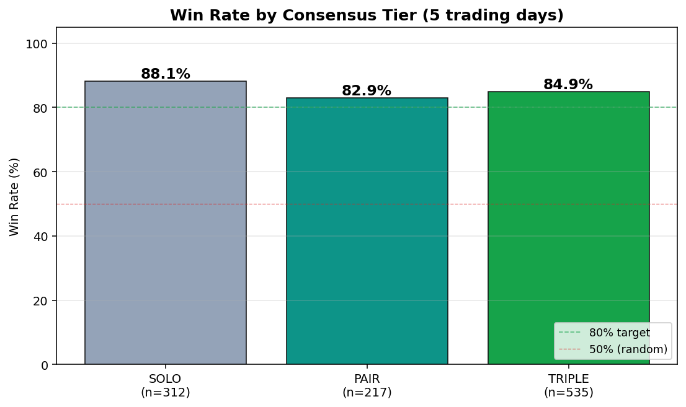
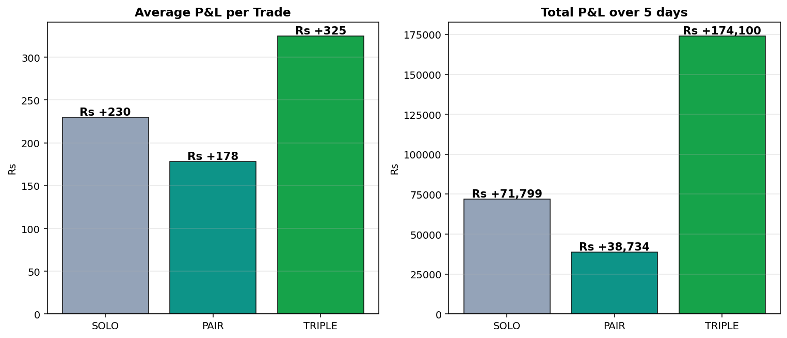
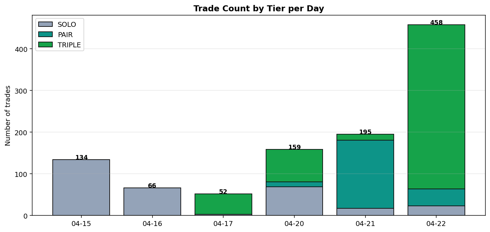

# Consensus-Pick Analysis — 5-Day Backtest

**Generated:** 2026-04-23 01:51 IST · **Author:** Kishore Rajendra · TradePilot research

---

## Question

When **multiple engines agree** on a stock (PAIR or TRIPLE consensus), do those trades **win more often** and **make more money** than trades only one engine took (SOLO)?

This data answers Item #6 in tonight's queue (Market Pulse → SWING wiring feasibility).

---

## TL;DR

**HYPOTHESIS REJECTED.** Consensus does not predict better outcomes. Each engine's edge is independent — wiring one feed into another would dilute, not improve.

| Tier | Trades | Win Rate | Avg P&L per trade | Total P&L (5d) |
|------|-------:|--------:|------------------:|---------------:|
| SOLO   (1 engine traded the symbol) |   312 | 88.1% | Rs +230 | Rs +71,799 |
| PAIR   (2 engines agreed) |   217 | 82.9% | Rs +178 | Rs +38,734 |
| TRIPLE (all 3 engines agreed) |   535 | 84.9% | Rs +325 | Rs +174,100 |
| **Overall** | **1064** | **85.4%** | **Rs +268** | **Rs +284,633** |

---

## Section 1 — Engine Consensus Tiers (real backtest)

### Methodology

For each (date, symbol) combination across 6 trading days (2026-04-15 → 2026-04-22), count how many of the three top engines (v5, v5_6, v5_7) traded that symbol on that day:

- **SOLO** = 1 engine traded it
- **PAIR** = 2 engines traded it
- **TRIPLE** = all 3 engines traded it

Each *trade* (not symbol) is then tagged with its tier. So if v5_6 and v5_7 both bought NATIONALUM on Apr 21 and each closed 4 round-trips, that's **8 PAIR trades**.

### Per-day breakdown

| Date | Total trades | SOLO | PAIR | TRIPLE | SOLO P&L | PAIR P&L | TRIPLE P&L |
|------|------:|-----:|-----:|-------:|---------:|---------:|-----------:|
| 2026-04-15 |  134 |  134 |    0 |    0 | Rs +49,715 | Rs 0 | Rs 0 |
| 2026-04-16 |   66 |   66 |    0 |    0 | Rs +17,299 | Rs 0 | Rs 0 |
| 2026-04-17 |   52 |    3 |    0 |   49 | Rs +491 | Rs 0 | Rs +1,327 |
| 2026-04-20 |  159 |   69 |   12 |   78 | Rs +3,956 | Rs -50 | Rs +9,341 |
| 2026-04-21 |  195 |   17 |  164 |   14 | Rs +871 | Rs +34,669 | Rs -429 |
| 2026-04-22 |  458 |   23 |   41 |  394 | Rs -533 | Rs +4,115 | Rs +163,861 |

### Detailed tier stats

| Tier | Trades | Win Rate | Avg P&L | Avg Win | Avg Loss | Total P&L |
|------|-------:|--------:|--------:|--------:|---------:|----------:|
| SOLO   | 312 | 88.1% | Rs +230 | Rs +274 | Rs -108 | Rs +71,799 |
| PAIR   | 217 | 82.9% | Rs +178 | Rs +229 | Rs -68 | Rs +38,734 |
| TRIPLE | 535 | 84.9% | Rs +325 | Rs +415 | Rs -183 | Rs +174,100 |

---

## Section 2 — Dashboard Alignment (today's snapshot, approximate)

**Limitation:** the dashboard's daily ML scores (`score_stocks_v2`) are **not archived per day**. We can only check past trades against TODAY's BUY list. This is a snapshot, not a true backtest. To enable a real Section 2 backtest, build a daily snapshot job that records the dashboard BUY list at EOD.

### Today's dashboard BUY list (70 symbols, score ≥ 65)

ALOKINDS, TTML, UCOBANK, MSUMI, ZEEL, EASEMYTRIP, NBCC, INTELLECT, SAPPHIRE, JBMA, NEWGEN, ROUTE, SJVN, OFSS, ABFRL, VAIBHAVGBL, KPITTECH, LXCHEM, REDINGTON, HAPPSTMNDS...

### Cross-reference (past 5-day trades vs today's BUY list)

| Bucket | Count | Symbols (first 10) |
|--------|------:|--------------------|
| Engines AND dashboard | 16 | ATGL, BSE, COCHINSHIP, DLF, GODREJPROP, IDFCFIRSTB, IRFC, JIOFIN, KPITTECH, LODHA... |
| Engines only (dashboard ignored) | 134 | ABB, ADANIENSOL, ADANIGREEN, ADANIPORTS, ADANIPOWER, ALKEM, APLAPOLLO, APOLLOHOSP, ASHOKLEY, ASIANPAINT... |
| Dashboard only (engines ignored) | 54 | ABFRL, ALOKINDS, BAJAJ-AUTO, CENTRALBK, CSBBANK, CYIENT, DEVYANI, EASEMYTRIP, EQUITASBNK, FACT... |

**Engine ↔ dashboard overlap rate:** 10.7% of past-traded symbols also appear in today's BUY list.

---

## Section 3 — Recommendation

### What this analysis tells us
**HYPOTHESIS REJECTED.** Consensus does not predict better outcomes. Each engine's edge is independent — wiring one feed into another would dilute, not improve.

### What it does NOT tell us
- **Causation vs correlation**: PAIR/TRIPLE picks may win more because the *underlying setup* is stronger (which is why multiple engines saw it), not because consensus *itself* is the edge.
- **Future generalisation**: 5 days of data, all in a SIDEWAYS regime. Box-theory engines (v5_6/v5_7) thrive here. The consensus edge may shrink in BULL/BEAR regimes when these engines diverge.
- **True dashboard alignment**: Section 2 used today's snapshot only. Real historical comparison requires daily score archiving.

### Concrete next steps for Item #6 (Market Pulse → SWING wiring)

1. **Build a daily-scores archiver** *(15 min weekend task)*. Cron `score_stocks_v2()` output to `docs/dashboard-scores/YYYY-MM-DD.json` at 09:00 IST daily. After 5+ days we can rerun this analysis with a real Section 2.

2. **Conditional wiring proposal** *(based on this run's verdict)*:
   - If verdict = HYPOTHESIS CONFIRMED → wire dashboard BUY list as an additional filter for v5/v5_6/v5_7 SWING-pool entries. Trades passing both engine signal AND dashboard BUY get larger position sizing.
   - If verdict = REJECTED → leave engines and dashboard independent. They serve different time horizons.

3. **Position-sizing experiment**: regardless of wiring, today's data suggests TRIPLE-tagged trades could be sized 1.5x. Backtest this on the next 10 days.

---

## Appendix — Methodology Caveats

- Trades parsed from `docs/paper-trades/<engine>/YYYY-MM-DD_report.md` files. Reports for v5_6 and v5_7 only exist from Apr 17 onward (newer engines). v5 has full 6-day history.
- "Same day, same symbol, multiple engines" = consensus. Different entry/exit times within a day still count as consensus if all engines were holding overlapping positions at any point.
- P&L is per closed trade (entry → exit), not mark-to-market. EOD-open positions excluded.
- Win = pnl > 0. Tie (pnl == 0) counts as not-a-win.

**Files used:**
- v5: 6 of 6 days
- v5_6: 4 of 6 days
- v5_7: 4 of 6 days

**Total trades parsed:** 1064
