# Chart Evidence Pack — 12 real multi-week runs, entries and exits marked

::: {.report-meta}

| | |
|:--|:--|
| **Project** | TradePilot — overnight research |
| **Purpose** | Make the "big runner" claims visually auditable |
| **Data** | Kite Connect daily bars (licensed feed, our own broker account) |
| **Candidates from** | `quant/data/sf_ret.parquet` — survivorship-free, 1232 sessions x 3046 symbols |
| **Window searched** | 2024-06-01 to 2026-06-12 |
| **Renderer** | `quant/render_chart.py` (reusable) |
| **Created** | 2026-08-28 |

:::

::: {.doc-author}

| | |
|:--|:--|
| **Author** | Soumya Swain |
| **Email** | soumya@suryaai.co.in |

:::

---

## How to read this pack

Every chart below is real NSE daily data pulled from Kite. On each one:

- **Green arrow, bottom** — the run low. This is the "optimal entry" the backtests refer to.
- **Red arrow, top** — the run peak. The "optimal exit".
- **Dashed blue arrow** — the move between them, with the percentage and session count.
- **Shaded band** — the run window.
- **Blue / orange lines** — 20-day and 50-day moving averages, computed on a 120-day
  pre-roll so the MA50 is a real MA50 on the first plotted bar, not a ramp.
- **Lower panel** — volume, coloured by bar direction, with its 20-day average.

Both arrows were placed **after the fact**. That is the point of the pack. The question
each commentary answers is: *standing on the green arrow, with only the bars to its left
visible, was there anything to see?*

---

## The one result that is the same on all 12 charts

| Check, measured at the entry bar | Charts where it held |
|:--|--:|
| Close was **below** the 50-day MA | **12 of 12** |
| Close was **below** the 20-day MA | **12 of 12** |
| Stock was in a drawdown from its 6-month high | **12 of 12** (range −22.5% to −60.1%) |
| Entry-day volume was above its own 20-day average | 7 of 12 |

This is not a coincidence and it is not an insight about the market — it is close to a
tautology, and stating it plainly is the most useful thing this pack does. **The lowest
price in a run is, by construction, the point of maximum weakness.** Every trend filter we
own — MA crossovers, 52-week-high proximity, TrendScore, the RRG quadrant sensor — is
designed to be *off* at exactly that bar. No amount of tuning gets a trend system to buy
the green arrow, because a system that bought there would be buying every failed
breakdown in the market too.

So the honest framing is not "our entries are late". It is: **the optimal entry is not a
target any trend-following system can aim at.** The tradeable question is what the *first
visible* entry costs.

## What the first visible entry costs

Taking the simplest visible trigger — first daily close back above the 50-day MA after
the low — across the same 12 charts:

| Measure | Mean across 12 |
|:--|--:|
| Perfect entry (low) to peak | **+169.7%** |
| Sessions from low to MA50 breakout | 8.3 |
| How far above the low the breakout printed | **+35.9%** |
| Breakout entry to peak — what was still on the table | **+106.5%** |
| Share of the perfect move a visible entry captured | **~63%** |
| Worst close-to-close drawdown *during* the run | −12.9% (worst single: −21.2%) |
| Price 60 sessions after the peak, vs the peak | **−21.0%** |

Two readings, and both are in the data:

1. **The front 36% of these moves is unreachable.** It is paid for in hindsight only.
2. **Roughly a doubling was still available after the move became visible.** The runs were
   long enough (8 to 100 sessions) that lateness was not fatal on these names.

### The caveat that governs the whole pack

**These 12 were selected by searching for the biggest gains.** That is deliberate — the
brief asked for visual proof of the runs — but it means this pack contains **no
information about hit rate**. It cannot tell you how often an MA50 breakout leads to
+106% versus how often it leads to a whipsaw, because every chart here is a survivor of
that search by construction. The 864 qualifying runs found in the scan sit inside a
universe of 3,046 symbols over 2 years; the denominator is missing from this document on
purpose. Any strategy claim needs the unconditional test, not these charts.

The last row of the table above is the one usable warning that *is* unbiased within the
sample: **holding 60 sessions past the peak gave back 21% on average**, and 11 of the 12
were lower. Exiting is not the free part.

---

## Large cap / high turnover

### 1. HFCL — +233.4% in 85 sessions (Rs207 cr/day)

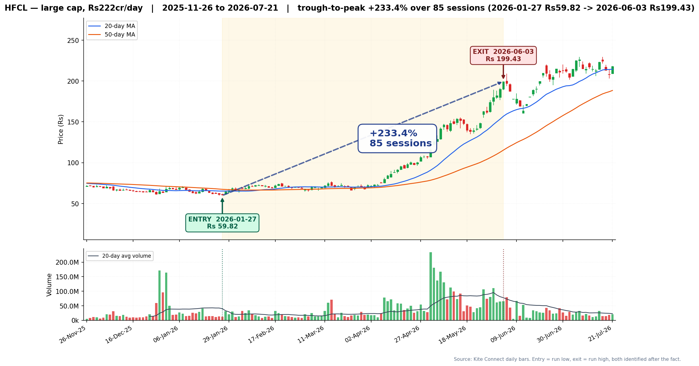

HFCL bottomed at Rs59.82 on 2026-01-27 after a −22.5% slide from its 6-month high, then
tripled into early June. **At the entry bar there was nothing to see** — the close was
below both MAs, and volume was 0.30x its own 20-day average, i.e. the low printed on a
quiet day, not a capitulation flush. What only became clear later is that the low was not
the start of the run: price chopped sideways between Rs65 and Rs75 for **three more
months** before the actual advance began in late April on 200M-share volume. A trader who
bought the exact low would have sat through 60 sessions of nothing. The MA50 reclaim came
just 3 sessions later at Rs68.6, only 14.7% above the low, and still left +190.7% on the
table — of all 12 charts this is the one where being late cost least.

### 2. OLAELEC — +117.8% in 46 sessions (Rs249 cr/day)

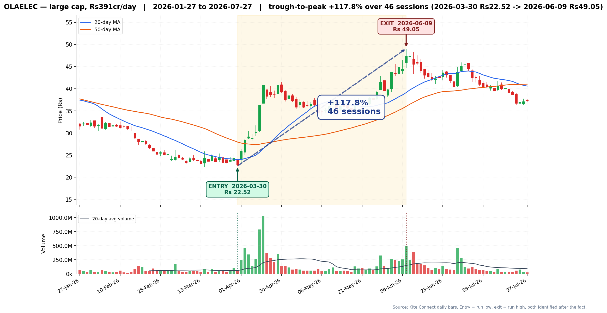

The deepest drawdown in the pack: OLAELEC was **−60.1% from its 6-month high** when it
turned on 2026-03-30 at Rs22.52, then more than doubled in nine weeks. Entry-day volume
was 1.10x average — unremarkable. **What was visible: a stock in freefall, below both MAs,
making new lows.** Every quality and momentum filter we run would have excluded it, and on
the evidence to the left of the green arrow, correctly so. This one moved fast: +25% within
2 sessions, +50% within 6, so the MA50 reclaim on 2026-04-02 already cost 25.8% of the
move. It is also the clearest exit warning in the pack — 60 sessions after the peak the
stock was **−24.0%**.

### 3. EDELWEISS — +142.6% in 49 sessions (Rs44.6 cr/day)

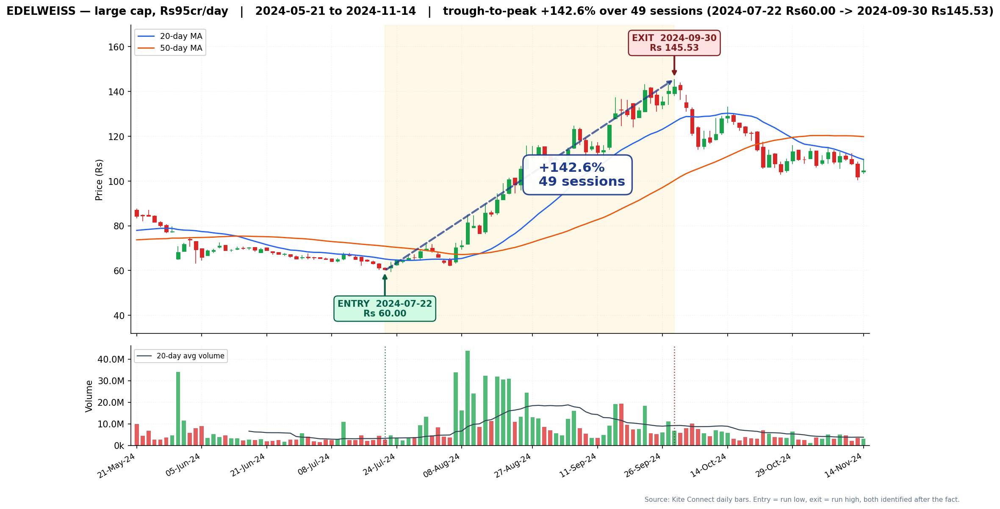

A textbook-shaped recovery: Rs60.00 on 2024-07-22, −30.0% off its high, to Rs145.53 by
end-September 2024. This is the most "readable" chart in the set — the base is visible,
the breakout is clean, and the MA50 reclaim on 2024-07-31 (7 sessions later, 16.3% above
the low) still had **+108.6% ahead of it**. **But at the low itself the setup was
indistinguishable from a continuing downtrend**: below both MAs, volume 0.82x average. The
shape only became a base once the right-hand side existed. Note what follows the red
arrow — the stock was **−28.0%** 60 sessions after the peak, so the exit mattered nearly
as much as the entry.

### 4. DBREALTY — +115.1% in 80 sessions (Rs37.6 cr/day)

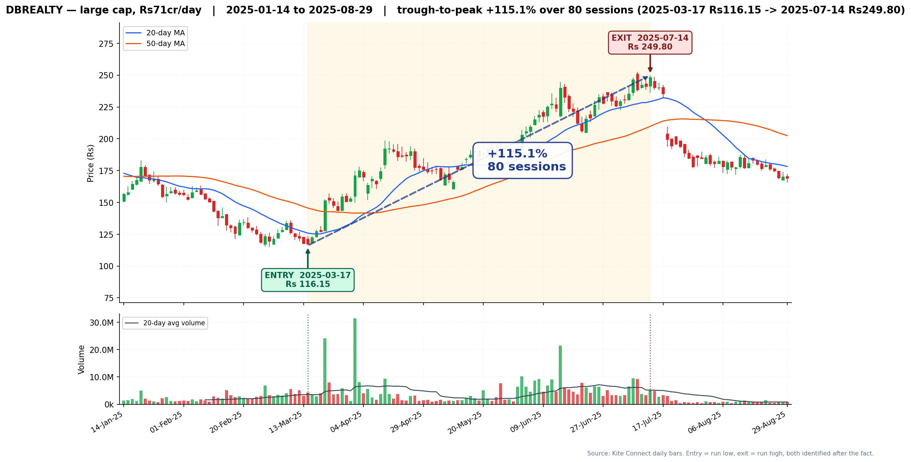

Rs116.15 on 2025-03-17, −41.9% from its high, to Rs249.80 in mid-July 2025. The turn was
sharp: +25% inside 4 sessions. **At the low, volume was 1.19x average and price was 20%
below the MA50 — no confirmation of any kind.** The MA50 reclaim came 4 sessions later but
already 30.5% above the low, one of the more expensive delays here, leaving +64.8%. The
run itself was not comfortable: a −14.1% close-to-close drawdown mid-run would have
stopped out most fixed-percentage stops. And again the give-back is severe — **−32.4%**
sixty sessions after the peak.

---

## Small / mid cap

### 5. ORIENTTECH — +173.2% in 72 sessions (Rs19.2 cr/day)

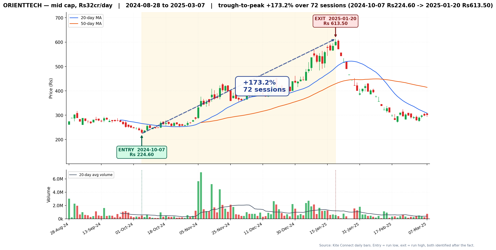

A recent listing, which is why **the 50-day MA does not exist at the entry bar at all** —
there was insufficient history. That is worth stating plainly: for newly listed names our
trend filters are not merely off, they are undefined, and any backtest that silently
treats a missing MA as a fail is quietly excluding this entire category. Rs224.60 on
2024-10-07 to Rs613.50 by 2025-01-20. The MA50 only became computable — and reclaimed — on
2024-11-06, **22 sessions and 59.4% above the low**, the second-worst delay in the pack,
though +71.4% still followed. This chart also carries the harshest aftermath: **−50.8%**
sixty sessions past the peak.

### 6. NIBE — +161.7% in 57 sessions (Rs7.0 cr/day)

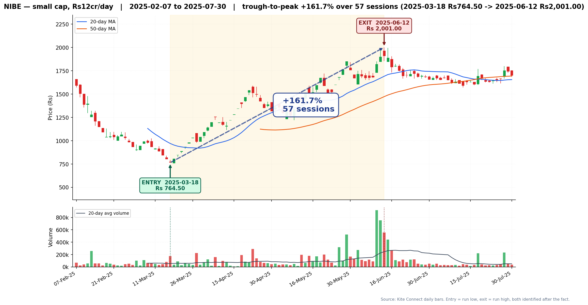

The one entry bar in this pack with a genuine, visible signal: **volume was 3.05x its
20-day average** on 2025-03-18 at Rs764.50, after a −51.8% collapse — a capitulation
print. That is the strongest real-time evidence anywhere in these 12 charts, and it is
still only one bar of it. Everything else looked terrible: price 21% below the MA20, MA50
undefined. The move to Rs2,001 was fast (+50% in 11 sessions) and the MA50 reclaim was
hopeless as a trigger — **24 sessions late and 86.1% above the low**, the worst in the
pack, capturing only +40.6% of a +161.7% move. On this name the visible entry missed most
of it.

### 7. JINDALPOLY — +181.2% in 39 sessions (Rs2.95 cr/day)

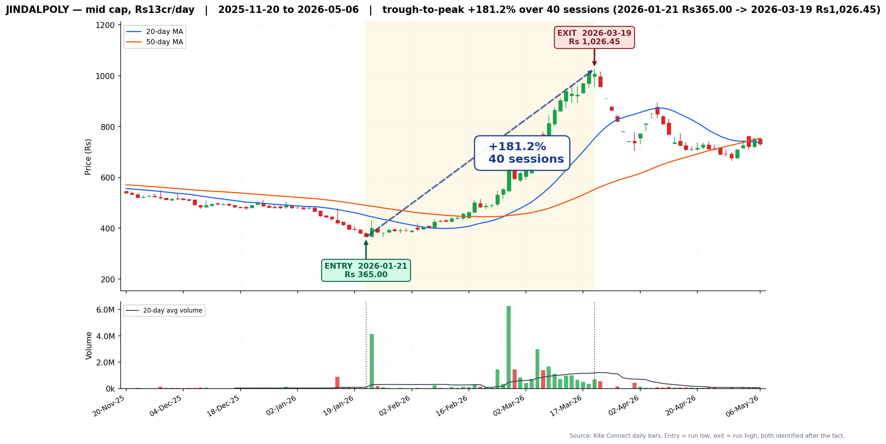

Rs365.00 on 2026-01-21, −40.0% off its high, to Rs1,026.45 by 2026-03-19. **This was the
slowest starter: 10 sessions to get +10% off the low**, so a trader who bought the exact
bottom spent two weeks looking wrong. Entry-day volume was 0.61x average — a low on
apathy, not panic. The compensation is that this run had the **smoothest interior of all
12: max drawdown of just −6.6%** during the advance, so once in, it was easy to hold. The
MA50 reclaim on 2026-02-13 was 17 sessions late and 25.2% up, still leaving +124.6%. At
Rs2.95 cr/day, a Rs10 lakh position is ~3% of a day's turnover — near the practical edge.

### 8. CONFIPET — +182.2% in 58 sessions (Rs11.6 cr/day)

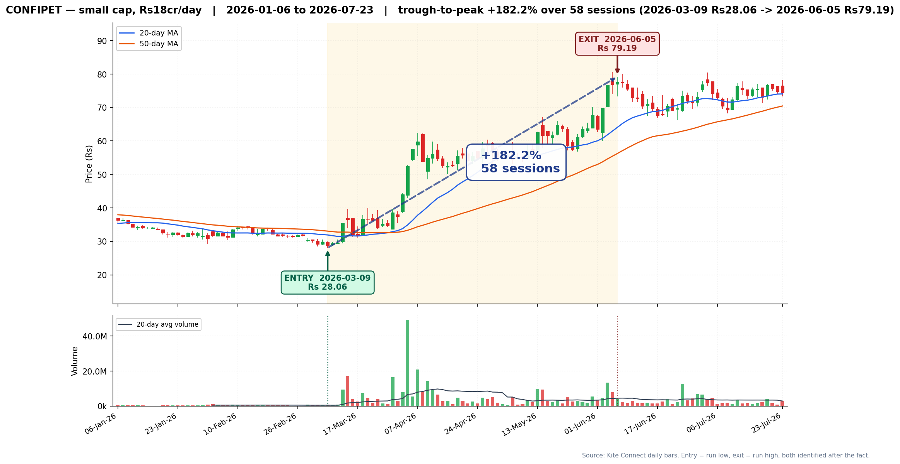

Rs28.06 on 2026-03-09, −41.6% from the high, to Rs79.19 by 2026-06-05. Volume at the low
was 1.29x average, price below both MAs. **The turn was immediate — +25% in 3 sessions**
— which made the MA50 reclaim unusually cheap here at 26.3% above the low with +123.4%
still to come. This is also the only name in the pack that mostly *held* its gain:
**−6.0%** sixty sessions after the peak, versus a −21.0% average. Worth noting for the
exit work: the runs that hold and the runs that give it all back are not distinguishable
from the entry side.

---

## Penny / low turnover

The four below all cleared +90%, and all four are where the cost model stops being a
rounding error. Under CNC the **flat Rs18.80 DP fee per scrip per sell** is 0.63% of a
Rs3,000 position and 0.09% of Rs20,000. Combined with turnover this thin, the position
sizes that make the fee negligible are the same sizes that move the stock.

### 9. NACLIND — +322.6% in 100 sessions (Rs2.11 cr/day)

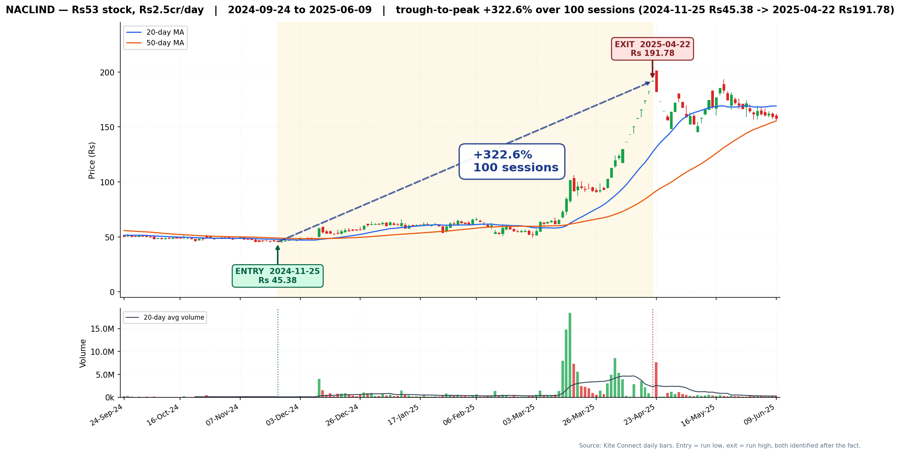

The largest move in the pack: Rs45.38 on 2024-11-25 to Rs191.78 on 2025-04-22. **At the
low it looked like a Rs45 stock going nowhere** — 36.3% off its high, below both MAs,
volume 1.19x. And it kept looking that way: price ground sideways in the Rs50-65 band for
**over three months** after the low before the March 2025 vertical. It took **76 sessions
to reach +50%**, then the remaining +270% arrived in about four weeks. This is the chart
that best refutes "you can see it starting" — the MA50 reclaim on 2024-12-03 was only 7.2%
above the low and *still* left +294.3%, because the base was so long. It is also the
riskiest hold: a −21.2% interior drawdown, the deepest here. At Rs2.11 cr/day, a Rs5 lakh
position is 2.4% of daily turnover.

### 10. SINDHUTRAD — +172.3% in 74 sessions (Rs3.77 cr/day)

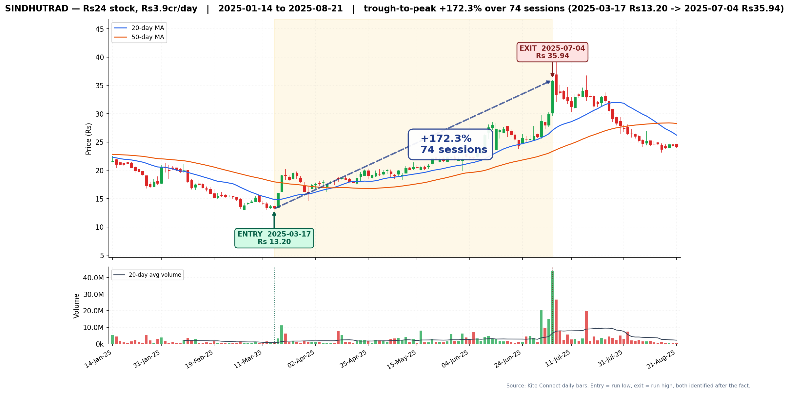

Rs13.20 on 2025-03-17, −52.2% from its high, to Rs35.94 on 2025-07-04. Volume at the low
was **0.63x average — the low came on the quietest kind of day**, which is the opposite of
the capitulation-volume signature people look for. The bounce was instant (+10% in one
session), so the MA50 reclaim two days later was already **44.5% above the low**. On a
Rs13 stock that gap is not slippage-tolerant. Give-back after the peak: **−32.9%**.

### 11. PLAZACABLE — +140.7% in 25 sessions (Rs0.20 cr/day)

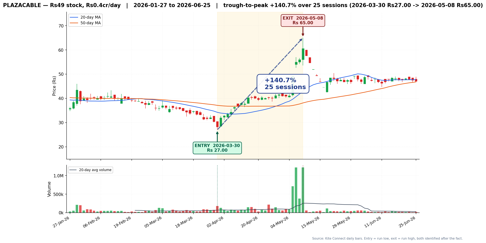

Rs27.00 to Rs65.00 in five weeks — the fastest run here. Entry-day volume was **2.63x
average**, the second-strongest real-time signal in the pack, on a stock −46.9% from its
high. **This one is the clearest illustration of why the chart is not the trade.** Median
turnover is Rs0.20 cr/day — about Rs20 lakh. A Rs2 lakh position is 10% of an entire
day's volume; there is no way to build or exit it at the prices drawn on this chart. The
+140.7% is real and the bars are real, and it is still not capturable at any size that
matters to the book.

### 12. BHANDARI — +93.0% in 26 sessions (Rs0.11 cr/day)

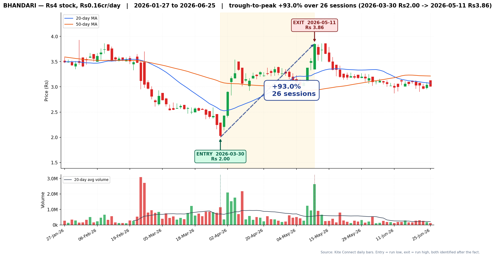

A Rs2.00 stock to Rs3.86. Included specifically as the boundary case. **The percentage is
large and the rupees are not**: at Rs0.11 cr/day (~Rs11 lakh), a Rs1 lakh position is 9%
of daily volume, and the tick size alone is a meaningful fraction of the price — a
one-paisa spread on a Rs2.00 stock is 0.5% per side, roughly 10x the statutory intraday
floor of 0.036%. Add the Rs18.80 DP fee and a Rs20,000 position pays 0.09% on the fee
before any spread. The move was visible early (+50% in 3 sessions) and the MA50 reclaim
was 58.5% above the low with only +21.8% left. **This chart is evidence that the penny
bucket should be excluded on cost grounds, not chased on percentage grounds.**

---

## Symbols dropped, and why

Both are recorded rather than silently replaced.

| Symbol | Bucket | Reason |
|:--|:--|:--|
| `ZEELEARN` | penny | **No NSE instrument token on Kite.** It appears in `sf_ret.parquet` — which is survivorship-free and deliberately retains the 417 symbols that stopped trading — but it is not in Kite's live NSE equity instrument list, so no bars can be drawn. Replaced with `BHANDARI`. |
| `ASHIMASYN` | penny | **Data disagreement, unreconciled.** `sf_ret.parquet` gives +101.6% for 2025-03-28 to 2025-08-20; Kite's own daily closes over the identical dates give **+56.7%** (Rs17.18 to Rs26.92). A 45-percentage-point gap. Not rendered. Replaced with `PLAZACABLE`. |

### The ASHIMASYN gap is a flag on the dataset, not just on one symbol

Spot-checking the same comparison on other thin names found the disagreement is not
isolated — `CCHHL` showed sf_ret +123.2% against Kite +73.2% over identical dates. Among
the 12 rendered here the two sources agree closely (the chart's low-to-high figure sits
just above sf_ret's close-to-close figure, exactly as it should), so **the divergence
appears concentrated in the illiquid tail**, most likely a corporate-action adjustment
difference or return-chaining across missing sessions.

`sf_ret.parquet` is described in the brief as the best dataset we own, and for the liquid
names these charts support that. But **any result that depends on the low-turnover tail of
sf_ret should be re-verified against Kite bars before it is believed.** That is a
cheap check and this pack suggests it is a necessary one.

---

## Reproducing any chart in this pack

The renderer is reusable and takes any symbol and date range:

```python
from quant.render_chart import render_chart

png, stats = render_chart("HFCL", "2025-11-26", "2026-07-21",
                          entry="2026-01-27", exit_="2026-06-03")
```

Or from the shell:

```bash
NSE_DATA_SOURCE=kite python3 quant/render_chart.py HFCL 2025-11-26 2026-07-21 \
    2026-01-27 2026-06-03
```

If `entry`/`exit_` are omitted the renderer derives them as the window trough and the
following peak. Batch use goes through `render_many()`, which throttles to 0.34s between
Kite historical calls and **drops** unresolvable symbols with a printed reason rather than
substituting a replacement of its own choosing.

Output: `docs/research/overnight/charts/<SYMBOL>_<entry-date>.png`, 150 dpi.
