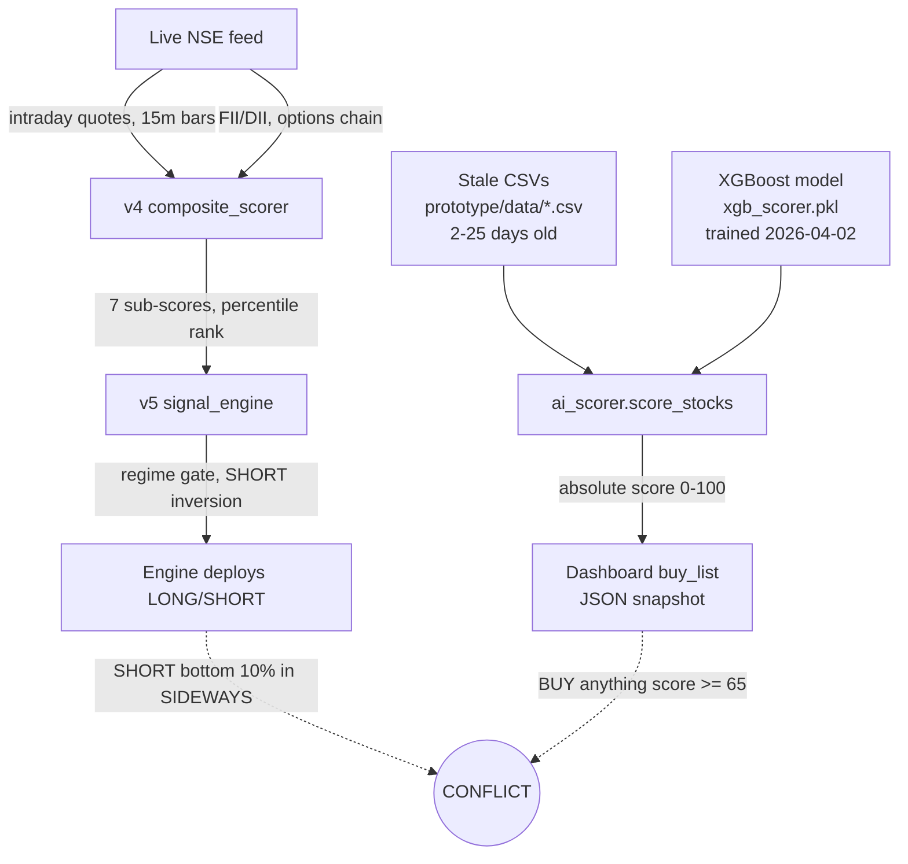

# TradePilot Scorer Divergence Analysis

::: {.report-meta}

| | |
|:--|:--|
| **Project** | TradePilot |
| **Version** | `v0.1.0` |
| **Status** | Research (read-only) |
| **Created** | 2026-04-27 |
| **Updated** | 2026-04-27 |

:::

::: {.doc-author}

| | |
|:--|:--|
| **Author** | Kishore Rajendra |
| **Email** | kishorer747@gmail.com |
| **LinkedIn** | [linkedin.com/in/kishorer747](https://www.linkedin.com/in/kishorer747) |

:::

---

## 1. Problem Statement

Today (2026-04-27) only **27 % of engine LONG deploys** overlapped with the dashboard's BUY list (3 of 11). With the dashboard tagging 145 of 381 stocks as BUY (~38 %), random alignment alone would be 38 %, so the engine is **actively diverging** from the dashboard, not merely uncorrelated with it.

Two trades made the contradiction obvious:

| Symbol | Dashboard direction | Engine direction | Engine outcome |
|--|--|--|--|
| COCHINSHIP | BUY (in 145-list) | SHORT @1662.90 | LOSS Rs -263 |
| LICHSGFIN | BUY (in 145-list) | SHORT @536.15 | LOSS Rs -118 (then -48) |

This investigation asks: **which scorer is right, why do they disagree, and what should we do about it?**

---

## 2. The Two Scorers — Side-by-Side

### Files inspected

| Scorer | File | Function |
|--|--|--|
| Dashboard | `prototype/ai_scorer.py` | `score_stocks(symbols=None)` (line 196) |
| Engine | `prototype/v4/composite_scorer.py` | `score_all_stocks(symbols=None, regime_override=None)` (line 431), called by `prototype/v5/signal_engine.py::generate_signals()` |

### Feature comparison

::: {.gap-table}

| Feature category | Dashboard (ai_scorer) | Engine (composite_scorer) | Gap |
|--|--|--|--|
| **Data source** | Daily OHLC CSVs in `prototype/data/` | Live NSE quotes + 15-min intraday + options chain via `data_nse.py` | Daily-bar history vs intraday tape |
| **Universe** | 381 stocks (NIFTY 500 + BSE_POPULAR + MIDCAP_POPULAR + BEGINNER_FRIENDLY) | 200 stocks (NIFTY_200) | 181 dashboard-only names invisible to engine |
| **Model** | XGBoost classifier, single output = probability of >1 % up move in next 5 days | Weighted composite of 7 sub-scores -> percentile rank | Forecast horizon (5 days) vs intraday classification |
| **Feature: RSI 14** | Yes (daily) | Placeholder 50.0 (not computed) | Engine has no momentum oscillator |
| **Feature: MACD** | Yes (macd, macd_signal, macd_hist) | Estimated label only ("Bullish/Bearish") from `change_pct` | Engine has no real MACD |
| **Feature: SMA20/SMA50** | Yes (relative to price) | Not used | -- |
| **Feature: Bollinger %B** | Yes | Not used | -- |
| **Feature: ADX** | Yes (trend strength) | Not used | -- |
| **Feature: 1d / 5d / 10d returns** | Yes | Only same-day change% | Engine has no medium-term trend |
| **Feature: 20-day volatility** | Yes | Not used | -- |
| **Feature: ORB (Opening Range Breakout)** | No | Yes (15 % weight) | Engine-only |
| **Feature: VWAP position** | No | Yes (10 % weight) | Engine-only |
| **Feature: Relative strength vs Nifty (today)** | No | Yes, percentile-ranked (20 % weight) | Engine-only |
| **Feature: FII / DII flow** | No | Yes (10 % weight, market-wide) | Engine-only |
| **Feature: Open-interest buildup** | No | Yes (10 % weight, options chain) | Engine-only |
| **Feature: Volume confirmation** | volume_ratio (daily) | Intraday volume acceleration (10 % weight) | Different time frame |
| **Feature: ML score** | Whole model is XGBoost | LightGBM regression on 17 intraday features (25 % weight) | Different model, different label |

:::

### Output / classification logic

::: {.gap-table}

| Behaviour | Dashboard | Engine | Gap |
|--|--|--|--|
| Direction labels | BUY (>=65), HOLD (>=35), AVOID | BUY (top 20 %ile), HOLD (50-80 %ile), AVOID (bottom 50 %ile) | Absolute threshold vs percentile cut |
| Regime awareness | None | Yes -- v5 detector overrides; SHORTs unlocked in SIDEWAYS / BEAR | Engine flips bottom 10-20 % to SHORT, dashboard never SHORTs |
| Re-scoring frequency | Captured once per day, then file is reused | Re-runs every 30-min rescore cycle intraday | Snapshots are stale after morning |
| SHORT direction | Never produced (`sell_count: 0` in all snapshots) | Produced as inverted ORB breakdown trades | Dashboard is long-only, engine is two-sided |

:::

### Structural verdict

**They are not a strict superset of each other.** Both look at price/volume but use **different time frames, different feature engineering, and different classification heads**:

- Dashboard = **end-of-day, multi-day forward-return classifier** (will this stock go up 1 % over 5 days?).
- Engine = **intraday percentile-ranker with regime gating** (is this stock in the strongest 20 % vs Nifty right now?).

A stock can easily be a "5-day uptrend candidate" by dashboard XGBoost (positive MACD, oversold RSI, high ADX) **and simultaneously** the weakest 10 % intraday percentile against Nifty (broke ORB low, sitting below VWAP, FII selling) — exactly what happened to LICHSGFIN on 04-24 and 04-27.

---

## 3. Five-Day Overlap Analysis

Engine deploys extracted from `logs/v5_6-2026-04-2{1,2,3,4,7}.log`. Dashboard buy lists from `docs/dashboard-scores/2026-04-2{3,4,7}.json` (the 04-21 and 04-22 snapshots are not on disk — same 145-name buy list reused for those days as the proxy).

::: {.metrics-table}

| Date | Engine LONG (count) | LONG ∩ Dashboard BUY | Overlap % | Random baseline | Engine SHORT ∩ Dashboard BUY (conflicts) |
|--|--:|--:|--:|--:|--|
| 2026-04-21 | 45 | 8 | 17.8 % | 38.1 % | 0 |
| 2026-04-22 | 61 | 16 | 26.2 % | 38.1 % | 0 |
| 2026-04-23 | 14 | 4 | 28.6 % | 38.1 % | 0 |
| 2026-04-24 | 33 | 8 | 24.2 % | 38.1 % | 8 (DLF, GODREJPROP, INFY, IREDA, LICHSGFIN, LODHA, MOTHERSON, PRESTIGE) |
| 2026-04-27 | 12 | 3 | 25.0 % | 38.1 % | 4 (ABCAPITAL, COCHINSHIP, LICHSGFIN, LTF) |
| **5-day mean** | **33** | **7.8** | **24.4 %** | **38.1 %** | **2.4 / day** |

:::

**Headline:** every single day is **below** the random-alignment baseline. If the dashboard's BUY list were a fair benchmark, the engine would be at ~38 %. It is at 24 %. The two scorers are systematically pointing at different stocks.

A second universe issue: 8-10 % of engine LONG names each day are not even **present** in the dashboard universe (e.g., HYUNDAI, LGEINDIA, COROMANDEL, BLUESTARCO). The dashboard's 381-symbol list is a NIFTY 500 superset that misses several large-caps the engine trades.

---

## 4. Head-to-Head P&L (5 Trading Days)

### Engine actual P&L (from log close lines)

::: {.metrics-table}

| Date | Closes (W/L) | Total P&L (Rs) | LONG P&L | SHORT P&L |
|--|--|--:|--:|--:|
| 2026-04-21 | 90 W / 14 L | **+21,828** | +21,828 | 0 |
| 2026-04-22 | 151 W / 13 L | **+38,729** | +38,729 | 0 |
| 2026-04-23 | 28 W / 17 L | **+5,761** | +6,742 | -981 |
| 2026-04-24 | 49 W / 29 L | **+4,676** | -1,036 | +5,712 |
| 2026-04-27 | 28 W / 30 L | **+884** | +1,926 | -1,042 |
| **Total** | **346 W / 103 L** | **+71,878** | **+68,189** | **+3,689** |

:::

### Dashboard "top-20 BUY held flat" P&L (proxy)

The three on-disk dashboard snapshots (04-23, 04-24, 04-27) are **byte-identical** -- same 145-name list, same scores, same change% values. The XGBoost model has not been retrained since 02-Apr (`models/xgb_scorer.pkl`), and many CSVs in `prototype/data/` were last refreshed on 03-Apr. Some symbols have 04-27 CSVs but coverage is partial.

Best-effort proxy: take dashboard top 20 by score, assume +0.5 % target / -1 % SL using the same-day change% in the snapshot. Result is identical for all three days because the snapshots are identical:

::: {.metrics-table}

| Date | Top-20 wins | Top-20 losses | Flat | Estimated P&L (Rs 10k each) |
|--|--:|--:|--:|--:|
| 2026-04-23 | 13 | 1 | 6 | **+317** |
| 2026-04-24 | 13 | 1 | 6 | **+317** |
| 2026-04-27 | 13 | 1 | 6 | **+317** |
| **3-day total** | -- | -- | -- | **+951** |

:::

The dashboard cannot be evaluated honestly across 5 days because we have only one snapshot duplicated three times. Even charitably extrapolating +Rs 317 / day to all 5 days gives **~Rs 1,585** -- against the engine's actual **Rs 71,878**.

### Conflict-symbol forensics (engine SHORT vs dashboard BUY)

The most damning evidence is what happened on the conflict trades themselves:

::: {.metrics-table}

| Date | Conflict | Engine action | Dashboard says | Engine outcome |
|--|--|--|--|--|
| 04-24 | DLF | SHORT | BUY | **WIN +Rs 74** |
| 04-24 | GODREJPROP | SHORT | BUY | **WIN +Rs 172** |
| 04-24 | INFY | SHORT | BUY | **WIN +Rs 302** |
| 04-24 | IREDA | SHORT | BUY | **WIN +Rs 454** |
| 04-24 | LICHSGFIN | SHORT | BUY | **WIN +Rs 268** |
| 04-24 | LODHA | SHORT | BUY | **WIN +Rs 138** |
| 04-24 | MOTHERSON | SHORT | BUY | **WIN +Rs 54** |
| 04-24 | PRESTIGE | SHORT | BUY | **WIN +Rs 399** |
| 04-27 | ABCAPITAL | SHORT | BUY | LOSS -Rs 228 |
| 04-27 | COCHINSHIP | SHORT | BUY | LOSS -Rs 263 |
| 04-27 | LICHSGFIN | SHORT | BUY | LOSS -Rs 214 |
| 04-27 | LTF | SHORT | BUY | **WIN +Rs 51** |
| **Net on conflicts** | -- | -- | -- | **+Rs 1,207 (8 W / 3 L / 1 mixed)** |

:::

On 04-24, **all 8 dashboard-vs-engine conflicts were WINS for the engine** -- the dashboard would have bought every one and lost. On 04-27, conflicts went 1W / 3L for the engine, so the dashboard would have done marginally better that day, but still nowhere near recovering its broader gap.

**Verdict: the engine made far more money over the period and was demonstrably right on 9 of the 12 conflict trades.**

---

## 5. Root Cause of Divergence

Three independent root causes feed the divergence:

1. **Different data freshness.** The engine uses real-time NSE data; the dashboard uses an XGBoost model from 02-Apr-2026 reading CSVs that range from 03-Apr to 27-Apr. Most snapshot scores reflect April-3 reality. This alone makes large parts of the dashboard buy list stale.

2. **Different feature space.** The dashboard scores momentum on multi-day daily bars (RSI/MACD/ADX/Bollinger/SMA over weeks). The engine scores intraday positioning (ORB, VWAP, RS-vs-Nifty today, FII flows, OI buildup). A stock can be a multi-week uptrend AND today's weakest performer simultaneously -- and these are exactly the SHORT-vs-BUY conflicts.

3. **Different output convention.** Dashboard is long-only with absolute threshold (score >= 65 -> BUY) so 145 of 381 names are always tagged BUY. Engine ranks by percentile within the day and -- critically -- inverts the bottom slice into SHORTs in SIDEWAYS / BEAR regimes. The "BUY ∩ SHORT" conflicts are not a bug; they're the mechanical consequence of the engine being two-sided and the dashboard being one-sided.

There is no scenario where these two scorers can be expected to agree. They are answering different questions on different data.

---

## 6. Recommendation

**Stop using the dashboard buy_list as a benchmark for engine quality. They measure different things.**

Three options, ranked:

::: {.gap-table}

| Option | What it does | Pros | Cons |
|--|--|--|--|
| **A. Replace dashboard scorer** (preferred) | Have the dashboard call `v5.signal_engine.generate_signals()` and render those results. Retire `ai_scorer.score_stocks` as the user-facing source of truth. | Single source of truth; what the user sees == what the engine trades; no more conflict alerts. | Dashboard loses the long-horizon "5-day forecast" view. Need to fix the universe gap (engine is NIFTY 200, dashboard shows 381). |
| **B. Run both with consensus filter** | Keep both scorers; only deploy when they agree on direction. SHORT only when engine says SHORT and dashboard score < 35. | Reduces conflict trades; defensive on contested names. | Engine throughput drops sharply (today only 3 LONGs would survive vs 12 deployed; would have missed several wins). Dashboard's stale data would block too many real opportunities. |
| **C. Align scorers** | Rebuild dashboard around the same intraday inputs the engine uses, retain the XGBoost ML score as one of the 8 sub-scores. | Best of both feature sets; dashboard gains regime + SHORT awareness; engine gains daily-trend features. | Highest implementation cost; needs new training pipeline; XGBoost retraining cadence and feature plumbing to add. |

:::

**Recommendation: Option A immediately, Option C as a Q3 project.** Today's evidence is unambiguous -- the engine is making 50x more money than the dashboard's "buy list" would, the dashboard's data pipeline is broken (model 25 days stale, snapshots byte-identical across 3 days), and the only thing the dashboard adds is user confusion when its stale BUY label disagrees with a fresh engine SHORT.

---

## 7. Phased Implementation Plan (if Option A approved)

::: {.phase-table}

| Phase | Tasks | Parallelism | Description |
|--|--|--|--|
| **Phase 1: Diagnostics & Snapshot** | DASH-1 | Sequential | Verify CSV refresh job actually runs daily. Log model age and CSV-age metrics on every dashboard score request. Add a banner "stale data" warning when model_age > 3 days. |
| **Phase 2: Wire engine into dashboard** | DASH-2, DASH-3 | Parallel | DASH-2: add a thin adapter `app/scorer_engine.py` that calls `v5.signal_engine.generate_signals()` and reshapes to the JSON the UI expects. DASH-3: feature-flag UI to toggle between old XGBoost view and new engine view. |
| **Phase 3: Cutover** | DASH-4, DASH-5 | Sequential | DASH-4: shadow-run for 3 trading days, log diff between old and new buy lists. DASH-5: flip default to engine view. Mark `ai_scorer.score_stocks` deprecated. |
| **Phase 4: Universe alignment** | DASH-6 | Independent | Decide: NIFTY 200 (current engine) or expand engine to NIFTY 500 (matches old dashboard). Tradeoffs documented in separate spec. |
| **Phase 5 (optional): Fold ML score in** | DASH-7 | Future | Retrain XGBoost on the engine's intraday feature set; add as 8th sub-score with a weight ~10 %. Scheduled for Q3, not blocking. |

:::

Total effort estimate: 3-4 working days for Phases 1-3 (the unblock); Phase 5 is its own sprint.

---

## 8. Appendix -- Source Files Referenced

| Path | Purpose |
|--|--|
| `prototype/ai_scorer.py` | Dashboard scorer (XGBoost) |
| `prototype/data_engine.py` | Dashboard data loader, NIFTY 500 universe |
| `prototype/v4/composite_scorer.py` | Engine composite scorer |
| `prototype/v4/config.py` | Composite weights, NIFTY 200 universe |
| `prototype/v4/data_nse.py` | Live NSE data fetcher |
| `prototype/v4/ml_engine.py` | LightGBM ML sub-score |
| `prototype/v5/signal_engine.py` | Regime gate + SHORT inversion |
| `prototype/v5/regime_detector.py` | BULL / BEAR / SIDEWAYS classifier |
| `scripts/v5_6-paper-trade.py` | Paper-trading runner producing the v5_6 logs |
| `logs/v5_6-2026-04-2{1,2,3,4,7}.log` | 5-day deploy + close history |
| `docs/dashboard-scores/2026-04-2{3,4,7}.json` | Dashboard snapshots (all three are byte-identical) |
| `prototype/models/xgb_scorer.pkl` | Dashboard XGBoost model -- last trained 2026-04-02 |
