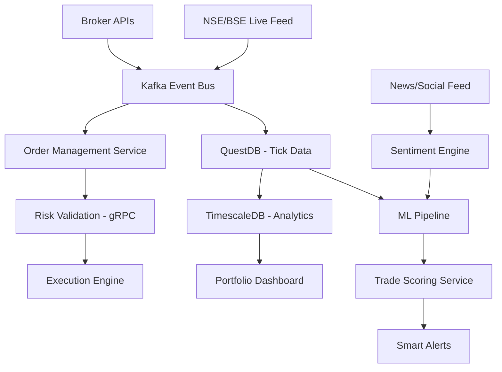
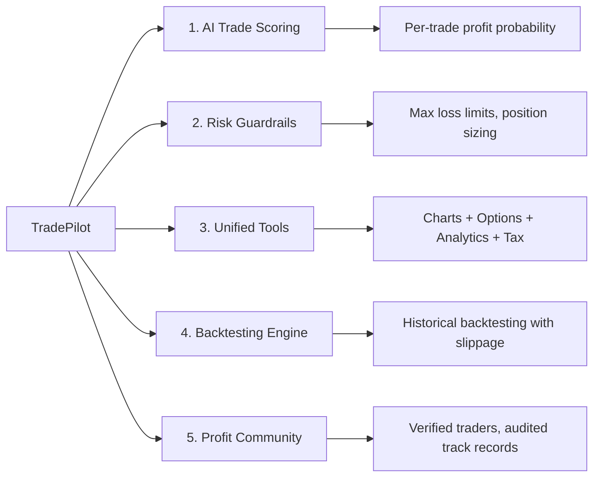

# TradePilot: Next-Gen Indian Trading Platform

*Deep Research Report -- Competitor Analysis, Market Gaps, Technology, Regulation & Community Insights*

::: {.report-meta}

| | |
|:--|:--|
| **Project** | TradePilot |
| **Version** | `v0.1.0` |
| **Status** | Research Phase |
| **Created** | 2026-04-02 |
| **Updated** | 2026-04-02 |

:::

::: {.doc-author}

| | |
|:--|:--|
| **Author** | Soumya Swain |
| **Email** | support@devpilot.co.in |
| **LinkedIn** | [linkedin.com/in/kishorer747](https://www.linkedin.com/in/kishorer747) |

:::

---

## Executive Summary

The Indian retail trading market is at an inflection point. With 212M+ demat accounts, 33% YoY growth, and a post-COVID boom in retail participation -- the market is exploding. But there's a dark side: **93% of F&O traders lose money**, with aggregate losses exceeding Rs 1.8 trillion over 3 years (SEBI, 2024).

Current platforms (Zerodha, Groww, Upstox) are **order execution terminals** -- they help you place trades but don't help you make money. Zerodha sits at 1.7/5 on Trustpilot. Upstox at 1.6/5. A 6+ lakh user exodus happened in mid-2025.

**TradePilot's thesis:** Build the first Indian trading platform where every screen, every feature asks: *"Will this trade make you money?"* -- AI-powered trade scoring, risk guardrails, strategy validation, and profit probability before you click buy.

---

<div class="page-break"></div>

## 1. Market Sizing & Opportunity

### 1.1 TAM / SAM / SOM

::: {.metrics-table}

| Metric | Value | Source |
|:-------|------:|:-------|
| Demat accounts (2025) | 212.8M | CDSL/NSDL |
| New accounts/month | 3.8M | Industry data |
| Active trading accounts | 154M | NSE |
| Active individual traders | 10M+ | SEBI |
| Security brokerage TAM (2025) | $2.20B | IMARC Group |
| Brokerage TAM (2034 proj.) | $2.83B | IMARC Group |
| Retail AUM (mid-2024) | Rs 61.33L cr | Industry data |
| F&O active traders | 11.3M | SEBI |
| F&O aggregate losses (FY22-24) | Rs 1.8T | SEBI Study |

:::

### 1.2 Growth Trajectory

- **5-year demat CAGR (2019-2024):** ~32% annually
- **2024 growth:** 33% YoY (46M new accounts)
- **Individual traders:** 120% increase FY22-FY25
- **Registered investors:** Tripled since March 2020

### 1.3 The Paradox

Account growth is explosive (33% YoY) but brokerage revenue growth is anemic (2.84% CAGR). This means: **high user acquisition, low monetization, high churn risk.** Platforms are commoditized -- the winner will be whoever solves profitability for traders, not just access.

### 1.4 Key Demographics

::: {.metrics-table}

| Segment | Data | Implication |
|:--------|:-----|:------------|
| Age | 43% of consumption under 25 by 2025 | Massive young cohort, needs education |
| Income | 75% of F&O traders earn <Rs 5L/year | Price-sensitive, high-risk behavior |
| Gender | 24.3% female nationally | Emerging underserved segment |
| Geography | 50% new accounts from Tier-II/III | Rural/semi-urban growth outpacing metros |
| Loss rate | 93% of F&O traders lose money | CRITICAL -- the problem to solve |

:::

---

<div class="page-break"></div>

## 2. Competitor Landscape

### 2.1 Indian Platform Comparison

::: {.gap-table}

| Platform | Strengths | Weaknesses | Trust Rating |
|:---------|:----------|:-----------|:-------------|
| **Zerodha Kite** | Largest base (2.3cr+), free APIs, ecosystem (Sensibull/Streak/Smallcase) | Limited charting, no native options tools, 1.7/5 Trustpilot, outages | 1.7/5 |
| **Groww** | Simplest UX, 1.25cr active users, 100% Trustpilot resolution | No commodities, no algo, basic charting, no bracket orders | Better |
| **Upstox** | 3-in-1 account, NRI support, TradingView integration | 1.6/5 Trustpilot, hidden charges, "dead slow" app | 1.6/5 |
| **Angel One** | SmartAPI for algo, commodities, NRI trading | Steep learning curve, highest AMC, less beginner-friendly | Mid |
| **Dhan** | Fastest execution (<50ms), strong options focus (DEXT engine) | Smaller platform, limited brand recognition | Growing |
| **Fyers** | Best native charting/TA tools, lifetime free AMC | Mid-tier user base, less documented API | Niche |
| **5Paisa** | Transparent flat pricing (Rs 20/trade) | Limited charting, smaller ecosystem | Low |

:::

### 2.2 International Benchmarks

::: {.gap-table}

| Platform | What India Lacks | Feature Gap |
|:---------|:-----------------|:------------|
| **Interactive Brokers** | 47K+ stocks, 160+ markets, 0.52ms latency | Global access, ultra-low latency, margin lending |
| **ThinkorSwim** | Advanced charting, backtesting, paper trading with slippage | Strategy simulation, conditional orders |
| **TradingView** | 1000+ indicators, Pine Script, community scripts | Professional charting, custom indicators |
| **Robinhood** | Fractional shares, no minimums | Micro-investing, zero-barrier entry |
| **QuantConnect** | 100TB+ backtesting data, heatmap optimization | Quantitative strategy validation |
| **Composer** | No-code hedge fund strategy builder | Visual strategy building for non-coders |
| **Bookmap** | Advanced order flow visualization | DOM heatmaps, liquidity analysis |

:::

### 2.3 The 10 Critical Gaps No Indian Platform Fills

1. **Professional-grade charting & backtesting** -- forced to use TradingView separately
2. **Global asset access** -- no unified India + international markets
3. **Ultra-low latency** -- 50ms vs 0.52ms internationally
4. **Advanced options strategy builder** -- must use Sensibull/Opstra separately
5. **Fractional shares / micro-investing** -- can't build diversified portfolio with small capital
6. **Integrated backtesting & paper trading** -- zero Indian platforms offer this
7. **Unified trading account** -- separate accounts for different asset classes
8. **Sophisticated risk management** -- no OCO, trailing stops inconsistent, no TWAP/VWAP
9. **Ecosystem integration** -- 3-4 tabs/apps for complete workflow
10. **Tax automation** -- manual Excel reconciliation for capital gains

---

<div class="page-break"></div>

## 3. Community Pain Points (Ranked)

### 3.1 Top 15 Pain Points

::: {.task-table}

| Rank | Pain Point | Severity | Impact |
|-----:|:-----------|:---------|:-------|
| 1 | Platform crashes during volatility | Critical | Financial losses from stuck orders |
| 2 | Order execution failures & slippage | Critical | Orders stuck in limbo, price lag |
| 3 | Poor customer support | High | No resolution, automated replies |
| 4 | Hidden charges & unclear fees | High | "Zero brokerage" masks real costs |
| 5 | Inadequate charting tools | High | Forced to split between broker + TradingView |
| 6 | No backtesting or paper trading | High | Deploying real capital without validation |
| 7 | Missing portfolio analytics | Medium | No P&L attribution, drawdown analysis |
| 8 | Poor options trading tools | High | No Greeks, no multi-leg from platform |
| 9 | No strategy automation for retail | High | Must use 3rd-party (Tradetron, Streak) |
| 10 | Slow settlement & withdrawal | Medium | T+3 frustration |
| 11 | Zero guardrails for beginners | Medium | No loss limits, no position sizing guidance |
| 12 | Mobile app UX problems | Medium | Dead slow performance during trading |
| 13 | Tax reporting nightmare | Medium | Manual capital gains tracking |
| 14 | No social/community features | Medium | Traders scattered across Telegram/Discord |
| 15 | Data accuracy issues | Low | Chart prices differ from execution prices |

:::

### 3.2 The Workaround Stack (What Profitable Traders Cobble Together)

Today's profitable trader uses **5-6 separate tools:**

```
Broker (Zerodha/Dhan)     -- order execution
  + TradingView            -- charting (Rs 500+/month)
  + Sensibull/Opstra       -- options Greeks & strategy
  + Tradetron/Streak       -- automation
  + Excel                  -- portfolio tracking & P&L
  + Moneycontrol/Screener  -- fundamental analysis
  + Cleartax               -- tax filing
```

**TradePilot's opportunity:** Unify this into ONE platform.

### 3.3 Dream Features Traders Want

1. Integrated backtesting engine (historical options backtesting)
2. Unified portfolio analytics dashboard (P&L by trade/strategy/sector)
3. Built-in strategy automation with risk guardrails
4. TradingView-grade charting natively
5. Tax automation (capital gains categorization, ITR export)
6. AI-powered risk warnings ("You're risking 5% on this trade")
7. Community layer with verified signal providers
8. Advanced order types (OCO, bracket, conditional)
9. Greeks analysis integrated with order flow
10. Multi-broker integration (execute across brokers from one dashboard)

---

<div class="page-break"></div>

## 4. Technology Architecture

### 4.1 Recommended Tech Stack

```
Frontend:        React/Next.js + TradingView Charting Library + WebGL (heatmaps)
Backend:         Go/Rust microservices + gRPC (risk validation)
Event Bus:       Apache Kafka (multi-broker event streaming)
Time-Series DB:  QuestDB (tick data, 12-36x faster than InfluxDB)
Analytics DB:    TimescaleDB (portfolio analytics, continuous aggregates)
ML/AI Pipeline:  PyTorch (price models) + spaCy (NLP sentiment)
Real-Time:       WebSocket + Server-Sent Events (fallback)
Broker APIs:     Zerodha Kite Connect v3 + Angel SmartAPI + Dhan API
Deployment:      Docker + Kubernetes (AWS Mumbai region)
```

### 4.2 AI/ML Capabilities

::: {.spec-table}

| Capability | Technology | What It Does |
|:-----------|:-----------|:-------------|
| Price prediction | LSTM/Transformer models | 30-day price movement forecasting |
| Sentiment analysis | NLP on news + FII/DII flows | Market mood scoring |
| Pattern recognition | CNN-based chart analysis | Auto-detect patterns with probability scores |
| Trade risk scoring | Ensemble models | Per-trade probability of profit/loss |
| Smart alerts | Contextual AI | Alert when sentiment diverges from price |
| Position sizing | Kelly criterion + volatility | Optimal position size per trade |

:::

### 4.3 Data Architecture



### 4.4 Interactive UI Features

- **Liquidity heatmaps** -- real-time order flow visualization (Bookmap-style)
- **Options payoff simulator** -- interactive Greeks with strategy overlay
- **Risk meter** -- portfolio-level heat map with position risk scoring
- **Parameter sensitivity heatmaps** -- backtest all strategy iterations visually
- **Flow visualization** -- historical footprint charts showing volume at price
- **No-code strategy builder** -- Composer-style drag-and-drop

---

<div class="page-break"></div>

## 5. Regulatory Roadmap

### 5.1 Path to Market (3 Options)

::: {.phase-table}

| Path | Timeline | Cost | Risk | Best For |
|:-----|:---------|-----:|:-----|:---------|
| **SEBI Research Analyst (RA)** | 1-2 months | Rs 5-10L | Low | MVP -- algo signals/advisory |
| **Authorized Person (AP)** | 2-4 weeks/exchange | Rs 2-5L/broker | Medium | White-label under broker |
| **Full Broker License** | 6-18 months | Rs 50L+ initial | High | Full independence |

:::

### 5.2 Recommended Phased Approach

**Phase 1 (Month 0-2): Research Analyst registration**
- NISM Series XV exam, SEBI RA application
- Launch as algo strategy/signal platform
- Partner with broker for execution
- Cost: Rs 5-10L | Revenue in: 2-3 months

**Phase 2 (Month 2-6): Authorized Person licenses**
- Add AP licenses with 2-3 brokers
- White-label platform under broker licenses
- Cost: Rs 2-5L per broker

**Phase 3 (Month 6-18): Full broker license (optional)**
- Apply for SEBI stockbroker license
- Direct client acquisition
- Cost: Rs 50L+ initial, Rs 1Cr+ annually

### 5.3 Critical Regulatory Constraints

::: {.checklist}

| | Constraint |
|:---:|:-----------|
| ! | **Algo trading (Apr 1, 2026):** All algos must be broker-hosted. No standalone APIs allowed |
| ! | **Order rate limit:** 10 orders/sec/exchange/client. Above = mandatory algo registration |
| ! | **Weekly expiry restricted:** Only 1 benchmark index per exchange (since Nov 2024) |
| ! | **F&O lot sizes increased:** Contract value Rs 15-20L (reduces retail speculation) |
| ! | **KYC/AML mandatory:** UBO identification, 5-year audit logs |
| ! | **Client fund segregation:** Escrow accounts mandatory |
| ! | **2FA + OAuth:** Required for all API access |

:::

---

<div class="page-break"></div>

## 6. TradePilot: The Opportunity

### 6.1 Positioning

**"The platform that makes Indian traders profitable."**

Not another order terminal. A profit-making machine with:
- AI trade scoring before every trade
- Risk guardrails that prevent catastrophic losses
- Backtesting so you validate before you risk real money
- Unified tools (no more 5 separate apps)
- Community with verified, accountable signal providers

### 6.2 Five Pillars of Differentiation



### 6.3 Target Market (Initial)

::: {.metrics-table}

| Segment | Size | Why They Switch |
|:--------|-----:|:----------------|
| F&O traders losing money | 10.5M | Platform that helps them STOP losing |
| Options traders using Sensibull + broker | 3-5M | Unified experience, no tab-switching |
| Algo-curious retail traders | 2-3M | No-code strategy builder + backtesting |
| Beginner traders (Gen Z) | 5-10M/year | Education + guardrails + micro-investing |
| Profitable traders cobbling tools | 500K-1M | All-in-one premium platform |

:::

### 6.4 Revenue Model

::: {.metrics-table}

| Stream | Price | Margin | Priority |
|:-------|------:|-------:|:---------|
| Freemium (basic trading + education) | Rs 0 | -- | Acquisition |
| Pro subscription (AI scoring + backtesting) | Rs 499/month | 70% | Primary |
| Premium (algo builder + automation) | Rs 999/month | 75% | Growth |
| Brokerage (via broker partnership) | 0.03-0.05% | 15-30% | Volume |
| Data feeds (institutional-grade to retail) | Rs 199/month | 60% | Add-on |
| Certified courses | Rs 2,000-5,000 | 80% | Education |

:::

### 6.5 Competitive Moat

1. **AI models trained on Indian market data** -- FII/DII flows, sector rotation, event impact
2. **Risk-first architecture** -- no other Indian platform puts loss prevention at the core
3. **Unified workflow** -- replacing 5-6 separate tools with one
4. **Community with accountability** -- verified track records, not anonymous Telegram tips
5. **Regulatory-native** -- built for SEBI's algo framework from day one

---

<div class="page-break"></div>

## 7. What Makes TradePilot "Futuristic"

### 7.1 Features No Indian Platform Has

| Feature | TradePilot | Zerodha | Groww | Dhan |
|:--------|:----------:|:-------:|:-----:|:----:|
| AI trade probability scoring | Yes | No | No | No |
| Historical options backtesting | Yes | No | No | No |
| No-code strategy builder | Yes | No | No | No |
| Risk guardrails (max loss/day) | Yes | No | No | No |
| Liquidity heatmaps | Yes | No | No | No |
| Unified portfolio analytics | Yes | Basic | Basic | Basic |
| Tax automation (ITR export) | Yes | No | No | No |
| Verified community signals | Yes | No | No | No |
| Voice trading | Phase 2 | No | No | No |
| Fractional investing | Phase 2 | No | No | No |

### 7.2 The "Profit Probability" Screen

Before every trade, the trader sees:

```
+--------------------------------------------------+
|  BUY NIFTY 24500 CE @ Rs 152                     |
|                                                    |
|  Profit Probability:  67%  [=========>    ]       |
|  Risk/Reward Ratio:   1:2.3                       |
|  Max Loss (your limit): Rs 5,000                  |
|  Position Size (recommended): 2 lots              |
|  Similar trades (last 90d): 73% profitable        |
|  FII sentiment: Bullish (net +2,400 Cr today)     |
|  Volatility: HIGH (VIX 18.2, +12% from avg)      |
|                                                    |
|  [PLACE TRADE]  [BACKTEST FIRST]  [SKIP]          |
+--------------------------------------------------+
```

This is what "built for profit" looks like.

---

## Sources

### Market & Demographics
- SEBI Updated Study: 93% of Individual Traders Incurred Losses in Equity F&O (Sep 2024)
- IMARC Group: India Security Brokerage Market Size & Share Report, 2034
- Business Standard: Demat tally surges to 185 million in 2024
- Outlook Business: The Retail Investor Revolution

### Competitors
- Trustpilot Reviews: Zerodha (1.7/5), Upstox (1.6/5)
- Storyboard18: Zerodha, Groww, Angel One See Investor Exodus (Aug 2025)
- StockBrokers.com: Best Trading Platforms Awards

### Technology
- QuestDB vs TimescaleDB Benchmark Results (2026)
- LiquidityFinder: Best AI Platforms for Trading & Analytics (2026)
- Medium: Building Scalable Low-Latency Trading Systems

### Regulatory
- SEBI Stock Brokers Regulations 1992 (amended Feb 2025)
- SEBI Algo Trading Rules (effective Apr 1, 2026)
- SEBI F&O Regulations (Nov 2024)
- SEBI Research Analyst Registration Guide

### Community
- Reddit: r/IndianStreetBets, r/IndianStockMarket
- FreePressJournal: Zerodha 88% Unable to Trade (outage report)
- AlgoTest: Best Options Backtesting Tools in India
